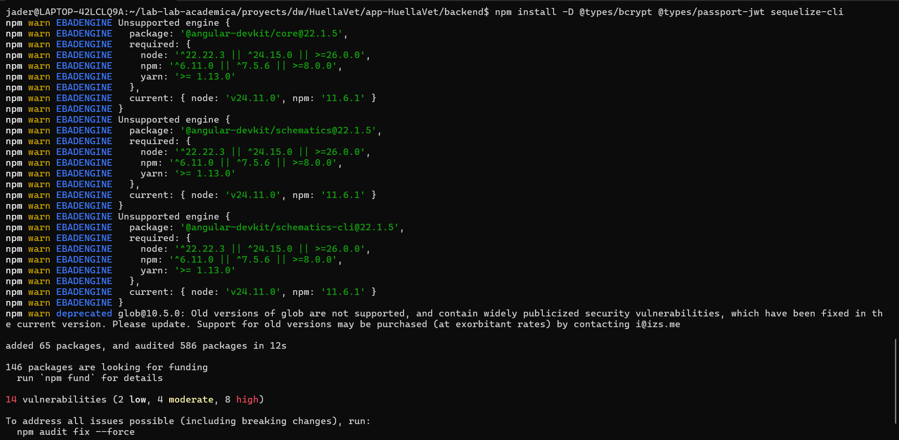
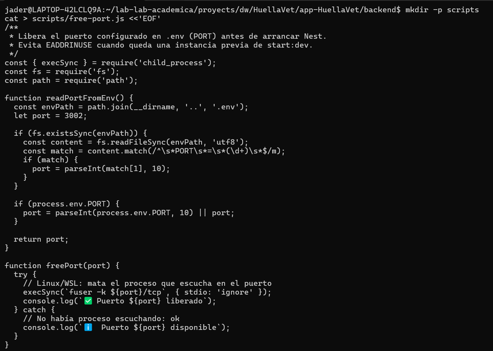
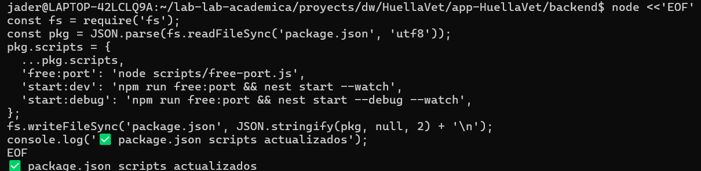
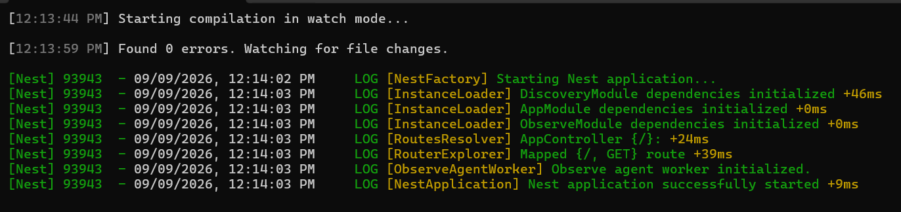
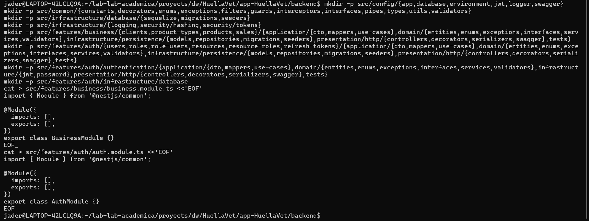
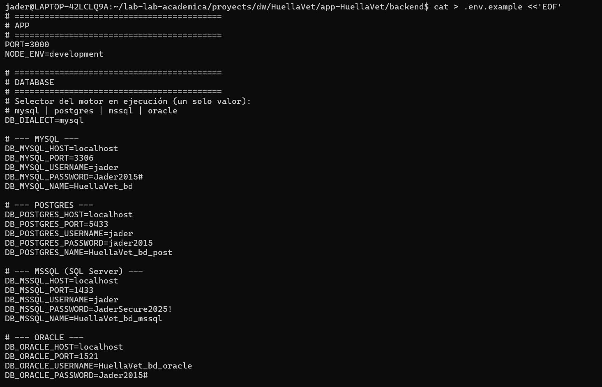
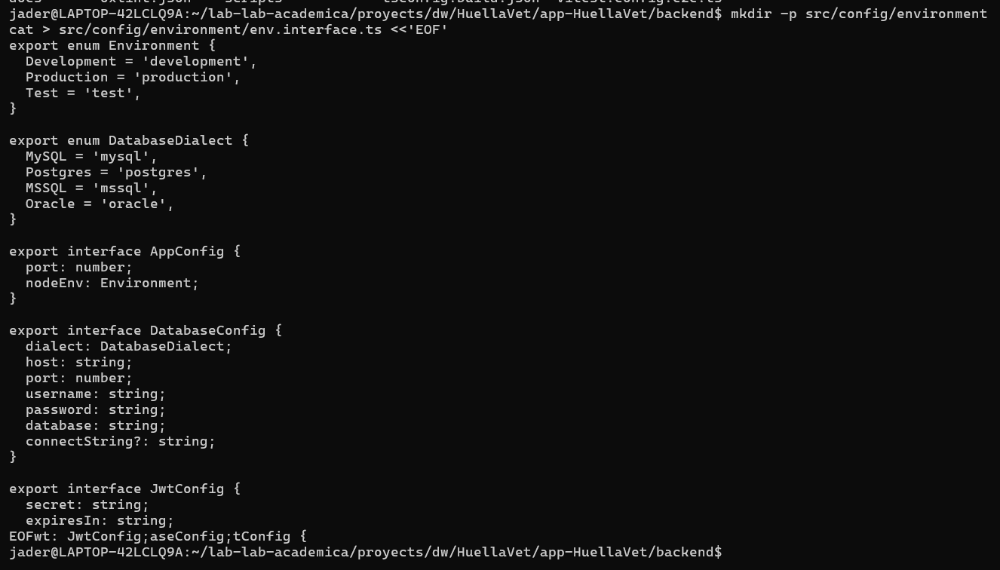
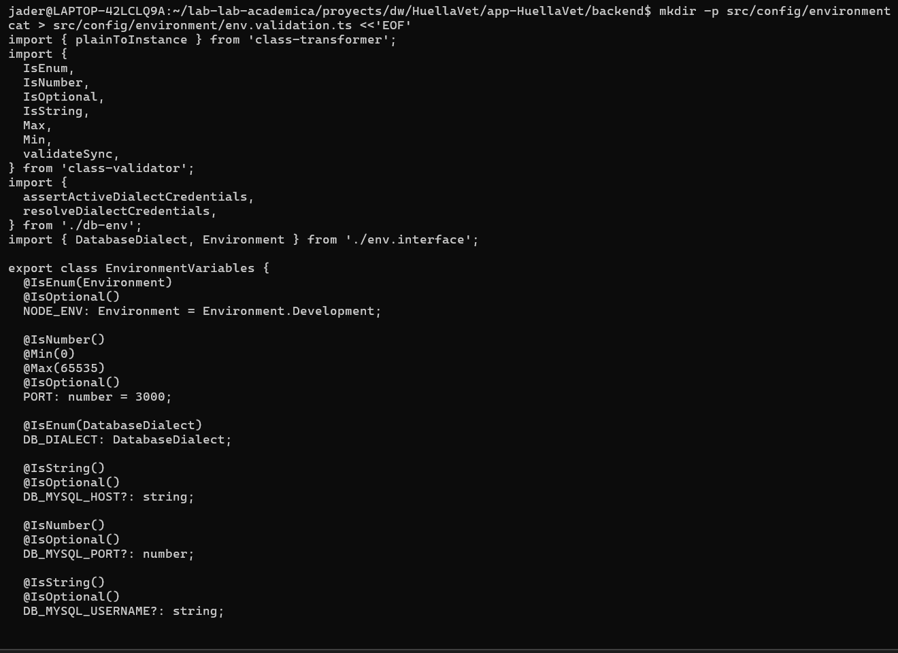

# Manual de creación del Backend

## FASE 1 **— `00_BASE_INIT_NESTJS`**

### Inicialización del proyecto

#### 1.1 — Crear carpetas padre y permisos

Prepara la ruta de trabajo en WSL. Los permisos evitan fallos de escritura del CLI.

``` bash
mkdir -p /lab-lab-academia/proyects/dw/HuellaVet/app-HuellaVet 
chmod -R 777 /lab-lab-academia/proyects/dw/HuellaVet/app-HuellaVet 
```


#### 1.2 — Instalar Nest CLI (si no existe)

``` bash
npm install -g @nestjs/cli
nest --version
```


#### 1.3 — Crear proyecto NestJS

``` bash
cd /home/portatiljq/apps/dlloweb/nestjs/express_sequelize 
nest new backend_ia 
cd backend_ia
```


#### 1.4 — Crear `.env` mínimo (puerto)

``` bash
cat > .env <<'EOF' 
PORT=3000
NODE_ENV=development 
EOF
```


#### 1.5 — Commit inicial del esqueleto

Congela el punto de partida reproducible.

``` bash
git init 
git add . 
git commit -m "chore: inicialización del proyecto NestJS"
```

------------------------------------------------------------------------

## FASE 2 — `01_BASE_DEPS_Y_PUERTO`

### Dependencias + manejo de puerto (EADDRINUSE)

#### 2.1 — Dependencias de producción

Config, Swagger, JWT/Passport, Sequelize + drivers de 4 motores, validación, bcrypt y utilidades HTTP.

``` bash
npm install @nestjs/config @nestjs/swagger @nestjs/jwt @nestjs/passport @nestjs/mapped-types \   passport passport-jwt sequelize sequelize-typescript mysql2 pg tedious oracledb \   class-validator class-transformer bcrypt reflect-metadata express compression helmet
```


#### 2.2 — Dependencias de desarrollo

``` bash
npm install -D @types/bcrypt @types/passport-jwt sequelize-cli
```



#### 2.3 — Script para liberar puerto (evita EADDRINUSE)

``` bash
mkdir -p scripts cat > scripts/free-port.js <<'EOF_BACKEND_IA' /**  * Libera el puerto configurado en .env (PORT) antes de arrancar Nest.  * Evita EADDRINUSE cuando queda una instancia previa de start:dev.  */ const { execSync } = require('child_process'); const fs = require('fs'); const path = require('path');  function readPortFromEnv() {   const envPath = path.join(__dirname, '..', '.env');   let port = 3002;    if (fs.existsSync(envPath)) {     const content = fs.readFileSync(envPath, 'utf8');     const match = content.match(/^\s*PORT\s*=\s*(\d+)\s*$/m);     if (match) {       port = parseInt(match[1], 10);     }   }    if (process.env.PORT) {     port = parseInt(process.env.PORT, 10) || port;   }    return port; }  function freePort(port) {   try {     // Linux/WSL: mata el proceso que escucha en el puerto     execSync(`fuser -k ${port}/tcp`, { stdio: 'ignore' });     console.log(`✅ Puerto ${port} liberado`);   } catch {     // No había proceso escuchando: ok     console.log(`ℹ️  Puerto ${port} disponible`);   } }  const port = readPortFromEnv(); freePort(port); EOF_BACKEND_IA
```



#### 2.4 — Actualizar scripts npm en package.json

``` bash
node <<'EOF_BACKEND_IA' const fs = require('fs'); const pkg = JSON.parse(fs.readFileSync('package.json', 'utf8')); pkg.scripts = {   ...pkg.scripts,   'free:port': 'node scripts/free-port.js',   'start:dev': 'npm run free:port && nest start --watch',   'start:debug': 'npm run free:port && nest start --debug --watch', }; fs.writeFileSync('package.json', JSON.stringify(pkg, null, 2) + '\n'); console.log('✅ package.json scripts actualizados'); EOF_BACKEND_IA
```



#### 2.5 — Verificar arranque base

Debe levantar el Hello World de Nest en el puerto del `.env`.

``` bash
npm run start:dev # Ctrl+C cuando veas el log de arranque curl -s http://localhost:3002 || true
```



## FASE 3 — `02_BASE_ESTRUCTURA_CA`

#### 3.1 — Crear árbol base de carpetas

Aún no hay código de dominio. Solo directorios y módulos vacíos de features para anclar imports futuros.

``` bash
mkdir -p src/config/{app,database,environment,jwt,logger,swagger} mkdir -p src/common/{constants,decorators,enums,exceptions,filters,guards,interceptors,interfaces,pipes,types,utils,validators} mkdir -p src/infrastructure/database/{sequelize,migrations,seeders} mkdir -p src/infrastructure/{logging,security/hashing,security/tokens} mkdir -p src/features/business/{clients,product-types,products,sales}/{application/{dto,mappers,use-cases},domain/{entities,enums,exceptions,interfaces,services,validators},infrastructure/persistence/{models,repositories,migrations,seeders},presentation/http/{controllers,decorators,serializers,swagger},tests} mkdir -p src/features/auth/{users,roles,role-users,resources,resource-roles,refresh-tokens}/{application/{dto,mappers,use-cases},domain/{entities,enums,exceptions,interfaces,services,validators},infrastructure/persistence/{models,repositories,migrations,seeders},presentation/http/{controllers,decorators,serializers,swagger},tests} mkdir -p src/features/auth/authentication/{application/{dto,mappers,use-cases},domain/{entities,enums,exceptions,interfaces,services,validators},infrastructure/{jwt,password},presentation/http/{controllers,decorators,serializers,swagger},tests} mkdir -p src/features/auth/infrastructure/database cat > src/features/business/business.module.ts <<'EOF_BACKEND_IA' import { Module } from '@nestjs/common';  @Module({   imports: [],   exports: [], }) export class BusinessModule {} EOF_BACKEND_IA cat > src/features/auth/auth.module.ts <<'EOF_BACKEND_IA' import { Module } from '@nestjs/common';  @Module({   imports: [],   exports: [], }) export class AuthModule {} EOF_BACKEND_IA
```



#### 3.2 — Recordatorio de responsabilidades

| Carpeta           | Responsabilidad                              |
|-------------------|----------------------------------------------|
| `config/`         | Cómo se configura la app (env, jwt, swagger) |
| `common/`         | Piezas transversales reutilizables           |
| `infrastructure/` | Detalles técnicos (Sequelize, bcrypt, JWT)   |
| `features/*`      | Dominios (business/auth) con CA interna      |

**Error típico:** poner `@Table` de Sequelize dentro de `domain/entities`.

## FASE 4 — `03_BASE_ENTORNO_ENV`

### Configuración del entorno tipado (multi-base)

#### 4.1 — Crear `.env.example` y actualizar `.env` completo

El `.env` real NO se sube a Git. Usa BD dedicada `tecnogua_ia`.

**Contrato multi-base (igual que `docs/Prompt.md`):** - `DB_DIALECT` = `mysql` \| `postgres` \| `mssql` \| `oracle` (elige qué motor corre). - MySQL: `DB_MYSQL_HOST`, `DB_MYSQL_PORT`, `DB_MYSQL_USERNAME`, `DB_MYSQL_PASSWORD`, `DB_MYSQL_NAME`. - PostgreSQL: `DB_POSTGRES_*` (puerto lab 5432). - SQL Server: `DB_MSSQL_*` (puerto lab 1433, usuario `sa`). - Oracle: `DB_ORACLE_*` + `DB_ORACLE_CONNECT_STRING` (puerto lab 1521). - Para cambiar de motor, cambia **solo** `DB_DIALECT`. No uses `DB_HOST` / `DB_USERNAME` genéricos.

``` bash
cat > .env.example <<'EOF_BACKEND_IA' # ========================================== # APP # ========================================== PORT=3002 NODE_ENV=development  # ========================================== # DATABASE # ========================================== # Selector del motor en ejecución (un solo valor): # mysql | postgres | mssql | oracle DB_DIALECT=mysql  # --- MYSQL --- DB_MYSQL_HOST=localhost DB_MYSQL_PORT=3306 DB_MYSQL_USERNAME=root DB_MYSQL_PASSWORD=root DB_MYSQL_NAME=tecnogua_ia  # --- POSTGRES --- DB_POSTGRES_HOST=localhost DB_POSTGRES_PORT=5432 DB_POSTGRES_USERNAME=postgres DB_POSTGRES_PASSWORD=postgres DB_POSTGRES_NAME=tecnogua_ia  # --- MSSQL (SQL Server) --- DB_MSSQL_HOST=localhost DB_MSSQL_PORT=1433 DB_MSSQL_USERNAME=sa DB_MSSQL_PASSWORD=YourStrong@Passw0rd DB_MSSQL_NAME=tecnogua_ia  # --- ORACLE --- DB_ORACLE_HOST=localhost DB_ORACLE_PORT=1521 DB_ORACLE_USERNAME=system DB_ORACLE_PASSWORD=oracle DB_ORACLE_NAME=tecnogua_ia DB_ORACLE_CONNECT_STRING=localhost:1521/XEPDB1  # ========================================== # JWT (pista completa; el guion simple no implementa login) # ========================================== JWT_SECRET=lab-jwt-secret-tecnogua-ia JWT_EXPIRES_IN=1d JWT_REFRESH_SECRET=lab-jwt-refresh-tecnogua-ia JWT_REFRESH_EXPIRES_IN=7d EOF_BACKEND_IA
```

``` bash
cp .env.example .env # Laboratorio: DB_DIALECT + un bloque por motor (MYSQL/POSTGRES/MSSQL/ORACLE). # Cambia solo el bloque del motor que uses. Mantén DB_*_NAME=tecnogua_ia
```



#### 4.2 — Interface de entorno

**Archivo:** `src/config/environment/env.interface.ts`

``` bash
mkdir -p src/config/environment cat > src/config/environment/env.interface.ts <<'EOF_BACKEND_IA' export enum Environment {   Development = 'development',   Production = 'production',   Test = 'test', }  export enum DatabaseDialect {   MySQL = 'mysql',   Postgres = 'postgres',   MSSQL = 'mssql',   Oracle = 'oracle', }  export interface AppConfig {   port: number;   nodeEnv: Environment; }  export interface DatabaseConfig {   dialect: DatabaseDialect;   host: string;   port: number;   username: string;   password: string;   database: string;   connectString?: string; }  export interface JwtConfig {   secret: string;   expiresIn: string;   refreshSecret: string;   refreshExpiresIn: string; }  export interface EnvironmentConfig {   app: AppConfig;   database: DatabaseConfig;   jwt: JwtConfig; } EOF_BACKEND_IA
```



#### 4.3 — Validación de entorno con class-validator

Si falta JWT_SECRET o DB_DIALECT es inválido, o el bloque del motor activo está vacío, el boot falla con mensaje claro.

**Archivo:** `src/config/environment/env.validation.ts`

``` bash
mkdir -p src/config/environment cat > src/config/environment/env.validation.ts <<'EOF_BACKEND_IA' import { plainToInstance } from 'class-transformer'; import {   IsEnum,   IsNumber,   IsOptional,   IsString,   Max,   Min,   validateSync, } from 'class-validator'; import {   assertActiveDialectCredentials,   resolveDialectCredentials, } from './db-env'; import { DatabaseDialect, Environment } from './env.interface';  export class EnvironmentVariables {   @IsEnum(Environment)   @IsOptional()   NODE_ENV: Environment = Environment.Development;    @IsNumber()   @Min(0)   @Max(65535)   @IsOptional()   PORT: number = 3002;    @IsEnum(DatabaseDialect)   DB_DIALECT: DatabaseDialect;    @IsString()   @IsOptional()   DB_MYSQL_HOST?: string;    @IsNumber()   @IsOptional()   DB_MYSQL_PORT?: number;    @IsString()   @IsOptional()   DB_MYSQL_USERNAME?: string;    @IsString()   @IsOptional()   DB_MYSQL_PASSWORD?: string;    @IsString()   @IsOptional()   DB_MYSQL_NAME?: string;    @IsString()   @IsOptional()   DB_POSTGRES_HOST?: string;    @IsNumber()   @IsOptional()   DB_POSTGRES_PORT?: number;    @IsString()   @IsOptional()   DB_POSTGRES_USERNAME?: string;    @IsString()   @IsOptional()   DB_POSTGRES_PASSWORD?: string;    @IsString()   @IsOptional()   DB_POSTGRES_NAME?: string;    @IsString()   @IsOptional()   DB_MSSQL_HOST?: string;    @IsNumber()   @IsOptional()   DB_MSSQL_PORT?: number;    @IsString()   @IsOptional()   DB_MSSQL_USERNAME?: string;    @IsString()   @IsOptional()   DB_MSSQL_PASSWORD?: string;    @IsString()   @IsOptional()   DB_MSSQL_NAME?: string;    @IsString()   @IsOptional()   DB_ORACLE_HOST?: string;    @IsNumber()   @IsOptional()   DB_ORACLE_PORT?: number;    @IsString()   @IsOptional()   DB_ORACLE_USERNAME?: string;    @IsString()   @IsOptional()   DB_ORACLE_PASSWORD?: string;    @IsString()   @IsOptional()   DB_ORACLE_NAME?: string;    @IsString()   @IsOptional()   DB_ORACLE_CONNECT_STRING?: string;    @IsString()   JWT_SECRET: string;    @IsString()   @IsOptional()   JWT_EXPIRES_IN: string = '1d';    @IsString()   JWT_REFRESH_SECRET: string;    @IsString()   @IsOptional()   JWT_REFRESH_EXPIRES_IN: string = '7d'; }  function formatValidationErrors(   errors: ReturnType<typeof validateSync>, ): string {   return errors     .map((error) => {       const constraints = error.constraints         ? Object.values(error.constraints).join(', ')         : 'valor inválido';       return `${error.property}: ${constraints}`;     })     .join('; '); }  export function validate(config: Record<string, unknown>): EnvironmentVariables {   const validatedConfig = plainToInstance(EnvironmentVariables, config, {     enableImplicitConversion: true,     exposeDefaultValues: true,   });    const errors = validateSync(validatedConfig, {     skipMissingProperties: false,   });    if (errors.length > 0) {     throw new Error(       `Error de configuración: variable(s) crítica(s) inválida(s) o ausente(s). ${formatValidationErrors(errors)}. Copia .env.example a .env y completa el bloque del motor elegido (DB_DIALECT).`,     );   }    assertActiveDialectCredentials(resolveDialectCredentials(validatedConfig));    return validatedConfig; } EOF_BACKEND_IA
```


