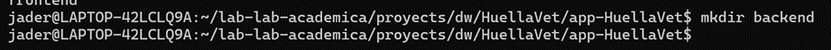
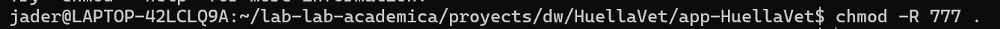
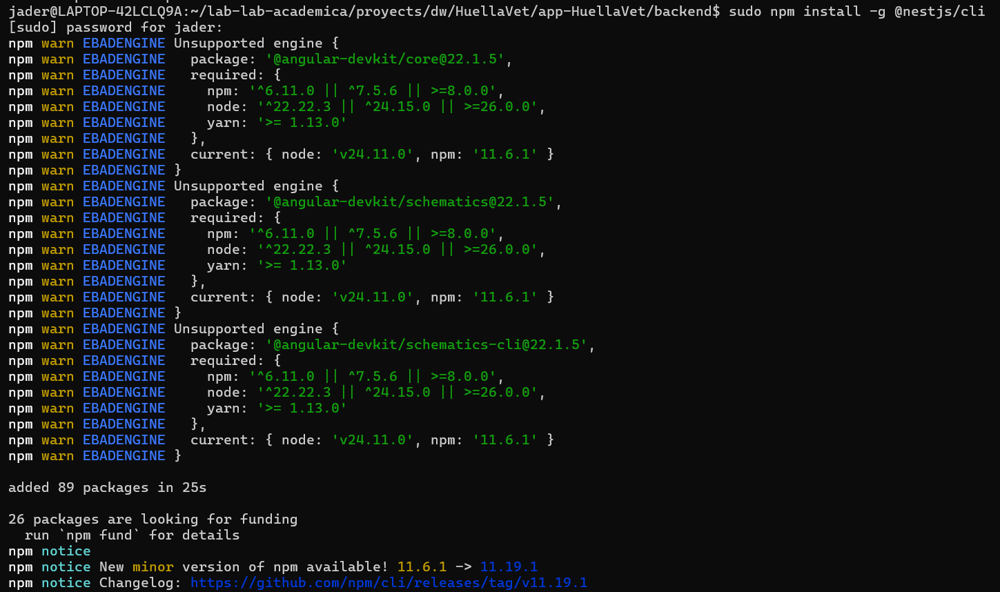
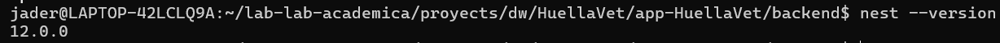
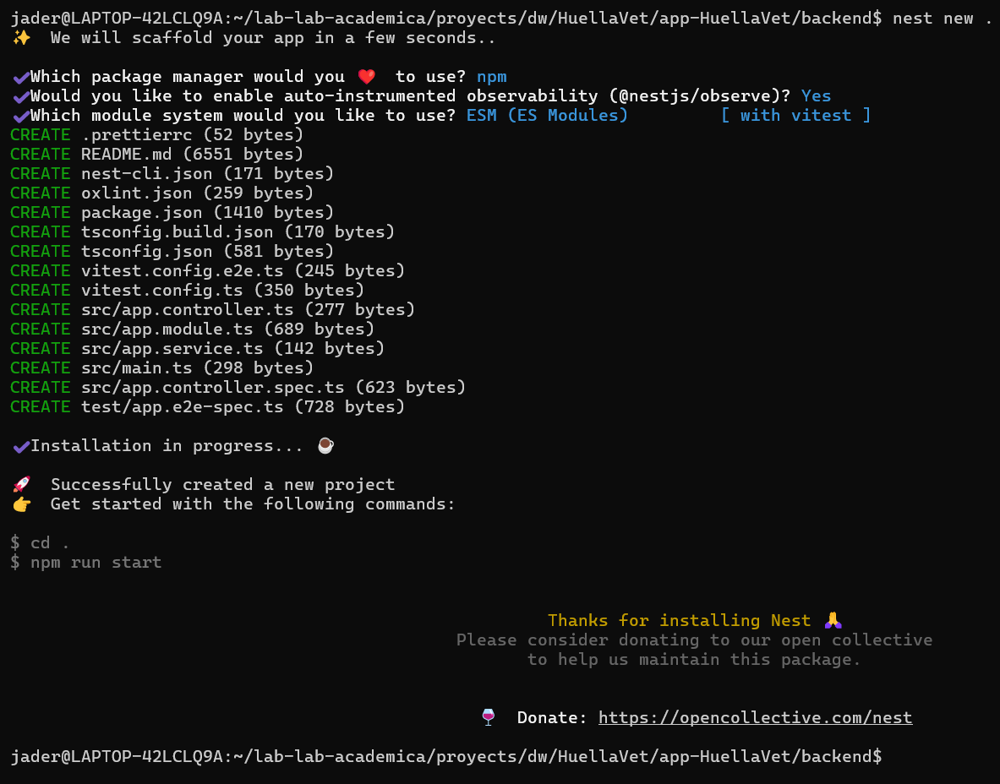
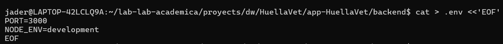
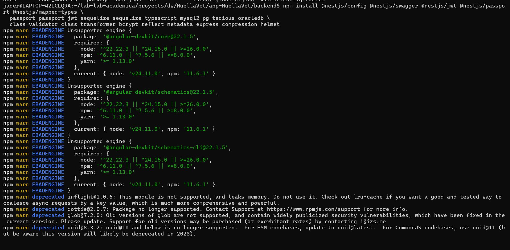

# Manual de creación del Backend

## FASE 1 **— `00_BASE_INIT_NESTJS`**

### Inicialización del proyecto

#### 1.1 — Crear carpetas padre y permisos

Prepara la ruta de trabajo en WSL. Los permisos evitan fallos de escritura del CLI.

``` bash
mkdir -p /lab-lab-academia/proyects/dw/HuellaVet/app-HuellaVet 
chmod -R 777 /lab-lab-academia/proyects/dw/HuellaVet/app-HuellaVet 
```





#### 1.2 — Instalar Nest CLI (si no existe)

``` bash
npm install -g @nestjs/cli
nest --version
```





#### 1.3 — Crear proyecto NestJS

``` bash
cd /home/portatiljq/apps/dlloweb/nestjs/express_sequelize 
nest new backend_ia 
cd backend_ia
```



#### 1.4 — Crear `.env` mínimo (puerto)

``` bash
cat > .env <<'EOF' 
PORT=3000
NODE_ENV=development 
EOF
```



#### 1.5 — Commit inicial del esqueleto

Congela el punto de partida reproducible.

``` bash
git init 
git add . 
git commit -m "chore: inicialización del proyecto NestJS"
```

------------------------------------------------------------------------

## FASE 2 — `01_BASE_DEPS_Y_PUERTO`

### Dependencias + manejo de puerto (EADDRINUSE)

#### 2.1 — Dependencias de producción

Config, Swagger, JWT/Passport, Sequelize + drivers de 4 motores, validación, bcrypt y utilidades HTTP.

``` bash
npm install @nestjs/config @nestjs/swagger @nestjs/jwt @nestjs/passport @nestjs/mapped-types \   passport passport-jwt sequelize sequelize-typescript mysql2 pg tedious oracledb \   class-validator class-transformer bcrypt reflect-metadata express compression helmet
```


