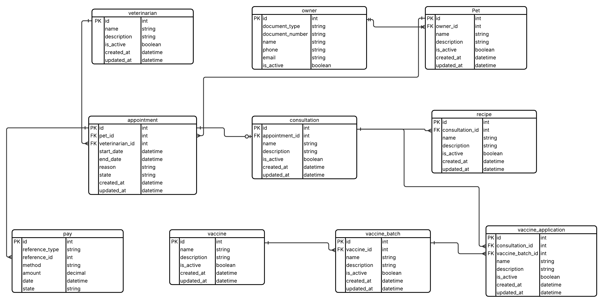

# SDD — HuellaVet (proyecto12)

**Asignatura:** Desarrollo Web 2026-II

**Semana:** 04 · Fundamentos web, dominio y arquitectura — inicio del proyecto (Unidad 01)

**Proyecto:** 12.HuellaVet - Historia clínica veterinaria

**Estudiante:** Jader Gutiérrez Areiza

**GitHub:** JaderGutierrezAz

**Metodología:** MIRIA — Metodología de Integración Responsable de IA para el Aprendizaje

------------------------------------------------------------------------

## 1. Identificación y temas de la semana — Momento 1 · Alineación

La semana 04 abre la aplicación integradora. Sobre el entorno verificado (S01 WSL, S02 Docker + 4 motores, S03 Python/Node/DBeaver) se inicia el desarrollo del backend de **HuellaVet — Historia clínica veterinaria**, proyecto asignado dentro de la UNIDAD 01: fundamentos web, dominio y arquitectura.

Se modela el dominio de HuellaVet (Propietario, Mascota, Veterinario, Cita, Consulta, Vacuna, LoteVacuna, AplicacionVacuna, Receta y Pago, con sus relaciones de negocio), se define la arquitectura por capas (presentation, application, domain, infrastructure) contemplando el control de acceso por roles (ADMIN, RECEPCION, VETERINARIO, FARMACIA, AUDITOR_CLINICO), se establecen los contratos iniciales (DTO/API) para los recursos de referencia (citas, consultas, vacunaciones, historia clínica) y se crea la base del backend (config, common, database, logging, health, Swagger). El frontend NO se aborda en esta semana (corresponde a la Unidad 03, semana 10).

**Lectura del contexto (proyecto HuellaVet):**

- *¿Qué viene construido de las semanas anteriores?* — WSL 2, repositorio, tablero Kanban, especificación inicial, laboratorio de 4 motores (S02, evidenciado en el entregable anterior: MySQL, PostgreSQL, MS SQL, Oracle vía Docker) y toolchain Python/Node/DBeaver con script de comprobación (S03).
- *¿Qué limitaciones o condiciones reales existen?* — El proyecto inicia sin base de código previa; hay que definir arquitectura y contratos antes de implementar; las BD de Docker se consumen por conexión remota; la historia clínica debe ser cronológica e inalterable en datos sensibles, lo que condiciona el diseño del dominio (auditoría, no-edición retroactiva).
- *¿Qué NO conviene incluir esta semana?* — CRUD completo con reglas de negocio, autenticación productiva, autorización RBAC completa (los 5 roles de HuellaVet se definen a nivel de diseño, no de implementación), frontend/interfaz (semanas 10+), despliegue ni pruebas de carga. Esta semana se sientan los fundamentos: dominio, arquitectura y base del backend.

## 2. Objetivo semanal — OBJ-S04 (Momento 1 · Alineación)

**OBJ-S04:** Al finalizar la semana, el estudiante comprende el dominio y la arquitectura de **HuellaVet** (problema —atención de mascotas en consulta, vacunación y controles preventivos, con historia clínica cronológica e inalterable en datos sensibles—, actores —Propietario, Mascota, Veterinario, Recepción, Farmacia, Auditor Clínico—, requisitos, entidades y relaciones), define la arquitectura por capas, establece los contratos (DTO/API) para los recursos de referencia (POST /citas, POST /consultas, POST /vacunaciones, GET /mascotas/:id/historia) y deja la base del backend NestJS (config, common, database, logging, health, Swagger) lista para construir durante la clase una primera rebanada vertical funcional y continuar su integración en las semanas siguientes.

## 3. Resultados esperados — Momento 2 · Especificación SDD

### 3.1 Tabla guía

|  |  |
|------------------------------------|------------------------------------|
| **ID** | **Resultado esperado (descompone OBJ-SNN)** |
| R-S04-01 | Problema, actores y requisitos del dominio identificados y documentados. |
| R-S04-02 | Modelo de dominio definido (entidades, relaciones, agregados) y diagramado. |
| R-S04-03 | Arquitectura por capas definida (presentation, application, domain, infrastructure). |
| R-S04-04 | Contratos (DTO/API) iniciales definidos y documentados. |
| R-S04-05 | Base del backend NestJS creada: config, common, database, logging, health, Swagger. |
| R-S04-06 | SDD (docs/sdd.md) y Kanban (docs/kanban.md) del proyecto actualizados. |

### 3.2 Tabla proyecto

| ID | Resultado esperado (descompone OBJ-S04) |
|------------------------------------|------------------------------------|
| R-S04-01 | Problema, actores (Propietario, Mascota, Veterinario, Recepción, Farmacia, Auditor Clínico) y requisitos del dominio de HuellaVet identificados y documentados. |
| R-S04-02 | Modelo de dominio definido (entidades: Propietario, Mascota, Veterinario, Cita, Consulta, Vacuna, LoteVacuna, AplicacionVacuna, Receta, Pago; relaciones y agregados) y diagramado. |
| R-S04-03 | Arquitectura por capas definida (presentation, application, domain, infrastructure), incluyendo el RBAC transversal de 5 roles. |
| R-S04-04 | Contratos (DTO/API) iniciales definidos y documentados para citas, consultas, vacunaciones e historia clínica. |
| R-S04-05 | Base del backend NestJS creada: config, common, database, logging, health, Swagger. |
| R-S04-06 | SDD (docs/sdd.md) y Kanban (docs/kanban.md) del proyecto HuellaVet actualizados. |

### 3.3 Diagrama del modelo de dominio

## 4. SPEC semanal — SPEC-S04 y requisitos (Momento 2 · Especificación SDD)

**SPEC-S04 (HuellaVet):** modelar el dominio HuellaVet (Propietario, Mascota, Veterinario, Cita, Consulta, Vacuna, LoteVacuna, AplicacionVacuna, Receta y Pago) con RBAC transversal (ADMIN, RECEPCION, VETERINARIO, FARMACIA, AUDITOR_CLINICO), definir la arquitectura cliente-servidor y por capas (presentation/application/domain/infrastructure), establecer los contratos iniciales de los recursos de referencia (POST /citas, POST /consultas, POST /vacunaciones, GET /mascotas/:id/historia) y crear la base del backend NestJS (config, common, database, logging, health y Swagger) sin frontend. Todo queda documentado en docs/sdd.md y docs/kanban.md.

**Requisitos derivados:**

| ID | Requisito |
|------------------------------------|------------------------------------|
| REQ-S04-01 | Problema, actores y requisitos del dominio HuellaVet documentados (docs/sdd.md). |
| REQ-S04-02 | Modelo de dominio con entidades y relaciones de HuellaVet definido y diagramado. |
| REQ-S04-03 | Arquitectura por capas definida y explicada (presentation/application/domain/infrastructure), con el RBAC de 5 roles ubicado en la capa correspondiente. |
| REQ-S04-04 | Contratos (DTO/API) iniciales definidos y documentados para citas, consultas, vacunaciones e historia clínica. |
| REQ-S04-05 | Base del backend NestJS operativa: config, common, database, logging, health, Swagger. |
| REQ-S04-06 | docs/sdd.md y docs/kanban.md del proyecto HuellaVet actualizados con trazabilidad. |

## 5. Criterios de aceptación y evidencia esperada (Momento 2 · Especificación SDD)

| ID | Criterio de aceptación | Evidencia |
|------------------------|------------------------|------------------------|
| AC-S04-01 | Documento con problema, actores y requisitos del dominio HuellaVet. | EVI-S04-01 (docs/sdd.md) |
| AC-S04-02 | Diagrama del modelo de dominio (10 entidades, relaciones, agregado). | EVI-S04-02 (diagrama) |
| AC-S04-03 | Diagrama de arquitectura por capas con responsabilidades. | EVI-S04-03 (diagrama) |
| AC-S04-04 | Contratos definidos (DTO/API) con ejemplo de request/response para citas/consultas/vacunaciones/historia. | EVI-S04-04 (docs/contratos) |
| AC-S04-05 | Backend NestJS arranca; /health responde; Swagger accesible. | EVI-S04-05 (captura + /health) |
| AC-S04-06 | docs/sdd.md y docs/kanban.md reflejan OBJ/SPEC/REQ/AC/Issues. | EVI-S04-06 (archivos) |

*Criterios de calidad comunes: dominio y arquitectura expresados en el lenguaje veterinario del proyecto (mascota, propietario, consulta, vacuna...); capas con responsabilidades claras; contratos consistentes con el modelo de dominio; backend arranca en WSL sin Docker para el framework; secretos excluidos; evidencia legible y trazable.*

## 6. Matriz de trazabilidad (Momento 2 · Especificación SDD)

| OBJ     | SPEC     | REQ        | AC        | Issue | Evidencia  |
|---------|----------|------------|-----------|-------|------------|
| OBJ-S04 | SPEC-S04 | REQ-S04-01 | AC-S04-01 | #01   | EVI-S04-01 |
| OBJ-S04 | SPEC-S04 | REQ-S04-02 | AC-S04-02 | #02   | EVI-S04-02 |
| OBJ-S04 | SPEC-S04 | REQ-S04-03 | AC-S04-03 | #03   | EVI-S04-03 |
| OBJ-S04 | SPEC-S04 | REQ-S04-04 | AC-S04-04 | #04   | EVI-S04-04 |
| OBJ-S04 | SPEC-S04 | REQ-S04-05 | AC-S04-05 | #05   | EVI-S04-05 |
| OBJ-S04 | SPEC-S04 | REQ-S04-06 | AC-S04-06 | #06   | EVI-S04-06 |

------------------------------------------------------------------------

*Pendiente de completar en momentos posteriores: diagramas reales (R-S04-02/03), contratos con ejemplos concretos de request/response (R-S04-04) y base de backend NestJS funcionando (R-S04-05) — estos se construyen durante la clase (Momento 4) y no se infieren aquí.*
