# **Archivo Evidencia Manual Backend Express**

**Nombre:** Jader Gutiérrez Areiza

**Asignatura:** Desarrollo Web

**Docente:** Jaider Quintero

Programa Ingeniería en Sistemas - Octavo Semestre

Universidad de La Guajira

# 1. ISS-00 — Requisitos previos

```         
node -v
npm -v
```

### Verificación


# 2. ISS-01 — Esqueleto express Arrancable

## 2.1 Inicializar npm y scripts

```         
mkdir backend_expres
cd backend_express
npm init -y
mkdir -p docs
```


## 2.2 Estructura de carpetas (features)

```         
mkdir -p \
  src/config \
  src/database/seeders \
  src/routes \
  src/features/business/client
```

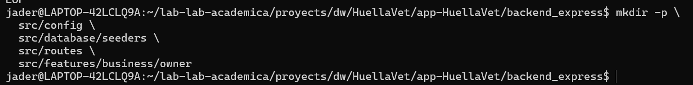

## 2.3 Dependencias base (Express + TypeScript)

```         
npm install express@^5.2.1 cors@^2.8.6 dotenv@^17.4.2 morgan@^1.12.1

npm install -D typescript@~5.9.2 ts-node@^10.9.2 nodemon@^3.1.14 \
  @types/node@^22.20.3 @types/express@^5.0.6 \
  @types/cors@^2.8.19 @types/morgan@^1.9.10
```

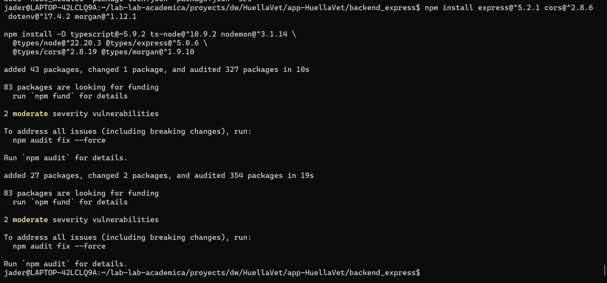

```         
npm ls --depth=0
```

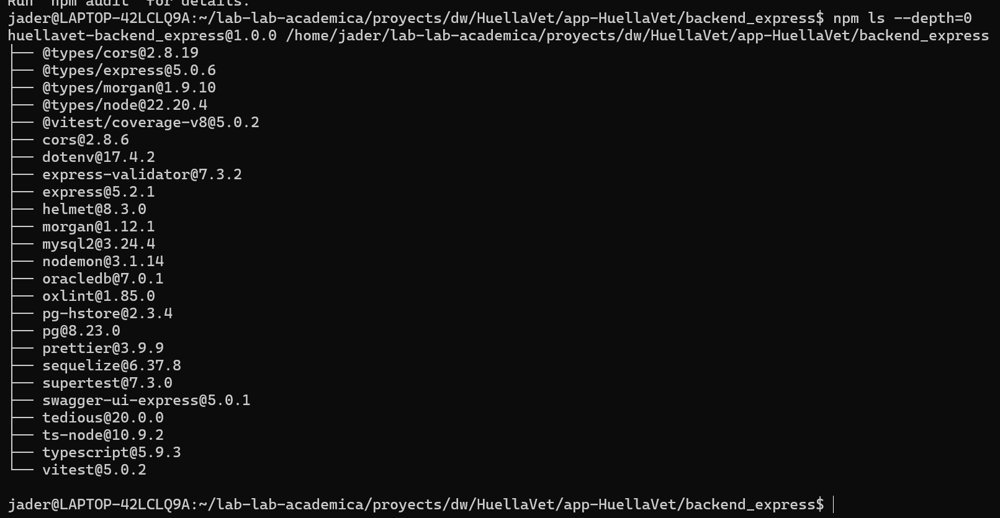

## 2.4 TypeScript (`tsconfig.json`)

```         
: > tsconfig.json
cat >> tsconfig.json << 'EOF'
{
  "compilerOptions": {
    "rootDir": "./src",
    "outDir": "./dist",
    "module": "commonjs",
    "target": "ES2020",
    "lib": ["ES2020"],
    "types": ["node"],
    "esModuleInterop": true,
    "resolveJsonModule": true,
    "sourceMap": true,
    "strict": true,
    "skipLibCheck": true,
    "moduleDetection": "force",
    "isolatedModules": true,
    "forceConsistentCasingInFileNames": true
  },
  "include": ["src/**/*"],
  "exclude": ["node_modules", "dist"]
}
EOF
```

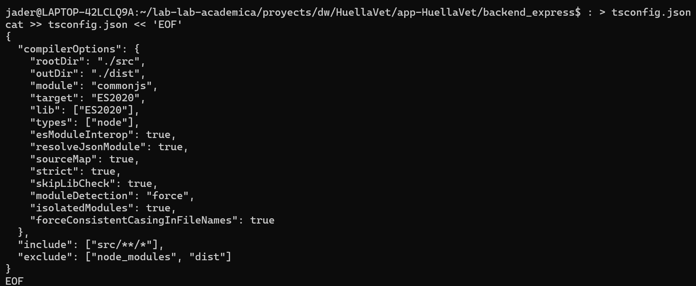

## 2.5 Servidor y App (esqueleto HTTP)

### 2.5.1 `src/server.ts`

```         
: > src/server.ts
cat >> src/server.ts << 'EOF'
import { App } from './config/index';

async function main() {
    const app = new App();
    await app.listen();
}

main();
EOF
```

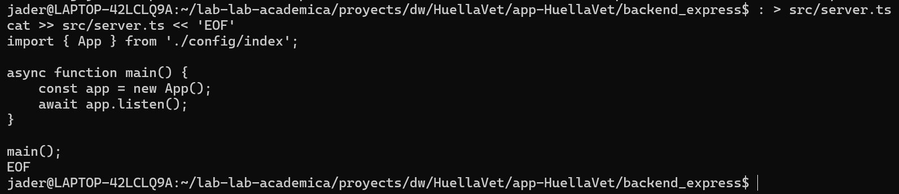

### 2.5.2 `src/config/index.ts` (esqueleto)

```         
: > src/config/index.ts
cat >> src/config/index.ts << 'EOF'
import dotenv from "dotenv";
import express, { Application } from "express";
import morgan from "morgan";
var cors = require("cors");

dotenv.config();

export class App {
  public app: Application;

  constructor(private port?: number | string) {
    this.app = express();
    this.settings();
    this.middlewares();
    this.routes();
    this.dbConnection();
  }

  private settings(): void {
    this.app.set('port', this.port || process.env.PORT || 4000);
  }

  private middlewares(): void {
    this.app.use(morgan('dev'));
    this.app.use(cors());
    this.app.use(express.json());
    this.app.use(express.urlencoded({ extended: false }));
  }

  private routes(): void {
    // ISS-03 §4.3
  }

  private async dbConnection(): Promise<void> {
    // ISS-02 / ISS-03
  }

  async listen() {
    await this.app.listen(this.app.get('port'));
    console.log(`🚀 Servidor ejecutándose en puerto ${this.app.get('port')}`);
  }
}
EOF
```

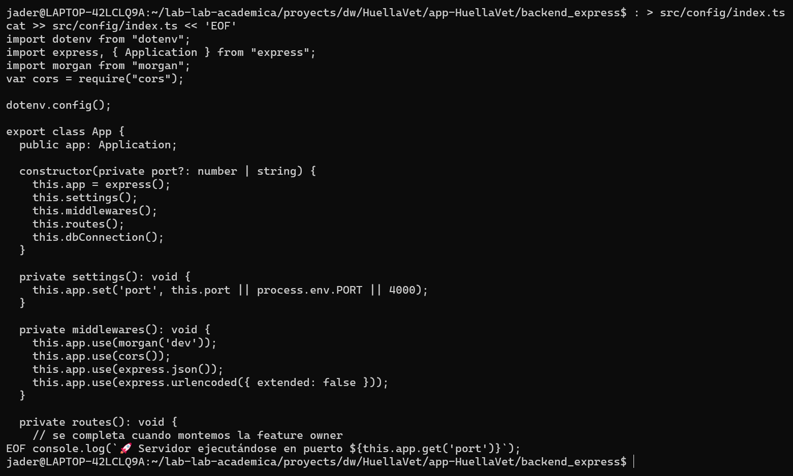

### Verificación del ISS-01

```         
npx tsc --noEmit
find src -type f | sort
```

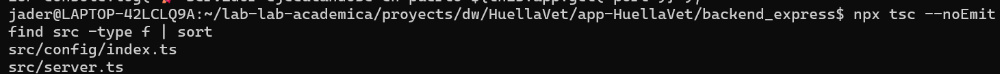

### Cierre del ISSUE-01

``` bash
npm run dev
```

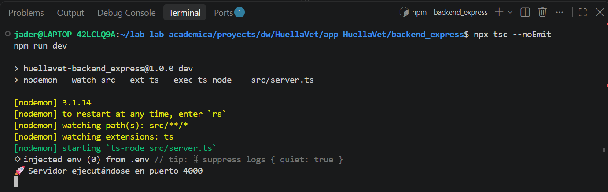

# 3. ISS-02 — Infraestructura de base de datos

## 3.1 Drivers Sequelize y `.env`

```         
npm install sequelize@^6.37.8 mysql2@^3.24.4 pg@^8.23.0 pg-hstore@^2.3.4 \
  tedious@^20.0.0 oracledb@^7.0.1
npm install -D @types/sequelize@^6.12.0
```

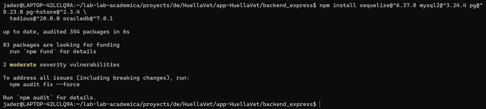

```         
: > .env
cat >> .env << 'EOF'
PORT=4000

# Variable para seleccionar el motor de base de datos
DB_ENGINE=mysql

# Configuración para MySQL
MYSQL_HOST=localhost
MYSQL_USER=admin
MYSQL_PASSWORD=MiNiCo57**
MYSQL_NAME=tecnogua
MYSQL_PORT=3306

# Configuración para PostgreSQL
POSTGRES_HOST=localhost
POSTGRES_USER=postgres
POSTGRES_PASSWORD=password
POSTGRES_NAME=almacen_2025_iisem_node
POSTGRES_PORT=5432

# Configuración para SQL Server
MSSQL_HOST=localhost
MSSQL_USER=sa
MSSQL_PASSWORD=password
MSSQL_NAME=almacen_2025_iisem_node
MSSQL_PORT=1433

# Configuración para Oracle
ORACLE_HOST=localhost
ORACLE_USER=ALMACENDB_ADMIN
ORACLE_PASSWORD=password
ORACLE_NAME=xe
ORACLE_PORT=1521

EOF
```

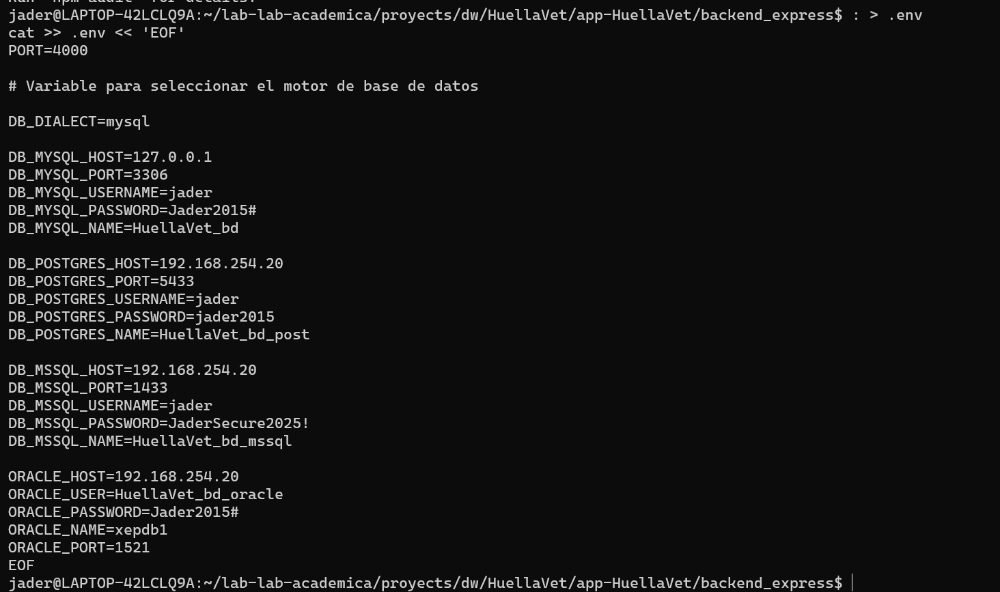

```         
test -f .env && grep DB_ENGINE .env
npm ls sequelize mysql2 --depth=0
```

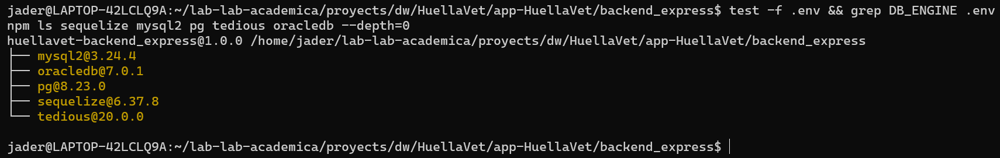

## 3.2 Configuración Sequelize (`database/db.ts`)

```         
: > src/database/db.ts
cat >> src/database/db.ts << 'EOF'
import { Sequelize } from "sequelize";
import dotenv from "dotenv";

dotenv.config();

interface DatabaseConfig {
  dialect: string;
  host: string;
  username: string;
  password: string;
  database: string;
  port: number;
}

const dbConfigurations: Record<string, DatabaseConfig> = {
  mysql: {
    dialect: "mysql",
    host: process.env.MYSQL_HOST || "localhost",
    username: process.env.MYSQL_USER || "root",
    password: process.env.MYSQL_PASSWORD || "",
    database: process.env.MYSQL_NAME || "test",
    port: parseInt(process.env.MYSQL_PORT || "3306")
  },
  postgres: {
    dialect: "postgres",
    host: process.env.POSTGRES_HOST || "localhost",
    username: process.env.POSTGRES_USER || "postgres",
    password: process.env.POSTGRES_PASSWORD || "",
    database: process.env.POSTGRES_NAME || "test",
    port: parseInt(process.env.POSTGRES_PORT || "5432")
  }
};

const selectedEngine = process.env.DB_ENGINE || "mysql";
const selectedConfig = dbConfigurations[selectedEngine];

if (!selectedConfig) {
  throw new Error(`Motor de base de datos no soportado: ${selectedEngine}`);
}

console.log(`🔌 Conectando a base de datos: ${selectedEngine.toUpperCase()}`);

export const sequelize = new Sequelize(
  selectedConfig.database,
  selectedConfig.username,
  selectedConfig.password,
  {
    host: selectedConfig.host,
    port: selectedConfig.port,
    dialect: selectedConfig.dialect as any,
    logging: process.env.NODE_ENV === 'development' ? console.log : false,
    pool: {
      max: 5,
      min: 0,
      acquire: 30000,
      idle: 10000
    }
  }
);

export const getDatabaseInfo = () => {
  return {
    engine: selectedEngine,
    config: selectedConfig,
    connectionString: `${selectedConfig.dialect}://${selectedConfig.username}@${selectedConfig.host}:${selectedConfig.port}/${selectedConfig.database}`
  };
};

export const testConnection = async (): Promise<boolean> => {
  try {
    await sequelize.authenticate();
    console.log(`✅ Conexión exitosa a ${selectedEngine.toUpperCase()}`);
    return true;
  } catch (error) {
    console.error(`❌ Error de conexión a ${selectedEngine.toUpperCase()}:`, error);
    return false;
  }
};
EOF
```

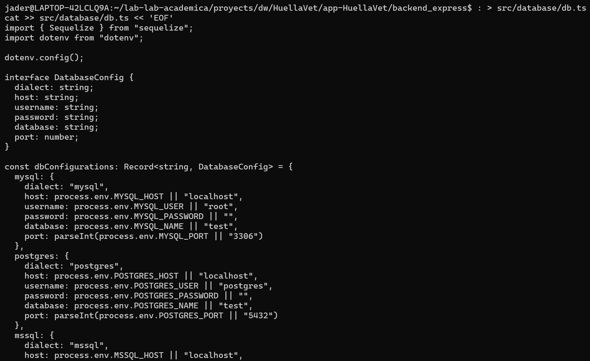

## 3.3 Carpeta seeders (reservada)

```         
mkdir -p src/database/seeders
# opcional: touch src/database/seeders/.gitkeep
```

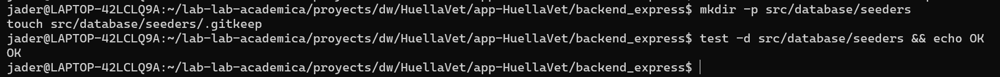

### Verificación del ISS-02

```         
npx tsc --noEmit
test -f src/database/db.ts && test -f .env && test -d src/database/seeders
```

### Cierre del ISSUE-02

``` bash
npm run dev
```

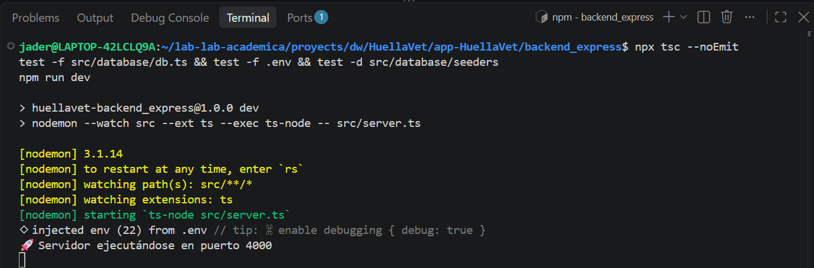

# 4. ISS-03-A — Feature Owner —  (modelo, esqueleto, HTTP, cableado)

## 4.1 Modelo Owner

```         
: > src/features/business/client/client.model.ts
cat >> src/features/business/client/client.model.ts << 'EOF'
import { DataTypes, Model } from "sequelize";
import { sequelize } from "../../../database/db";
import bcrypt from "bcryptjs";

export interface ClientI {
  id?: number;
  name: string;
  address: string;
  phone: string;
  email: string;
  password: string;
  status: "active" | "inactive";
  createdAt?: Date;
  updatedAt?: Date;
}

export class Client extends Model {
  public id!: number;
  public name!: string;
  public address!: string;
  public phone!: string;
  public email!: string;
  public password!: string;
  public status!: "active" | "inactive";
  public readonly createdAt!: Date;
  public readonly updatedAt!: Date;
}

Client.init(
  {
    name: {
      type: DataTypes.STRING,
      allowNull: true,
    },
    address: {
      type: DataTypes.STRING,
      allowNull: true,
    },
    phone: {
      type: DataTypes.STRING,
      allowNull: true,
      validate: {
        notEmpty: { msg: "Phone cannot be empty" },
      },
    },
    email: {
      type: DataTypes.STRING,
      allowNull: true,
      unique: true,
      validate: {
        isEmail: { msg: "Email must be a valid email address" },
      },
    },
    password: {
      type: DataTypes.STRING,
      allowNull: true,
    },
    status: {
      type: DataTypes.ENUM("active", "inactive"),
      defaultValue: "inactive",
      allowNull: false,
    },
  },
  {
    sequelize,
    modelName: "Client",
    tableName: "clients",
    timestamps: true,
    hooks: {
      beforeCreate: async (client: Client) => {
        if (client.password) {
          const salt = await bcrypt.genSalt(10);
          client.password = await bcrypt.hash(client.password, salt);
        }
      },
      beforeUpdate: async (client: Client) => {
        if (client.changed("password") && client.password) {
          const salt = await bcrypt.genSalt(10);
          client.password = await bcrypt.hash(client.password, salt);
        }
      },
      beforeBulkCreate: async (clients: Client[]) => {
        for (const client of clients) {
          if (client.password) {
            const salt = await bcrypt.genSalt(10);
            client.password = await bcrypt.hash(client.password, salt);
          }
        }
      },
    },
  }
);
EOF
```

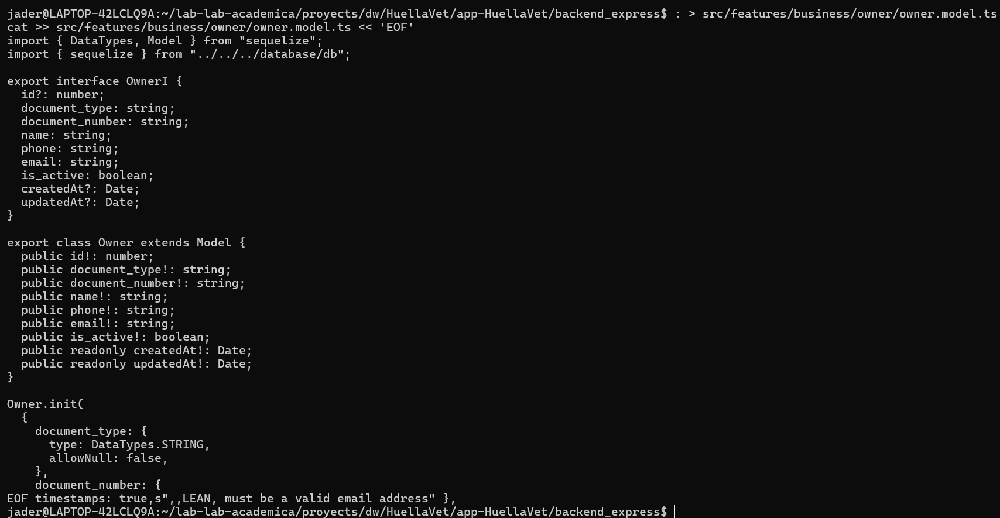

## 4.2 Esqueleto controller / routes + carpeta HTTP

```         
: > src/features/business/client/client.controller.ts
cat >> src/features/business/client/client.controller.ts << 'EOF'
import { Request, Response } from "express";
import { Client, ClientI } from "./client.model";

function paramId(req: Request): number {
  const raw = req.params.id;
  const value = Array.isArray(raw) ? raw[0] : raw;
  return Number(value);
}

export class ClientController {
  // ================== READ ==================
  // (rellenar en ISS-03-B) getAll, luego getOne

  // ================== CREATE ==================
  // (rellenar en ISS-03-C)

  // ================== UPDATE ==================
  // (rellenar en ISS-03-D)

  // ================== DELETE ==================
  // (rellenar en ISS-03-E)
}
EOF
```

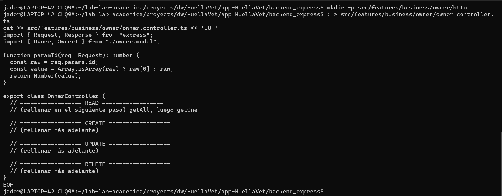

```         
: > src/features/business/client/client.routes.ts
cat >> src/features/business/client/client.routes.ts << 'EOF'
import { Application } from "express";
import { ClientController } from "./client.controller";

export class ClientRoutes {
  public clientController: ClientController = new ClientController();

  public routes(app: Application): void {
    // ================== RUTAS SIN AUTENTICACIÓN / SIN MIDDLEWARE JWT ==================
    // (rellenar en ISS-03-B…E)
  }
}
EOF
```

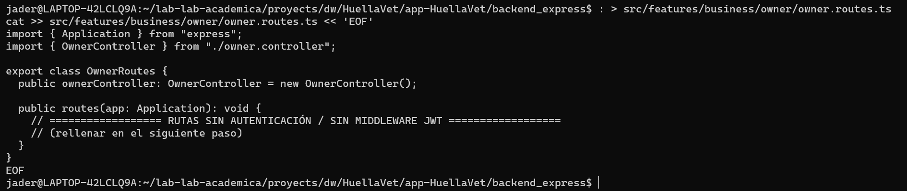

## 4.3 Agregador Routes + cableado en Config

```         
: > src/routes/index.ts
cat >> src/routes/index.ts << 'EOF'
import { ClientRoutes } from "../features/business/client/client.routes";

export class Routes {
  public clientRoutes: ClientRoutes = new ClientRoutes();
}
EOF
```

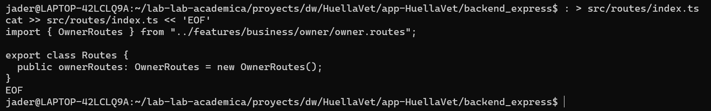

**PARCHE** — `src/config/index.ts` **ya existe**.

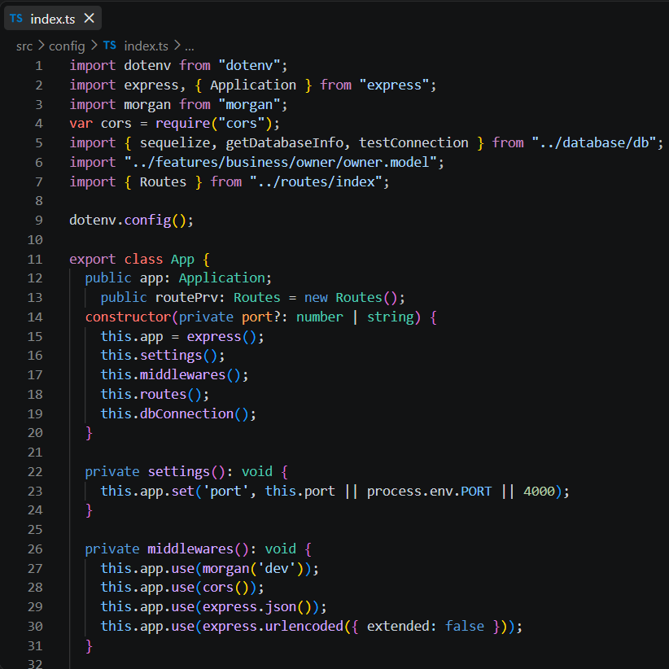

### Verificación ISS-03-A

``` bash
test -d src/features/business/client/http && echo HTTP_FOLDER_OK
```

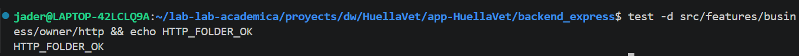

### Cierre del ISSUE-03-A

``` bash
npm run dev
```

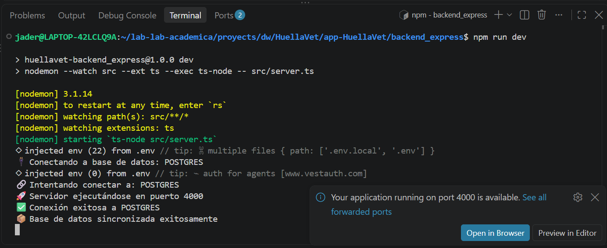

# 5. ISS-03-B — Feature Owner — GetAll y GetOne

### Controller — PARCHE `owner.controller.ts`

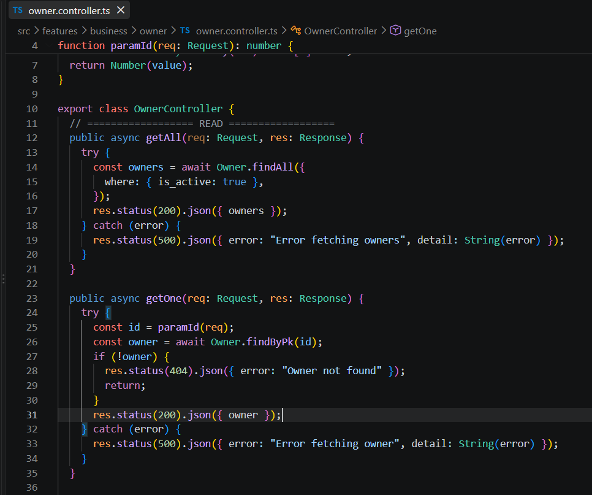

### Rutas — PARCHE `owner.routes.ts`

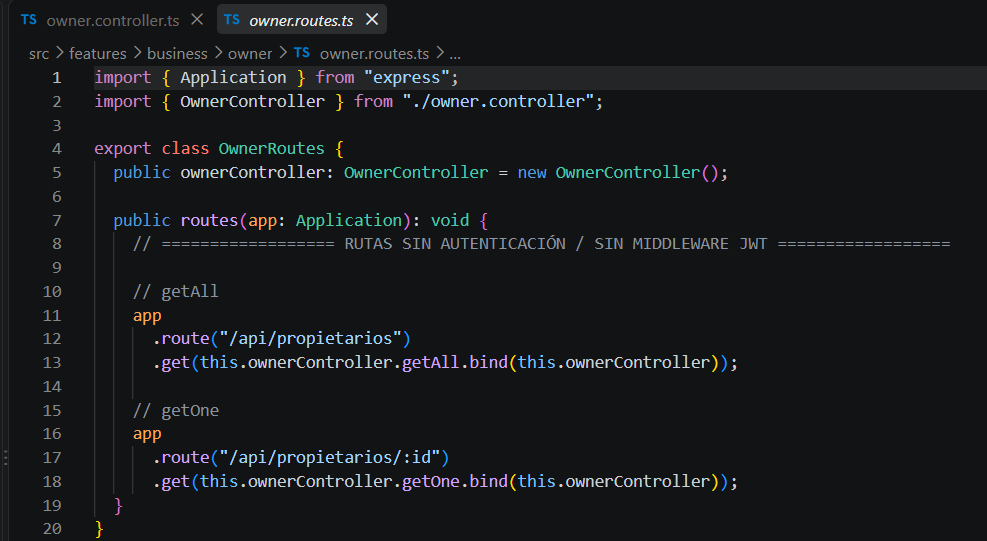

### HTTP — archivo nuevo

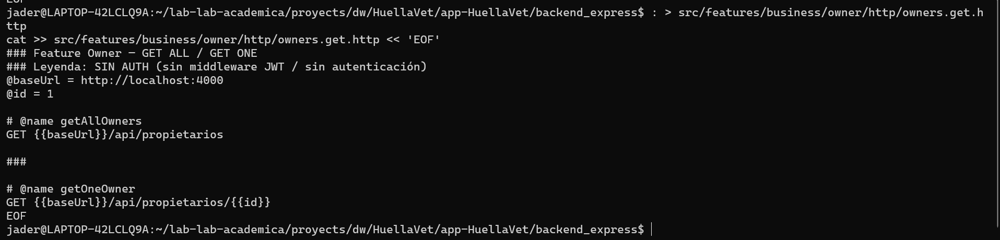

### Verificación

``` bash
curl -s http://localhost:4000/api/clientes curl -s http://localhost:4000/api/clientes/1
```

### Cierre del ISSUE-03-B

``` bash
npm run dev
```

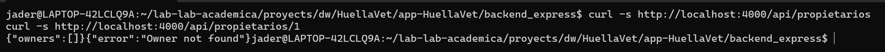](images/clipboard-1793068076.png)

# 6.ISS-03-C — Feature Owner: Crear owner

### Controller — PARCHE `owner.controller.ts`

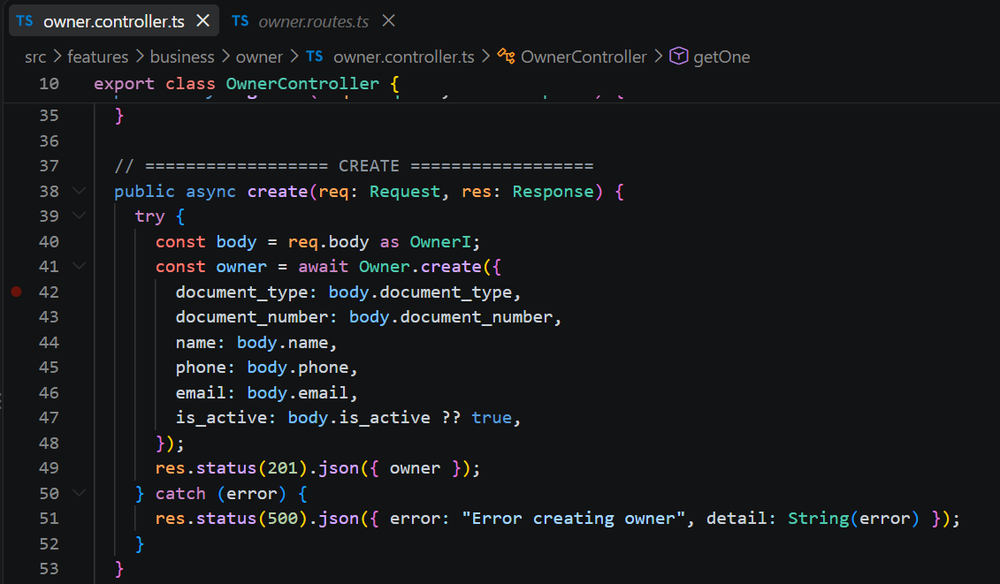

### Rutas — PARCHE `owner.routes.ts`

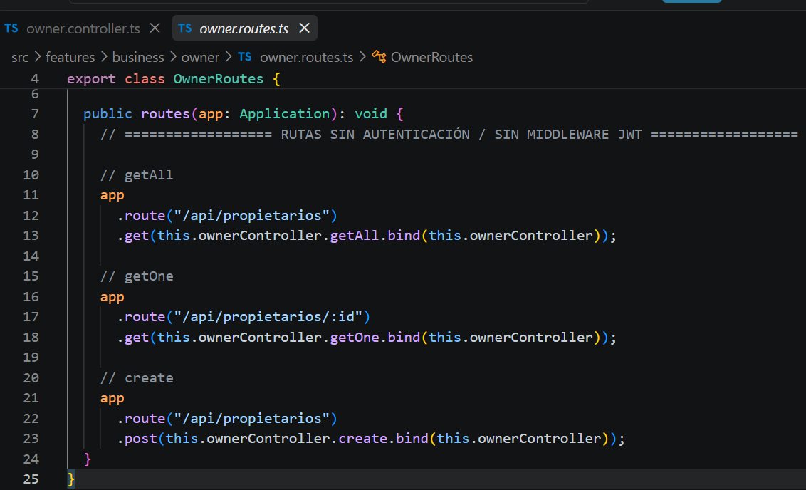

### HTTP — archivo nuevo

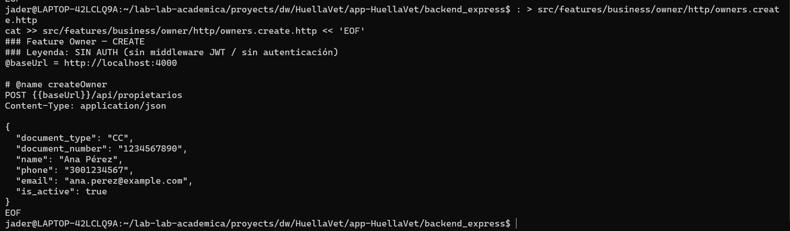

### Verificación

``` bash
curl -s -X POST http://localhost:4000/api/clientes \   -H 'Content-Type: application/json' \   -d '{"name":"Ana","phone":"3001","email":"ana@test.com","password":"Password123!","status":"active"}'
```

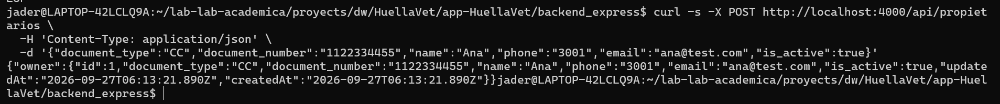

### Cierre del ISSUE-03-C

```         
npm run dev
```

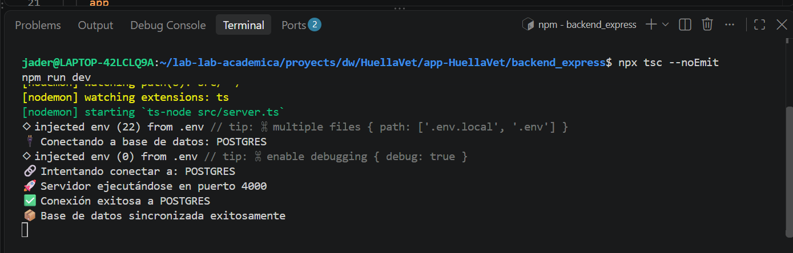

# 7.ISS-03-D — Feature Owner: Update (PUT) y Update (PATCH)

### Controller — PARCHE `owner.controller.ts`

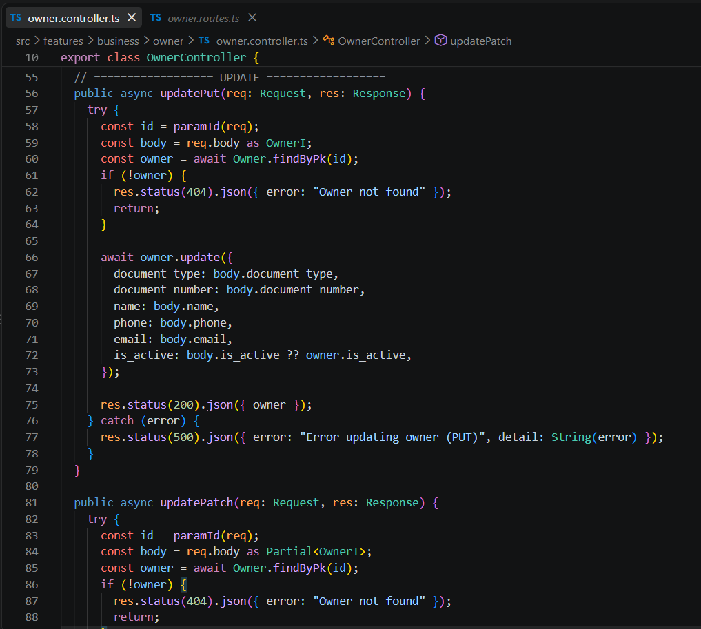

### Rutas — PARCHE `owner.routes.ts`

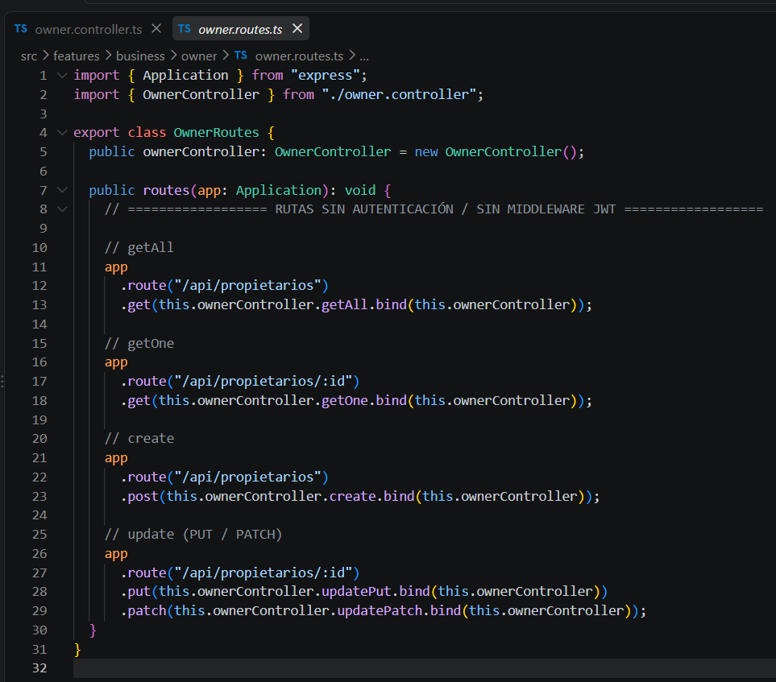

### HTTP — archivo nuevo

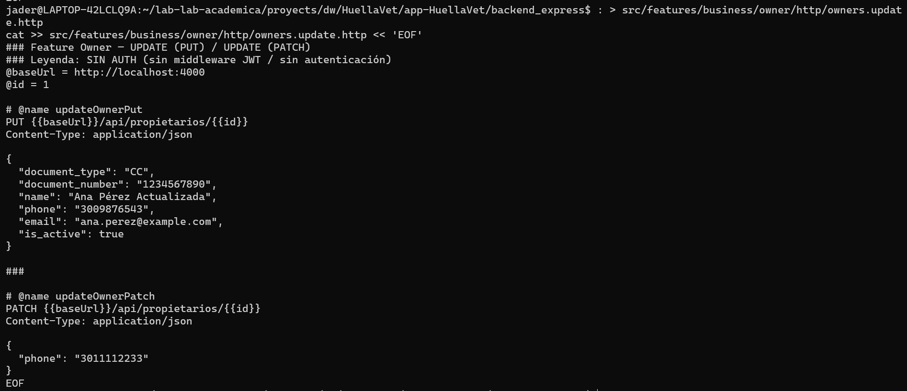

### Verificación

``` bash
curl -s -X PUT http://localhost:4000/api/clientes/1 -H 'Content-Type: application/json' \   -d '{"name":"Ana","address":"x","phone":"300","email":"ana@test.com","status":"active"}' curl -s -X PATCH http://localhost:4000/api/clientes/1 -H 'Content-Type: application/json' \   -d '{"phone":"301"}'
```

### Cierre del ISSUE-03-D

``` bash
npm run dev
```

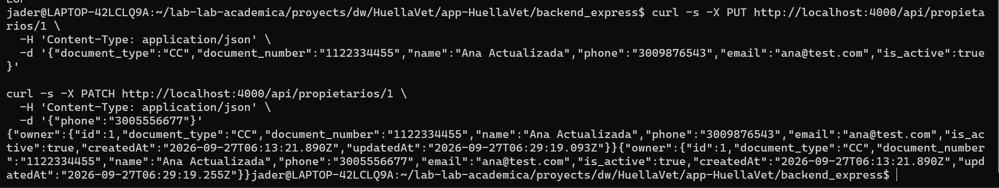](images/clipboard-2140658122.png)

# 8.ISS-03-E — Feature Owner: Eliminar (físico y lógico)

### Controller — PARCHE `owner.controller.ts`

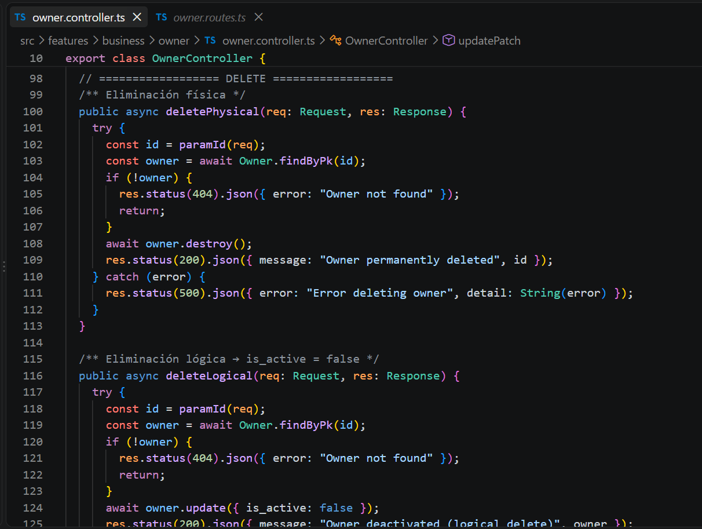

### Rutas — PARCHE `owner.routes.ts`

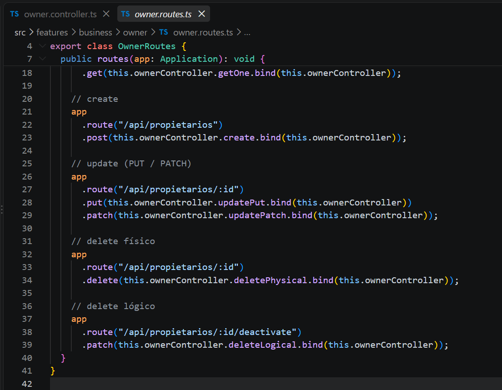

### HTTP — archivo nuevo

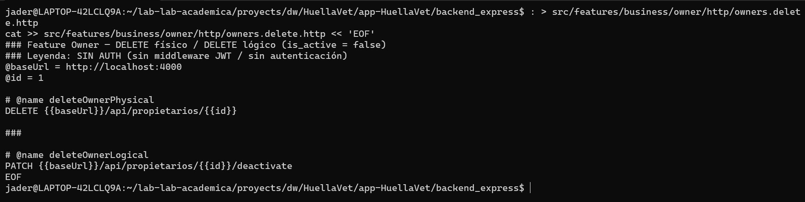

### Verificación

### 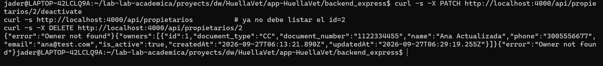

### Cierre del ISSUE-03-E

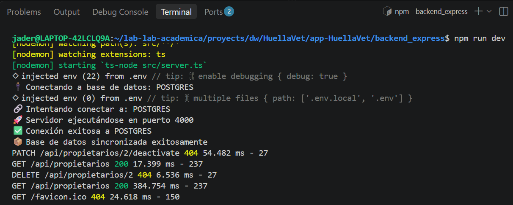

# 9. ISS-04 – Owner – Seeders con Faker (feature + runner externo)

```         
npm install -D @faker-js/faker@^10.6.0
```

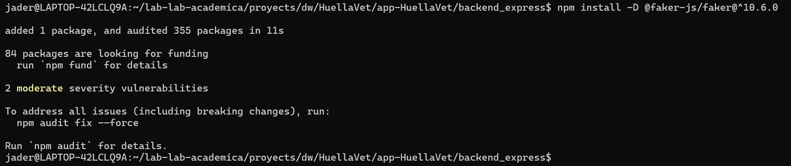

```         
: > src/features/business/client/client.seeder.ts
cat >> src/features/business/client/client.seeder.ts << 'EOF'
import { faker } from "@faker-js/faker";
import { Client } from "./client.model";

/**
 * Seeder del feature Client (datos falsos con @faker-js/faker).
 * Se invoca desde `src/database/seeders` (SeedersRunner), no desde la App.
 *
 * Idempotente: si ya hay filas, no vuelve a insertar.
 */
export async function seedClients(count: number): Promise<number> {
  if (count <= 0) {
    console.log("⏭️  clients: count=0, se omite");
    return 0;
  }

  const existing = await Client.count();
  if (existing > 0) {
    console.log(`⏭️  clients: ya hay ${existing} registro(s), se omite seeder`);
    return 0;
  }

  const rows = Array.from({ length: count }, (_, i) => ({
    name: faker.person.fullName(),
    address: faker.location.streetAddress(),
    phone: faker.phone.number({ style: "national" }),
    email: `client.${i}.${faker.string.alphanumeric(6)}@example.com`.toLowerCase(),
    password: "Password123!",
    status: "active" as const,
  }));

  await Client.bulkCreate(rows);
  console.log(`✅ clients: insertados ${count} registro(s) falsos`);
  return count;
}
EOF
```

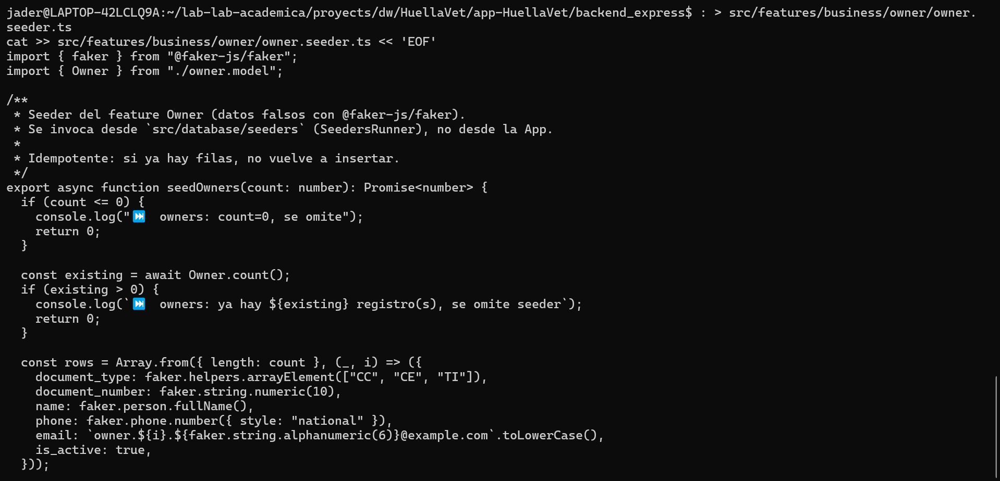

## 9.2 3. Conteos (`database/seeders/counts.ts`)

```         
: > src/database/seeders/counts.ts
cat >> src/database/seeders/counts.ts << 'EOF'
/**
 * Cantidad de registros por feature/entidad.
 * Prioridad: CLI (--clients=N) > env (SEED_CLIENTS) > default de este archivo.
 *
 * Cuando agregues features, suma aquí la clave y léela en el runner.
 */
export type SeedCounts = {
  clients: number;
  // users?: number;
  // roles?: number;
  // products?: number;
};

export const DEFAULT_SEED_COUNTS: SeedCounts = {
  clients: 10,
};

export function resolveSeedCounts(argv: string[] = process.argv.slice(2)): SeedCounts {
  const counts: SeedCounts = { ...DEFAULT_SEED_COUNTS };

  const envClients = process.env.SEED_CLIENTS;
  if (envClients !== undefined && envClients !== "") {
    counts.clients = Number(envClients);
  }

  for (const arg of argv) {
    const m = arg.match(/^--([a-zA-Z_]+)=(\d+)$/);
    if (!m) continue;
    const key = m[1] as keyof SeedCounts;
    const value = Number(m[2]);
    if (key in counts) {
      counts[key] = value;
    }
  }

  return counts;
}
EOF
```

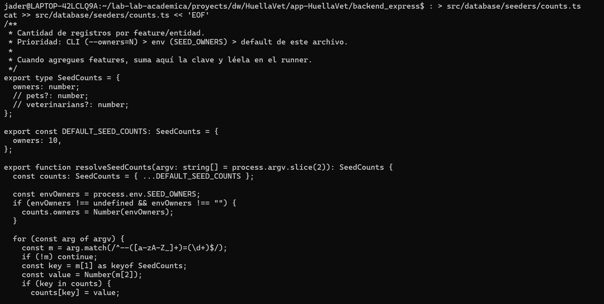

### 9.2.2 Runner (`database/seeders/index.ts`)

```         
: > src/database/seeders/index.ts
cat >> src/database/seeders/index.ts << 'EOF'
import dotenv from "dotenv";
import { sequelize, testConnection } from "../db";
import "../../features/business/client/client.model";
import { seedClients } from "../../features/business/client/client.seeder";
import { resolveSeedCounts } from "./counts";

dotenv.config();

/**
 * SeedersRunner — ejecuta TODOS los seeders de features.
 *
 * Ubicación: `src/database/seeders/` (orquestación fuera de cada feature).
 * Cada feature exporta su seeder (ej. `features/business/client/client.seeder.ts`).
 *
 * Uso:
 *   npm run db:seed
 *   npm run db:seed -- --clients=20
 *   SEED_CLIENTS=5 npm run db:seed
 */
export async function runAllSeeders(): Promise<void> {
  const counts = resolveSeedCounts();
  console.log("🌱 Iniciando SeedersRunner...");
  console.log("📊 Conteos:", counts);

  const ok = await testConnection();
  if (!ok) {
    throw new Error("No hay conexión a la base de datos");
  }

  await sequelize.sync({ force: false, alter: true });

  // Orden: business (padres → hijos)
  await seedClients(counts.clients);

  console.log("🌱 SeedersRunner finalizado");
}

if (require.main === module) {
  runAllSeeders()
    .then(async () => {
      await sequelize.close();
      process.exit(0);
    })
    .catch(async (err) => {
      console.error("❌ Error en seeders:", err);
      await sequelize.close();
      process.exit(1);
    });
}
EOF
```

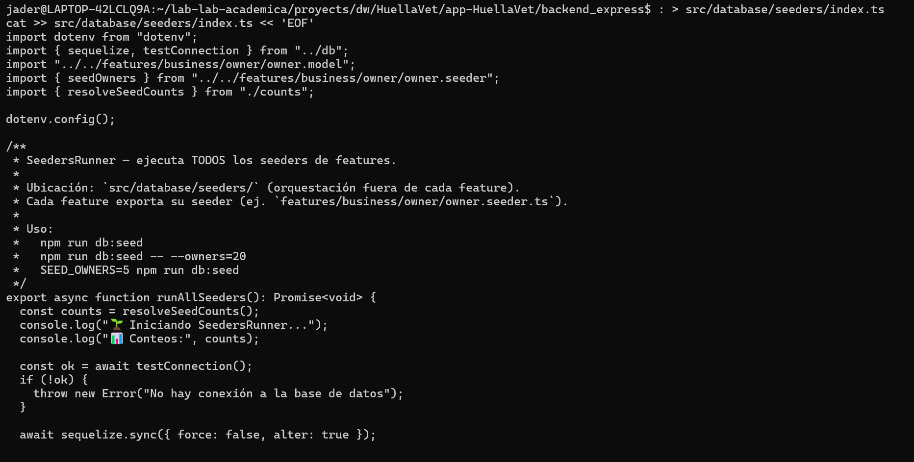

**PARCHE** — `package.json` **ya existe**.

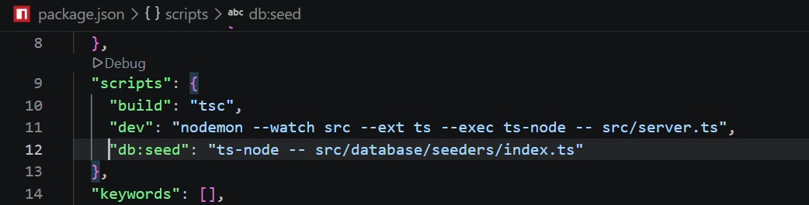

### Verificación ISS-04

```         
npm run db:seed
npm run db:seed -- --clients=20
SEED_CLIENTS=5 npm run db:seed
```

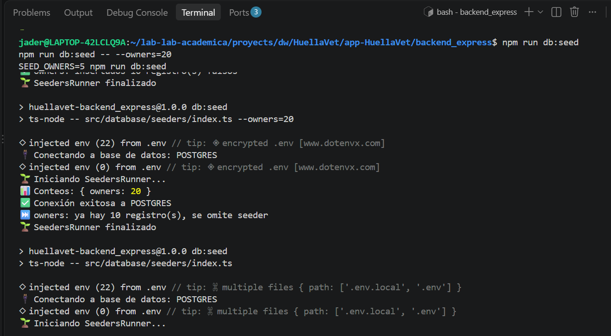

### Cierre del ISS

```         
npm run dev
```

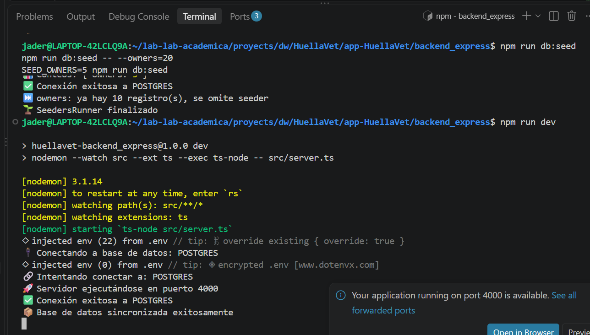

# 10. ISS-05 – Owner Swagger / OpenAPI (feature + registry externo)

## 10.1 OpenAPI dentro del feature Owner

```         
# Paquetes (una vez)
npm install swagger-ui-express@^5.0.1
npm install -D @types/swagger-ui-express@^4.1.8
```

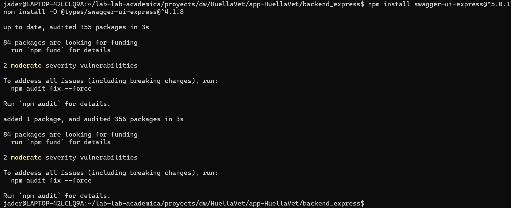

```         
: > src/features/business/client/client.swagger.ts
cat >> src/features/business/client/client.swagger.ts << 'EOF'
/**
 * Documentación OpenAPI del feature Client.
 * Se agrega desde `src/swagger` (registry externo), no se monta aquí.
 *
 * Leyenda: endpoints documentados como SIN AUTH (sin middleware JWT).
 */

export const clientSwagger = {
  tags: [
    {
      name: "Clientes",
      description: "CRUD de clientes — **SIN AUTH** (sin middleware JWT)",
    },
  ],
  paths: {
    "/api/clientes": {
      get: {
        tags: ["Clientes"],
        summary: "Listar clientes activos",
        description: "SIN AUTH — retorna clientes con status=active (sin password)",
        security: [],
        responses: {
          "200": {
            description: "Lista de clientes",
            content: {
              "application/json": {
                schema: {
                  type: "object",
                  properties: {
                    clients: {
                      type: "array",
                      items: { $ref: "#/components/schemas/Client" },
                    },
                  },
                },
              },
            },
          },
        },
      },
      post: {
        tags: ["Clientes"],
        summary: "Crear cliente",
        description: "SIN AUTH",
        security: [],
        requestBody: {
          required: true,
          content: {
            "application/json": {
              schema: { $ref: "#/components/schemas/ClientCreate" },
            },
          },
        },
        responses: {
          "201": {
            description: "Cliente creado",
            content: {
              "application/json": {
                schema: {
                  type: "object",
                  properties: {
                    client: { $ref: "#/components/schemas/Client" },
                  },
                },
              },
            },
          },
        },
      },
    },
    "/api/clientes/{id}": {
      get: {
        tags: ["Clientes"],
        summary: "Obtener cliente por id",
        description: "SIN AUTH",
        security: [],
        parameters: [
          {
            name: "id",
            in: "path",
            required: true,
            schema: { type: "integer" },
          },
        ],
        responses: {
          "200": {
            description: "Cliente encontrado",
            content: {
              "application/json": {
                schema: {
                  type: "object",
                  properties: {
                    client: { $ref: "#/components/schemas/Client" },
                  },
                },
              },
            },
          },
          "404": { description: "No encontrado" },
        },
      },
      put: {
        tags: ["Clientes"],
        summary: "Actualizar cliente (PUT — reemplazo)",
        description: "SIN AUTH",
        security: [],
        parameters: [
          {
            name: "id",
            in: "path",
            required: true,
            schema: { type: "integer" },
          },
        ],
        requestBody: {
          required: true,
          content: {
            "application/json": {
              schema: { $ref: "#/components/schemas/ClientUpdate" },
            },
          },
        },
        responses: {
          "200": { description: "Actualizado" },
          "404": { description: "No encontrado" },
        },
      },
      patch: {
        tags: ["Clientes"],
        summary: "Actualizar cliente (PATCH — parcial)",
        description: "SIN AUTH",
        security: [],
        parameters: [
          {
            name: "id",
            in: "path",
            required: true,
            schema: { type: "integer" },
          },
        ],
        requestBody: {
          required: true,
          content: {
            "application/json": {
              schema: { $ref: "#/components/schemas/ClientPatch" },
            },
          },
        },
        responses: {
          "200": { description: "Actualizado" },
          "404": { description: "No encontrado" },
        },
      },
      delete: {
        tags: ["Clientes"],
        summary: "Eliminar cliente (físico)",
        description: "SIN AUTH — borra la fila",
        security: [],
        parameters: [
          {
            name: "id",
            in: "path",
            required: true,
            schema: { type: "integer" },
          },
        ],
        responses: {
          "200": { description: "Eliminado" },
          "404": { description: "No encontrado" },
        },
      },
    },
    "/api/clientes/{id}/deactivate": {
      patch: {
        tags: ["Clientes"],
        summary: "Eliminar cliente (lógico)",
        description: "SIN AUTH — status = inactive",
        security: [],
        parameters: [
          {
            name: "id",
            in: "path",
            required: true,
            schema: { type: "integer" },
          },
        ],
        responses: {
          "200": { description: "Desactivado" },
          "404": { description: "No encontrado" },
        },
      },
    },
  },
  components: {
    schemas: {
      Client: {
        type: "object",
        properties: {
          id: { type: "integer", example: 1 },
          name: { type: "string", example: "Ana Pérez" },
          address: { type: "string", example: "Calle 10 #20-30" },
          phone: { type: "string", example: "3001234567" },
          email: { type: "string", format: "email", example: "ana@example.com" },
          status: { type: "string", enum: ["active", "inactive"], example: "active" },
          createdAt: { type: "string", format: "date-time" },
          updatedAt: { type: "string", format: "date-time" },
        },
      },
      ClientCreate: {
        type: "object",
        required: ["name", "phone", "email", "password"],
        properties: {
          name: { type: "string" },
          address: { type: "string" },
          phone: { type: "string" },
          email: { type: "string", format: "email" },
          password: { type: "string", format: "password" },
          status: { type: "string", enum: ["active", "inactive"], default: "active" },
        },
      },
      ClientUpdate: {
        type: "object",
        required: ["name", "phone", "email"],
        properties: {
          name: { type: "string" },
          address: { type: "string" },
          phone: { type: "string" },
          email: { type: "string", format: "email" },
          password: { type: "string", format: "password" },
          status: { type: "string", enum: ["active", "inactive"] },
        },
      },
      ClientPatch: {
        type: "object",
        properties: {
          name: { type: "string" },
          address: { type: "string" },
          phone: { type: "string" },
          email: { type: "string", format: "email" },
          password: { type: "string", format: "password" },
          status: { type: "string", enum: ["active", "inactive"] },
        },
      },
    },
  },
};
EOF
```

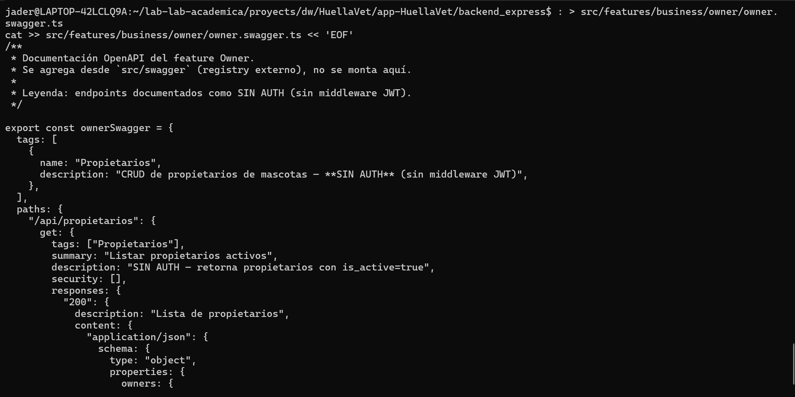

## 10.2 Registry externo + montaje en Config

```         
: > src/swagger/index.ts
cat >> src/swagger/index.ts << 'EOF'
import { Application } from "express";
import swaggerUi from "swagger-ui-express";
import { clientSwagger } from "../features/business/client/client.swagger";

export type FeatureSwaggerModule = {
  tags: unknown[];
  paths: Record<string, unknown>;
  components?: { schemas?: Record<string, unknown> };
};

/**
 * Registry externo: importa la documentación OpenAPI de cada feature
 * (mismo patrón que SeedersRunner).
 */
const featureSwaggerModules: FeatureSwaggerModule[] = [
  clientSwagger,
  // productSwagger,
  // userSwagger,
];

export function buildOpenApiDocument() {
  const tags: unknown[] = [];
  const paths: Record<string, unknown> = {};
  const schemas: Record<string, unknown> = {};

  for (const mod of featureSwaggerModules) {
    tags.push(...mod.tags);
    Object.assign(paths, mod.paths);
    if (mod.components?.schemas) {
      Object.assign(schemas, mod.components.schemas);
    }
  }

  return {
    openapi: "3.0.3",
    info: {
      title: "StoreLab API",
      version: "1.0.0",
      description:
        "API StoreLab (Express + Sequelize). Los endpoints de Client están documentados como **SIN AUTH** Todas las rutas business son **SIN AUTH** en este lab.",
    },
    servers: [
      {
        url: `http://localhost:${process.env.PORT || 4000}`,
        description: "Local",
      },
    ],
    tags,
    paths,
    components: { schemas },
  };
}

/** Monta Swagger UI y el JSON OpenAPI */
export function setupSwagger(app: Application): void {
  const document = buildOpenApiDocument();
  app.use("/api/docs", swaggerUi.serve, swaggerUi.setup(document));
  app.get("/api/docs.json", (_req, res) => {
    res.json(document);
  });
  console.log("📘 Swagger UI: /api/docs  |  OpenAPI JSON: /api/docs.json");
}
EOF
```

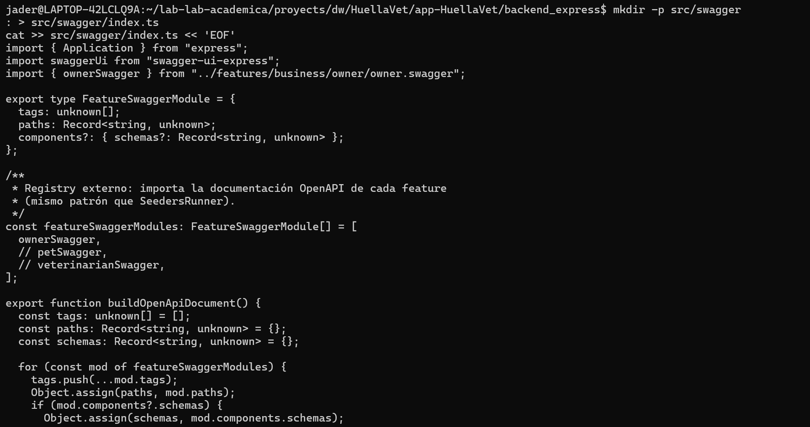

**PARCHE** — `src/config/index.ts` **ya existe**.

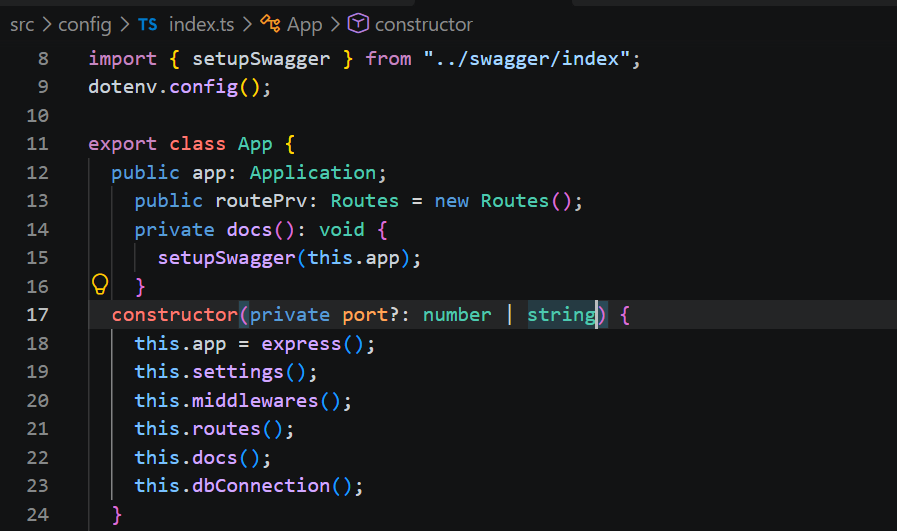

### Verificación ISS-05

```         
curl -s http://localhost:4000/api/docs.json | head
```

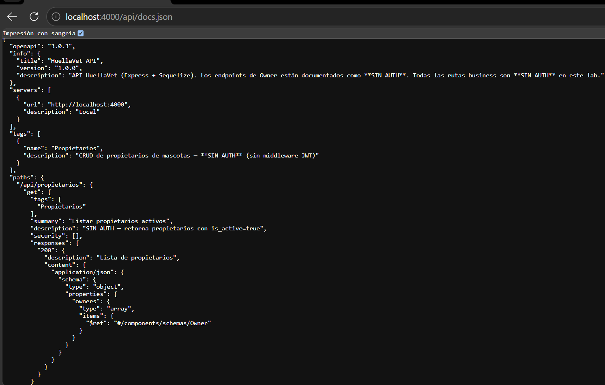

### Cierre del ISS

``` bash
npm run dev
```

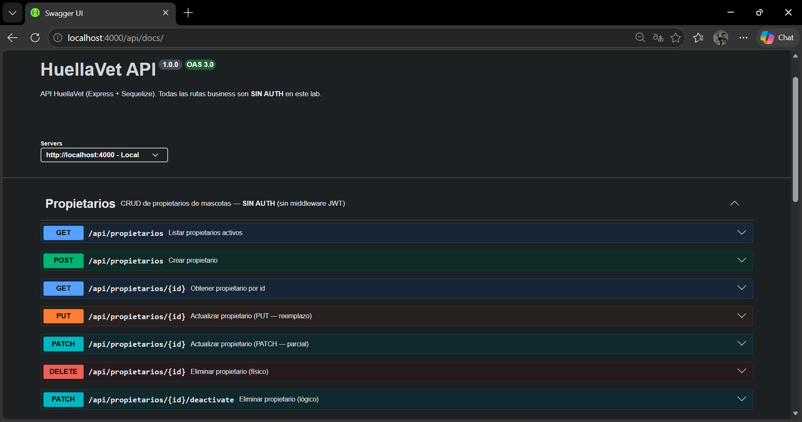](images/clipboard-993005702.png)

# 11. ISS-06 — Feature PET (Mascotas)

## 11.1 Modelo Pet

```         
: > src/features/business/product-type/product-type.model.ts
cat >> src/features/business/product-type/product-type.model.ts << 'EOF'
import { DataTypes, Model } from "sequelize";
import { sequelize } from "../../../database/db";

export interface ProductTypeI {
  id?: number;
  name: string;
  description?: string | null;
  status: "active" | "inactive";
  createdAt?: Date;
  updatedAt?: Date;
}

export class ProductType extends Model {
  public id!: number;
  public name!: string;
  public description!: string | null;
  public status!: "active" | "inactive";
  public readonly createdAt!: Date;
  public readonly updatedAt!: Date;
}

ProductType.init(
  {
    name: {
      type: DataTypes.STRING,
      allowNull: false,
    },
    description: {
      type: DataTypes.STRING,
      allowNull: true,
    },
    status: {
      type: DataTypes.ENUM("active", "inactive"),
      defaultValue: "inactive",
      allowNull: false,
    },
  },
  {
    sequelize,
    modelName: "ProductType",
    tableName: "product_types",
    timestamps: true,
  }
);
EOF
```

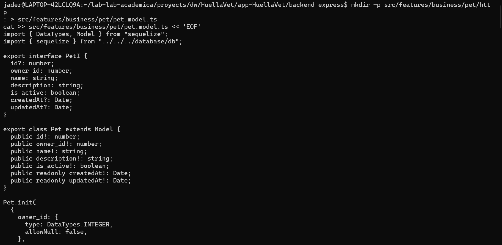

## 11.2 Controller + routes (CRUD completo)

```         
: > src/features/business/product-type/product-type.controller.ts
cat >> src/features/business/product-type/product-type.controller.ts << 'EOF'
import { Request, Response } from "express";
import { ProductType, ProductTypeI } from "./product-type.model";

function paramId(req: Request): number {
  const raw = req.params.id;
  const value = Array.isArray(raw) ? raw[0] : raw;
  return Number(value);
}

export class ProductTypeController {
  // ================== READ ==================
  public async getAll(req: Request, res: Response) {
    try {
      const product_types = await ProductType.findAll({
        where: { status: "active" },
      });
      res.status(200).json({ product_types });
    } catch (error) {
      res.status(500).json({ error: "Error fetching product types", detail: String(error) });
    }
  }

  public async getOne(req: Request, res: Response) {
    try {
      const id = paramId(req);
      const product_type = await ProductType.findByPk(id);
      if (!product_type) {
        res.status(404).json({ error: "Product type not found" });
        return;
      }
      res.status(200).json({ product_type });
    } catch (error) {
      res.status(500).json({ error: "Error fetching product type", detail: String(error) });
    }
  }

  // ================== CREATE ==================
  public async create(req: Request, res: Response) {
    try {
      const body = req.body as ProductTypeI;
      const product_type = await ProductType.create({
        name: body.name,
        description: body.description ?? null,
        status: body.status ?? "active",
      });
      res.status(201).json({ product_type });
    } catch (error) {
      res.status(500).json({ error: "Error creating product type", detail: String(error) });
    }
  }

  // ================== UPDATE ==================
  public async updatePut(req: Request, res: Response) {
    try {
      const id = paramId(req);
      const body = req.body as ProductTypeI;
      const product_type = await ProductType.findByPk(id);
      if (!product_type) {
        res.status(404).json({ error: "Product type not found" });
        return;
      }

      await product_type.update({
        name: body.name,
        description: body.description ?? null,
        status: body.status ?? product_type.status,
      });

      res.status(200).json({ product_type });
    } catch (error) {
      res.status(500).json({ error: "Error updating product type (PUT)", detail: String(error) });
    }
  }

  public async updatePatch(req: Request, res: Response) {
    try {
      const id = paramId(req);
      const body = req.body as Partial<ProductTypeI>;
      const product_type = await ProductType.findByPk(id);
      if (!product_type) {
        res.status(404).json({ error: "Product type not found" });
        return;
      }

      await product_type.update(body);
      res.status(200).json({ product_type });
    } catch (error) {
      res.status(500).json({ error: "Error updating product type (PATCH)", detail: String(error) });
    }
  }

  // ================== DELETE ==================
  /** Eliminación física */
  public async deletePhysical(req: Request, res: Response) {
    try {
      const id = paramId(req);
      const product_type = await ProductType.findByPk(id);
      if (!product_type) {
        res.status(404).json({ error: "Product type not found" });
        return;
      }
      await product_type.destroy();
      res.status(200).json({ message: "Product type permanently deleted", id });
    } catch (error) {
      res.status(500).json({ error: "Error deleting product type", detail: String(error) });
    }
  }

  /** Eliminación lógica → status = inactive */
  public async deleteLogical(req: Request, res: Response) {
    try {
      const id = paramId(req);
      const product_type = await ProductType.findByPk(id);
      if (!product_type) {
        res.status(404).json({ error: "Product type not found" });
        return;
      }
      await product_type.update({ status: "inactive" });
      res.status(200).json({
        message: "Product type deactivated (logical delete)",
        product_type,
      });
    } catch (error) {
      res.status(500).json({ error: "Error deactivating product type", detail: String(error) });
    }
  }
}
EOF
```

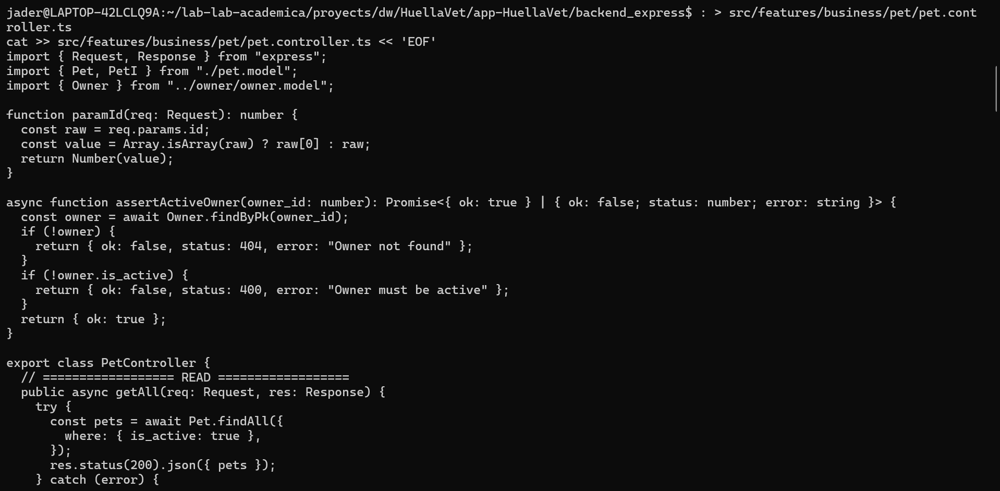

```         
: > src/features/business/product-type/product-type.routes.ts
cat >> src/features/business/product-type/product-type.routes.ts << 'EOF'
import { Application } from "express";
import { ProductTypeController } from "./product-type.controller";

export class ProductTypeRoutes {
  public productTypeController: ProductTypeController = new ProductTypeController();

  public routes(app: Application): void {
    // ================== RUTAS SIN AUTENTICACIÓN / SIN MIDDLEWARE JWT ==================

    // getAll
    app
      .route("/api/tipos-producto")
      .get(this.productTypeController.getAll.bind(this.productTypeController));

    // getOne
    app
      .route("/api/tipos-producto/:id")
      .get(this.productTypeController.getOne.bind(this.productTypeController));

    // create
    app
      .route("/api/tipos-producto")
      .post(this.productTypeController.create.bind(this.productTypeController));

    // update (PUT / PATCH)
    app
      .route("/api/tipos-producto/:id")
      .put(this.productTypeController.updatePut.bind(this.productTypeController))
      .patch(this.productTypeController.updatePatch.bind(this.productTypeController));

    // delete físico
    app
      .route("/api/tipos-producto/:id")
      .delete(this.productTypeController.deletePhysical.bind(this.productTypeController));

    // delete lógico
    app
      .route("/api/tipos-producto/:id/deactivate")
      .patch(this.productTypeController.deleteLogical.bind(this.productTypeController));
  }
}
EOF
```

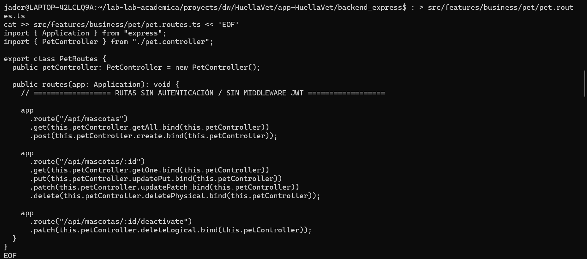

## 11.3 HTTP (REST Client)

```         
: > src/features/business/product-type/http/product-types.get.http
cat >> src/features/business/product-type/http/product-types.get.http << 'EOF'
### Feature ProductType — GET ALL / GET ONE
### Leyenda: SIN AUTH (sin middleware JWT / sin autenticación)
@baseUrl = http://localhost:4000
@id = 1

# @name getAllProductTypes
GET {{baseUrl}}/api/tipos-producto

###

# @name getOneProductType
GET {{baseUrl}}/api/tipos-producto/{{id}}
EOF
```

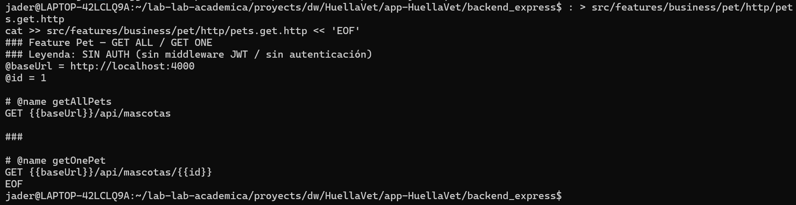

```         
: > src/features/business/product-type/http/product-types.create.http
cat >> src/features/business/product-type/http/product-types.create.http << 'EOF'
### Feature ProductType — CREATE
### Leyenda: SIN AUTH (sin middleware JWT / sin autenticación)
@baseUrl = http://localhost:4000

# @name createProductType
POST {{baseUrl}}/api/tipos-producto
Content-Type: application/json

{
  "name": "Electrónica",
  "description": "Dispositivos y accesorios",
  "status": "active"
}
EOF
```

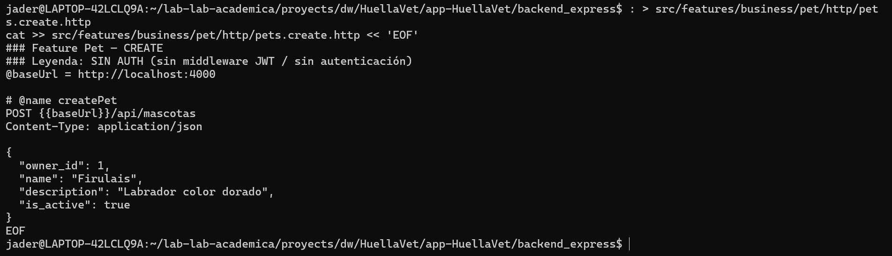

```         
: > src/features/business/product-type/http/product-types.update.http
cat >> src/features/business/product-type/http/product-types.update.http << 'EOF'
### Feature ProductType — UPDATE (PUT) / UPDATE (PATCH)
### Leyenda: SIN AUTH (sin middleware JWT / sin autenticación)
@baseUrl = http://localhost:4000
@id = 1

# @name updateProductTypePut
PUT {{baseUrl}}/api/tipos-producto/{{id}}
Content-Type: application/json

{
  "name": "Electrónica Actualizada",
  "description": "Categoría renovada",
  "status": "active"
}

###

# @name updateProductTypePatch
PATCH {{baseUrl}}/api/tipos-producto/{{id}}
Content-Type: application/json

{
  "description": "Descripción parcial"
}
EOF
```

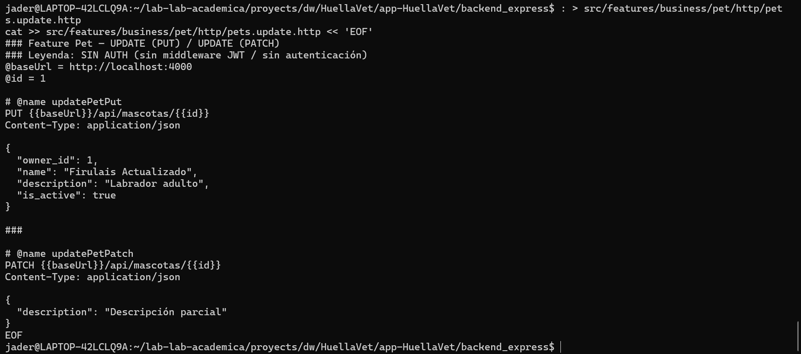

```         
: > src/features/business/product-type/http/product-types.delete.http
cat >> src/features/business/product-type/http/product-types.delete.http << 'EOF'
### Feature ProductType — DELETE físico / DELETE lógico (status = inactive)
### Leyenda: SIN AUTH (sin middleware JWT / sin autenticación)
@baseUrl = http://localhost:4000
@id = 1

# @name deleteProductTypePhysical
DELETE {{baseUrl}}/api/tipos-producto/{{id}}

###

# @name deleteProductTypeLogical
PATCH {{baseUrl}}/api/tipos-producto/{{id}}/deactivate
EOF
```

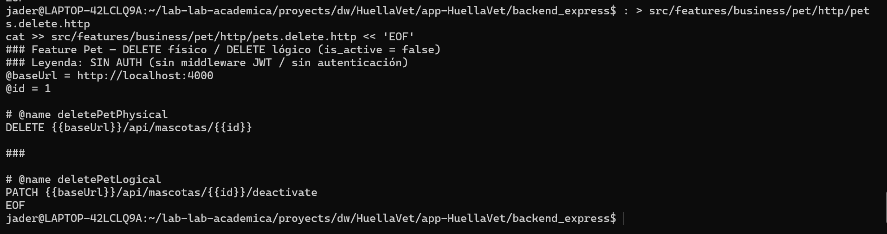

## 11.4 Cableado Routes + Config

**PARCHE** — `src/routes/index.ts` **ya existe**.

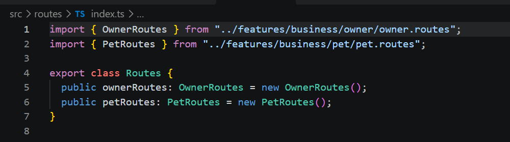

**PARCHE** — `src/config/index.ts` **ya existe**.

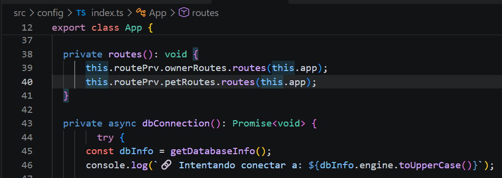

### Verificación

```         
curl -s -X POST http://localhost:4000/api/tipos-producto -H 'Content-Type: application/json' \
  -d '{"name":"Bebidas","description":"Refrescos","status":"active"}'
curl -s http://localhost:4000/api/tipos-producto
```

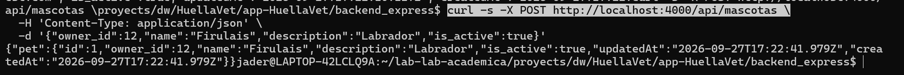

## 11.5 Seeder ProductType

```         
: > src/features/business/product-type/product-type.seeder.ts
cat >> src/features/business/product-type/product-type.seeder.ts << 'EOF'
import { faker } from "@faker-js/faker";
import { ProductType } from "./product-type.model";

/**
 * Seeder del feature ProductType (datos falsos con @faker-js/faker).
 * Se invoca desde `src/database/seeders` (SeedersRunner), no desde la App.
 *
 * Idempotente: si ya hay filas, no vuelve a insertar.
 */
export async function seedProductTypes(count: number): Promise<number> {
  if (count <= 0) {
    console.log("⏭️  product_types: count=0, se omite");
    return 0;
  }

  const existing = await ProductType.count();
  if (existing > 0) {
    console.log(`⏭️  product_types: ya hay ${existing} registro(s), se omite seeder`);
    return 0;
  }

  const rows = Array.from({ length: count }, () => ({
    name: faker.commerce.department(),
    description: faker.commerce.productDescription(),
    status: "active" as const,
  }));

  await ProductType.bulkCreate(rows);
  console.log(`✅ product_types: insertados ${count} registro(s) falsos`);
  return count;
}
EOF
```

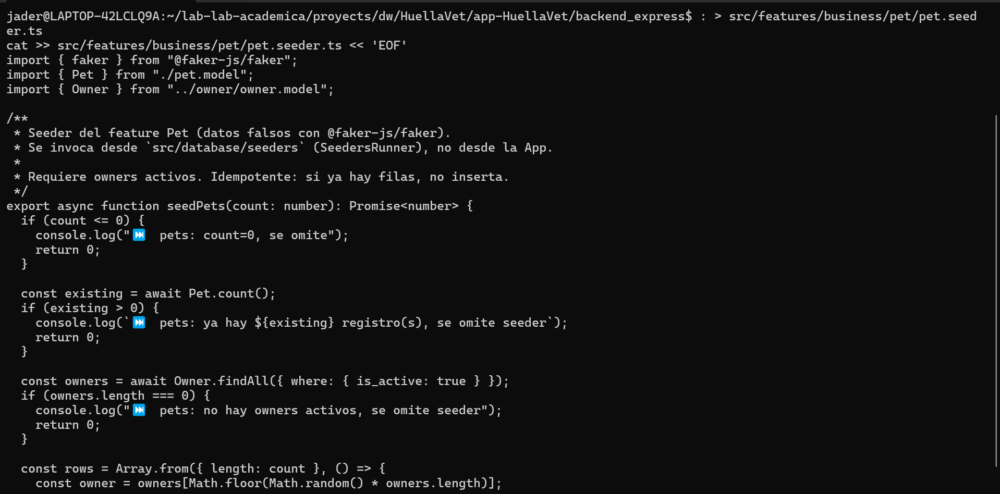

**PARCHE** — `src/database/seeders/counts.ts` **ya existe**.

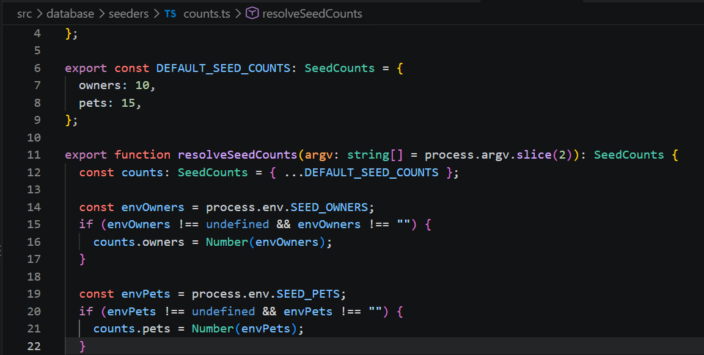

**PARCHE** — `src/database/seeders/index.ts` **ya existe**.

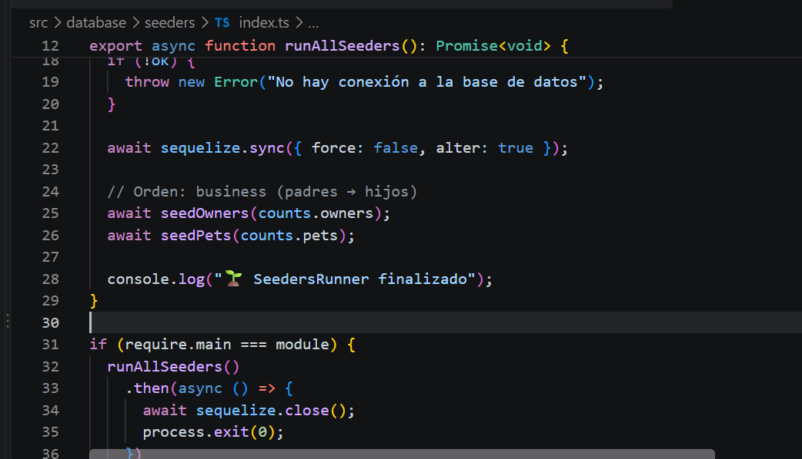

## 11.6 Swagger Pet

```         
: > src/features/business/product-type/product-type.swagger.ts
cat >> src/features/business/product-type/product-type.swagger.ts << 'EOF'
/**
 * Documentación OpenAPI del feature ProductType.
 * Se agrega desde `src/swagger` (registry externo), no se monta aquí.
 *
 * Leyenda: endpoints documentados como SIN AUTH (sin middleware JWT).
 */

export const productTypeSwagger = {
  tags: [
    {
      name: "TiposProducto",
      description: "CRUD de tipos de producto — **SIN AUTH** (sin middleware JWT)",
    },
  ],
  paths: {
    "/api/tipos-producto": {
      get: {
        tags: ["TiposProducto"],
        summary: "Listar tipos de producto activos",
        description: "SIN AUTH — retorna tipos con status=active",
        security: [],
        responses: {
          "200": {
            description: "Lista de tipos de producto",
            content: {
              "application/json": {
                schema: {
                  type: "object",
                  properties: {
                    product_types: {
                      type: "array",
                      items: { $ref: "#/components/schemas/ProductType" },
                    },
                  },
                },
              },
            },
          },
        },
      },
      post: {
        tags: ["TiposProducto"],
        summary: "Crear tipo de producto",
        description: "SIN AUTH",
        security: [],
        requestBody: {
          required: true,
          content: {
            "application/json": {
              schema: { $ref: "#/components/schemas/ProductTypeCreate" },
            },
          },
        },
        responses: {
          "201": {
            description: "Tipo de producto creado",
            content: {
              "application/json": {
                schema: {
                  type: "object",
                  properties: {
                    product_type: { $ref: "#/components/schemas/ProductType" },
                  },
                },
              },
            },
          },
        },
      },
    },
    "/api/tipos-producto/{id}": {
      get: {
        tags: ["TiposProducto"],
        summary: "Obtener tipo de producto por id",
        description: "SIN AUTH",
        security: [],
        parameters: [
          {
            name: "id",
            in: "path",
            required: true,
            schema: { type: "integer" },
          },
        ],
        responses: {
          "200": {
            description: "Tipo de producto encontrado",
            content: {
              "application/json": {
                schema: {
                  type: "object",
                  properties: {
                    product_type: { $ref: "#/components/schemas/ProductType" },
                  },
                },
              },
            },
          },
          "404": { description: "No encontrado" },
        },
      },
      put: {
        tags: ["TiposProducto"],
        summary: "Actualizar tipo de producto (PUT — reemplazo)",
        description: "SIN AUTH",
        security: [],
        parameters: [
          {
            name: "id",
            in: "path",
            required: true,
            schema: { type: "integer" },
          },
        ],
        requestBody: {
          required: true,
          content: {
            "application/json": {
              schema: { $ref: "#/components/schemas/ProductTypeUpdate" },
            },
          },
        },
        responses: {
          "200": { description: "Actualizado" },
          "404": { description: "No encontrado" },
        },
      },
      patch: {
        tags: ["TiposProducto"],
        summary: "Actualizar tipo de producto (PATCH — parcial)",
        description: "SIN AUTH",
        security: [],
        parameters: [
          {
            name: "id",
            in: "path",
            required: true,
            schema: { type: "integer" },
          },
        ],
        requestBody: {
          required: true,
          content: {
            "application/json": {
              schema: { $ref: "#/components/schemas/ProductTypePatch" },
            },
          },
        },
        responses: {
          "200": { description: "Actualizado" },
          "404": { description: "No encontrado" },
        },
      },
      delete: {
        tags: ["TiposProducto"],
        summary: "Eliminar tipo de producto (físico)",
        description: "SIN AUTH — borra la fila",
        security: [],
        parameters: [
          {
            name: "id",
            in: "path",
            required: true,
            schema: { type: "integer" },
          },
        ],
        responses: {
          "200": { description: "Eliminado" },
          "404": { description: "No encontrado" },
        },
      },
    },
    "/api/tipos-producto/{id}/deactivate": {
      patch: {
        tags: ["TiposProducto"],
        summary: "Eliminar tipo de producto (lógico)",
        description: "SIN AUTH — status = inactive",
        security: [],
        parameters: [
          {
            name: "id",
            in: "path",
            required: true,
            schema: { type: "integer" },
          },
        ],
        responses: {
          "200": { description: "Desactivado" },
          "404": { description: "No encontrado" },
        },
      },
    },
  },
  components: {
    schemas: {
      ProductType: {
        type: "object",
        properties: {
          id: { type: "integer", example: 1 },
          name: { type: "string", example: "Electrónica" },
          description: { type: "string", example: "Dispositivos y accesorios", nullable: true },
          status: { type: "string", enum: ["active", "inactive"], example: "active" },
          createdAt: { type: "string", format: "date-time" },
          updatedAt: { type: "string", format: "date-time" },
        },
      },
      ProductTypeCreate: {
        type: "object",
        required: ["name"],
        properties: {
          name: { type: "string" },
          description: { type: "string" },
          status: { type: "string", enum: ["active", "inactive"], default: "active" },
        },
      },
      ProductTypeUpdate: {
        type: "object",
        required: ["name"],
        properties: {
          name: { type: "string" },
          description: { type: "string" },
          status: { type: "string", enum: ["active", "inactive"] },
        },
      },
      ProductTypePatch: {
        type: "object",
        properties: {
          name: { type: "string" },
          description: { type: "string" },
          status: { type: "string", enum: ["active", "inactive"] },
        },
      },
    },
  },
};
EOF
```

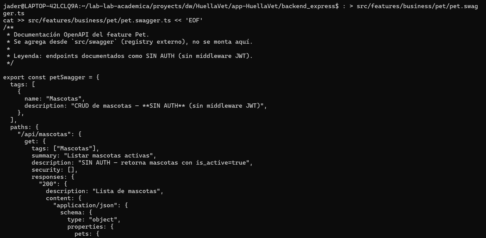

**PARCHE** — `src/swagger/index.ts` **ya existe**.

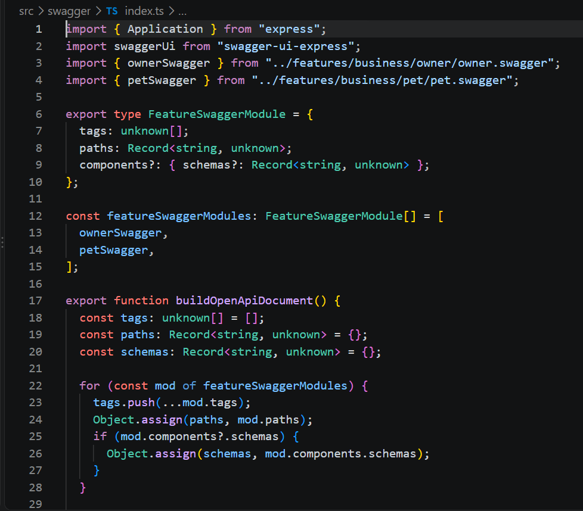

### Cierre del ISSUE-06

```         
npm run dev
```

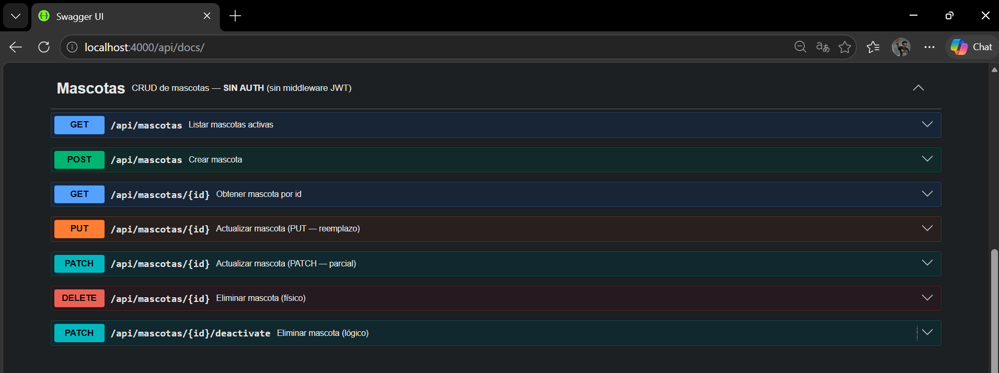](images/clipboard-2516005899.png)

# 12. ISS-07 — Feature Veterinarian (veterinarios)

## 12.1 Modelo veterinarian

```         
: > src/features/business/product/product.model.ts
cat >> src/features/business/product/product.model.ts << 'EOF'
import { DataTypes, Model } from "sequelize";
import { sequelize } from "../../../database/db";

export interface ProductI {
  id?: number;
  name: string;
  brand: string;
  price: number;
  min_stock: number;
  quantity: number;
  product_type_id: number;
  status: "active" | "inactive";
  createdAt?: Date;
  updatedAt?: Date;
}

export class Product extends Model {
  public id!: number;
  public name!: string;
  public brand!: string;
  public price!: number;
  public min_stock!: number;
  public quantity!: number;
  public product_type_id!: number;
  public status!: "active" | "inactive";
  public readonly createdAt!: Date;
  public readonly updatedAt!: Date;
}

Product.init(
  {
    name: {
      type: DataTypes.STRING,
      allowNull: false,
    },
    brand: {
      type: DataTypes.STRING,
      allowNull: false,
    },
    price: {
      type: DataTypes.DECIMAL(12, 2),
      allowNull: false,
    },
    min_stock: {
      type: DataTypes.INTEGER,
      allowNull: false,
      defaultValue: 0,
    },
    quantity: {
      type: DataTypes.INTEGER,
      allowNull: false,
      defaultValue: 0,
    },
    product_type_id: {
      type: DataTypes.INTEGER,
      allowNull: false,
    },
    status: {
      type: DataTypes.ENUM("active", "inactive"),
      defaultValue: "inactive",
      allowNull: false,
    },
  },
  {
    sequelize,
    modelName: "Product",
    tableName: "products",
    timestamps: true,
  }
);
EOF
```

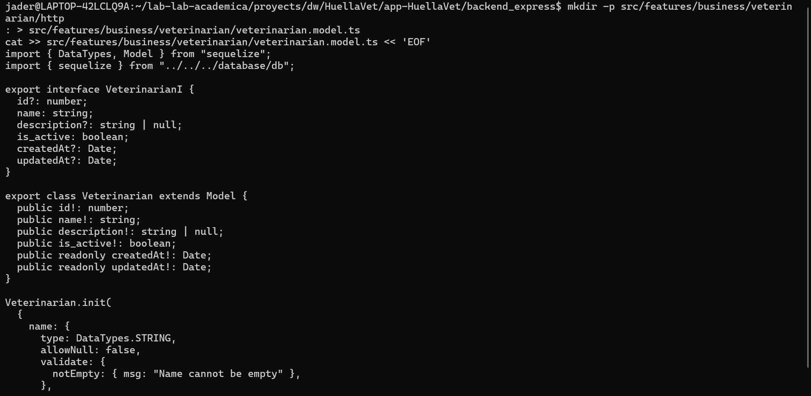

## 12.2 Controller + routes (CRUD completo)

``` bash
: > src/features/business/product/product.controller.ts
cat >> src/features/business/product/product.controller.ts << 'EOF'
import { Request, Response } from "express";
import { Product, ProductI } from "./product.model";
import { ProductType } from "../product-type/product-type.model";

function paramId(req: Request): number {
  const raw = req.params.id;
  const value = Array.isArray(raw) ? raw[0] : raw;
  return Number(value);
}

async function assertActiveProductType(product_type_id: number): Promise<{ ok: true } | { ok: false; status: number; error: string }> {
  const productType = await ProductType.findByPk(product_type_id);
  if (!productType) {
    return { ok: false, status: 404, error: "Product type not found" };
  }
  if (productType.status !== "active") {
    return { ok: false, status: 400, error: "Product type must be active" };
  }
  return { ok: true };
}

export class ProductController {
  // ================== READ ==================
  public async getAll(req: Request, res: Response) {
    try {
      const products = await Product.findAll({
        where: { status: "active" },
      });
      res.status(200).json({ products });
    } catch (error) {
      res.status(500).json({ error: "Error fetching products", detail: String(error) });
    }
  }

  public async getOne(req: Request, res: Response) {
    try {
      const id = paramId(req);
      const product = await Product.findByPk(id);
      if (!product) {
        res.status(404).json({ error: "Product not found" });
        return;
      }
      res.status(200).json({ product });
    } catch (error) {
      res.status(500).json({ error: "Error fetching product", detail: String(error) });
    }
  }

  // ================== CREATE ==================
  public async create(req: Request, res: Response) {
    try {
      const body = req.body as ProductI;
      const check = await assertActiveProductType(Number(body.product_type_id));
      if (!check.ok) {
        res.status(check.status).json({ error: check.error });
        return;
      }

      const product = await Product.create({
        name: body.name,
        brand: body.brand,
        price: body.price,
        min_stock: body.min_stock,
        quantity: body.quantity,
        product_type_id: body.product_type_id,
        status: body.status ?? "active",
      });
      res.status(201).json({ product });
    } catch (error) {
      res.status(500).json({ error: "Error creating product", detail: String(error) });
    }
  }

  // ================== UPDATE ==================
  public async updatePut(req: Request, res: Response) {
    try {
      const id = paramId(req);
      const body = req.body as ProductI;
      const product = await Product.findByPk(id);
      if (!product) {
        res.status(404).json({ error: "Product not found" });
        return;
      }

      const check = await assertActiveProductType(Number(body.product_type_id));
      if (!check.ok) {
        res.status(check.status).json({ error: check.error });
        return;
      }

      await product.update({
        name: body.name,
        brand: body.brand,
        price: body.price,
        min_stock: body.min_stock,
        quantity: body.quantity,
        product_type_id: body.product_type_id,
        status: body.status ?? product.status,
      });

      res.status(200).json({ product });
    } catch (error) {
      res.status(500).json({ error: "Error updating product (PUT)", detail: String(error) });
    }
  }

  public async updatePatch(req: Request, res: Response) {
    try {
      const id = paramId(req);
      const body = req.body as Partial<ProductI>;
      const product = await Product.findByPk(id);
      if (!product) {
        res.status(404).json({ error: "Product not found" });
        return;
      }

      if (body.product_type_id !== undefined) {
        const check = await assertActiveProductType(Number(body.product_type_id));
        if (!check.ok) {
          res.status(check.status).json({ error: check.error });
          return;
        }
      }

      await product.update(body);
      res.status(200).json({ product });
    } catch (error) {
      res.status(500).json({ error: "Error updating product (PATCH)", detail: String(error) });
    }
  }

  // ================== DELETE ==================
  /** Eliminación física */
  public async deletePhysical(req: Request, res: Response) {
    try {
      const id = paramId(req);
      const product = await Product.findByPk(id);
      if (!product) {
        res.status(404).json({ error: "Product not found" });
        return;
      }
      await product.destroy();
      res.status(200).json({ message: "Product permanently deleted", id });
    } catch (error) {
      res.status(500).json({ error: "Error deleting product", detail: String(error) });
    }
  }

  /** Eliminación lógica → status = inactive */
  public async deleteLogical(req: Request, res: Response) {
    try {
      const id = paramId(req);
      const product = await Product.findByPk(id);
      if (!product) {
        res.status(404).json({ error: "Product not found" });
        return;
      }
      await product.update({ status: "inactive" });
      res.status(200).json({
        message: "Product deactivated (logical delete)",
        product,
      });
    } catch (error) {
      res.status(500).json({ error: "Error deactivating product", detail: String(error) });
    }
  }
}
EOF
```

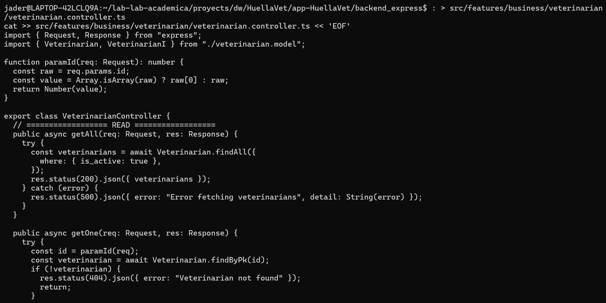

```         
: > src/features/business/product/product.routes.ts
cat >> src/features/business/product/product.routes.ts << 'EOF'
import { Application } from "express";
import { ProductController } from "./product.controller";

export class ProductRoutes {
  public productController: ProductController = new ProductController();

  public routes(app: Application): void {
    // ================== RUTAS SIN AUTENTICACIÓN / SIN MIDDLEWARE JWT ==================

    // getAll
    app
      .route("/api/productos")
      .get(this.productController.getAll.bind(this.productController));

    // getOne
    app
      .route("/api/productos/:id")
      .get(this.productController.getOne.bind(this.productController));

    // create
    app
      .route("/api/productos")
      .post(this.productController.create.bind(this.productController));

    // update (PUT / PATCH)
    app
      .route("/api/productos/:id")
      .put(this.productController.updatePut.bind(this.productController))
      .patch(this.productController.updatePatch.bind(this.productController));

    // delete físico
    app
      .route("/api/productos/:id")
      .delete(this.productController.deletePhysical.bind(this.productController));

    // delete lógico
    app
      .route("/api/productos/:id/deactivate")
      .patch(this.productController.deleteLogical.bind(this.productController));
  }
}
EOF
```

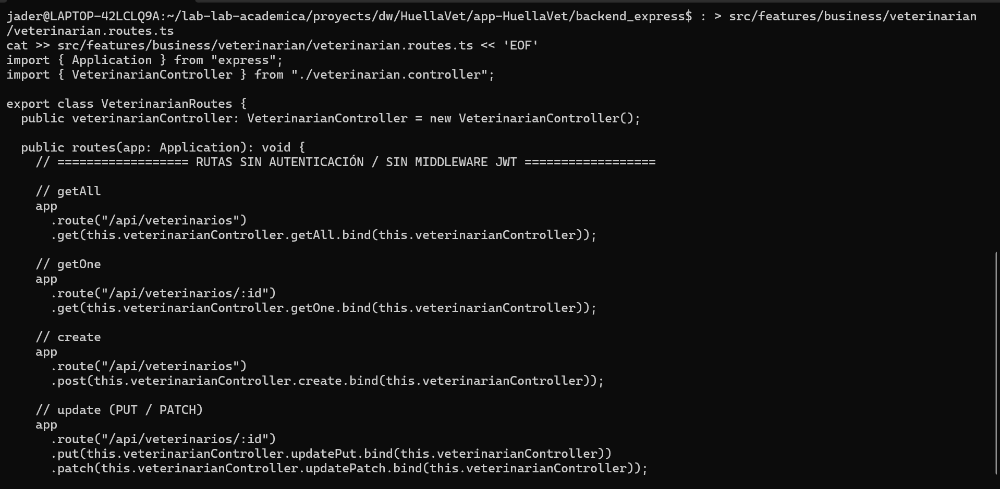

### 12.3 HTTP (REST Client)

```         
: > src/features/business/product/http/products.get.http
cat >> src/features/business/product/http/products.get.http << 'EOF'
### Feature Product — GET ALL / GET ONE
### Leyenda: SIN AUTH (sin middleware JWT / sin autenticación)
@baseUrl = http://localhost:4000
@id = 1

# @name getAllProducts
GET {{baseUrl}}/api/productos

###

# @name getOneProduct
GET {{baseUrl}}/api/productos/{{id}}
EOF
```

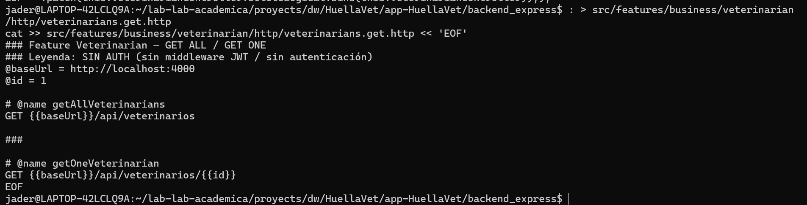

```         
: > src/features/business/product/http/products.create.http
cat >> src/features/business/product/http/products.create.http << 'EOF'
### Feature Product — CREATE
### Leyenda: SIN AUTH (sin middleware JWT / sin autenticación)
@baseUrl = http://localhost:4000

# @name createProduct
POST {{baseUrl}}/api/productos
Content-Type: application/json

{
  "name": "Laptop Pro",
  "brand": "TechBrand",
  "price": 1299.99,
  "min_stock": 5,
  "quantity": 50,
  "product_type_id": 1,
  "status": "active"
}
EOF
```

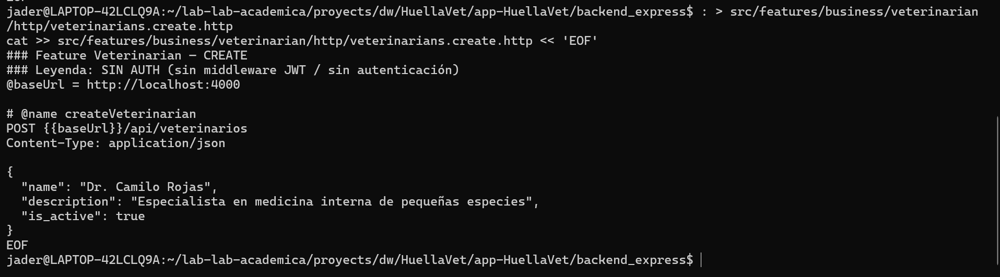

```         
: > src/features/business/product/http/products.update.http
cat >> src/features/business/product/http/products.update.http << 'EOF'
### Feature Product — UPDATE (PUT) / UPDATE (PATCH)
### Leyenda: SIN AUTH (sin middleware JWT / sin autenticación)
@baseUrl = http://localhost:4000
@id = 1

# @name updateProductPut
PUT {{baseUrl}}/api/productos/{{id}}
Content-Type: application/json

{
  "name": "Laptop Pro Max",
  "brand": "TechBrand",
  "price": 1499.99,
  "min_stock": 5,
  "quantity": 40,
  "product_type_id": 1,
  "status": "active"
}

###

# @name updateProductPatch
PATCH {{baseUrl}}/api/productos/{{id}}
Content-Type: application/json

{
  "price": 1399.99,
  "quantity": 45
}
EOF
```

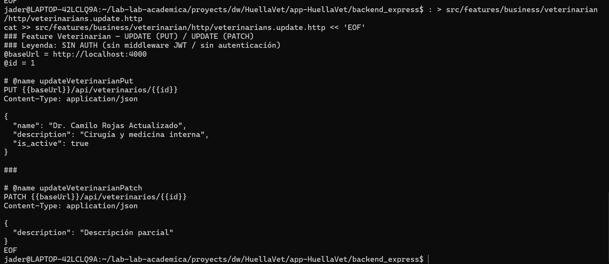

```         
: > src/features/business/product/http/products.delete.http
cat >> src/features/business/product/http/products.delete.http << 'EOF'
### Feature Product — DELETE físico / DELETE lógico (status = inactive)
### Leyenda: SIN AUTH (sin middleware JWT / sin autenticación)
@baseUrl = http://localhost:4000
@id = 1

# @name deleteProductPhysical
DELETE {{baseUrl}}/api/productos/{{id}}

###

# @name deleteProductLogical
PATCH {{baseUrl}}/api/productos/{{id}}/deactivate
EOF
```

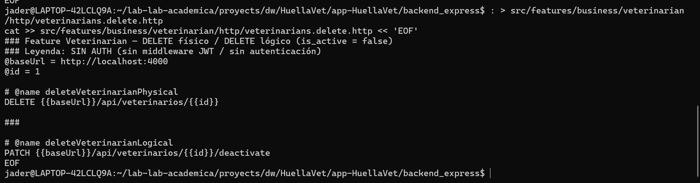

## 12.4 Cableado Routes + Config

**PARCHE** — `src/routes/index.ts`:

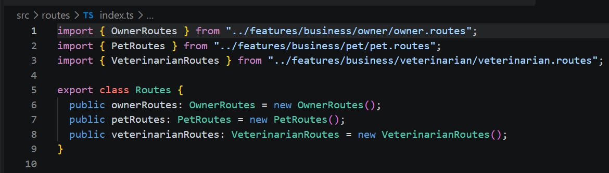

**PARCHE** — `src/config/index.ts`:

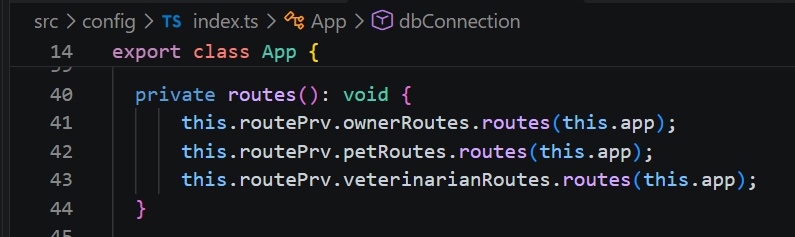

### Verificación

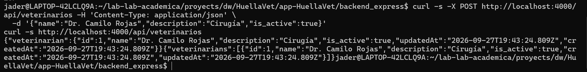

## 12.6 Seeder + Swagger Veterinarian

```         
: > src/features/business/product/product.seeder.ts
cat >> src/features/business/product/product.seeder.ts << 'EOF'
import { faker } from "@faker-js/faker";
import { Product } from "./product.model";
import { ProductType } from "../product-type/product-type.model";

/**
 * Seeder del feature Product (datos falsos con @faker-js/faker).
 * Se invoca desde `src/database/seeders` (SeedersRunner), no desde la App.
 *
 * Requiere tipos de producto activos. Idempotente: si ya hay filas, no inserta.
 */
export async function seedProducts(count: number): Promise<number> {
  if (count <= 0) {
    console.log("⏭️  products: count=0, se omite");
    return 0;
  }

  const existing = await Product.count();
  if (existing > 0) {
    console.log(`⏭️  products: ya hay ${existing} registro(s), se omite seeder`);
    return 0;
  }

  const types = await ProductType.findAll({ where: { status: "active" } });
  if (types.length === 0) {
    console.log("⏭️  products: no hay tipos de producto activos, se omite seeder");
    return 0;
  }

  const rows = Array.from({ length: count }, () => {
    const type = types[Math.floor(Math.random() * types.length)];
    return {
      name: faker.commerce.productName(),
      brand: faker.company.name(),
      price: Number(faker.commerce.price({ min: 5, max: 500, dec: 2 })),
      min_stock: faker.number.int({ min: 1, max: 10 }),
      quantity: faker.number.int({ min: 20, max: 100 }),
      product_type_id: type.id,
      status: "active" as const,
    };
  });

  await Product.bulkCreate(rows);
  console.log(`✅ products: insertados ${count} registro(s) falsos`);
  return count;
}
EOF
```

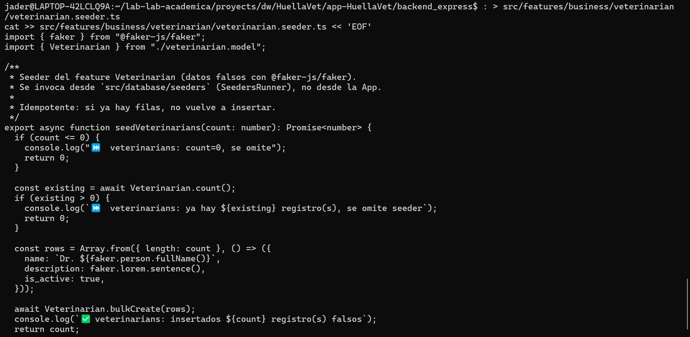

**PARCHE** — `src/database/seeders/counts.ts` completo:

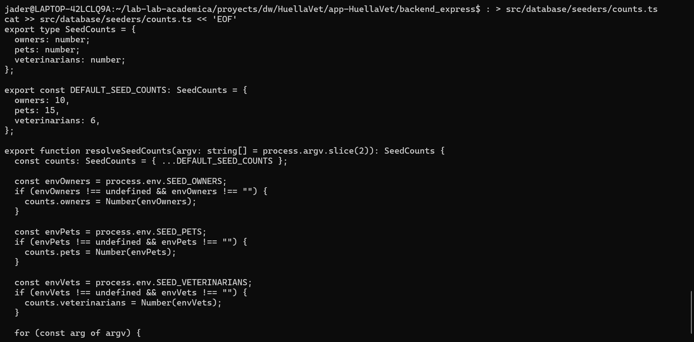

**PARCHE** — `src/database/seeders/index.ts` completo:

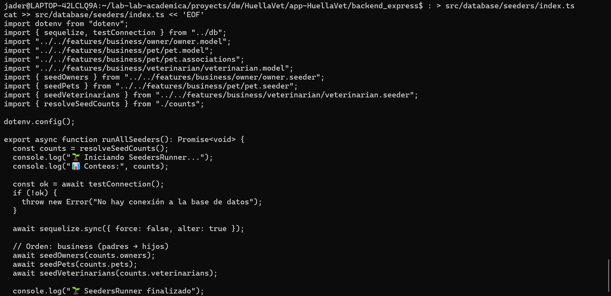

```         
: > src/features/business/product/product.swagger.ts
cat >> src/features/business/product/product.swagger.ts << 'EOF'
/**
 * Documentación OpenAPI del feature Product.
 * Se agrega desde `src/swagger` (registry externo), no se monta aquí.
 *
 * Leyenda: endpoints documentados como SIN AUTH (sin middleware JWT).
 */

export const productSwagger = {
  tags: [
    {
      name: "Productos",
      description: "CRUD de productos — **SIN AUTH** (sin middleware JWT)",
    },
  ],
  paths: {
    "/api/productos": {
      get: {
        tags: ["Productos"],
        summary: "Listar productos activos",
        description: "SIN AUTH — retorna productos con status=active",
        security: [],
        responses: {
          "200": {
            description: "Lista de productos",
            content: {
              "application/json": {
                schema: {
                  type: "object",
                  properties: {
                    products: {
                      type: "array",
                      items: { $ref: "#/components/schemas/Product" },
                    },
                  },
                },
              },
            },
          },
        },
      },
      post: {
        tags: ["Productos"],
        summary: "Crear producto",
        description: "SIN AUTH — product_type_id debe existir y estar active",
        security: [],
        requestBody: {
          required: true,
          content: {
            "application/json": {
              schema: { $ref: "#/components/schemas/ProductCreate" },
            },
          },
        },
        responses: {
          "201": {
            description: "Producto creado",
            content: {
              "application/json": {
                schema: {
                  type: "object",
                  properties: {
                    product: { $ref: "#/components/schemas/Product" },
                  },
                },
              },
            },
          },
          "400": { description: "Tipo de producto inactivo" },
          "404": { description: "Tipo de producto no encontrado" },
        },
      },
    },
    "/api/productos/{id}": {
      get: {
        tags: ["Productos"],
        summary: "Obtener producto por id",
        description: "SIN AUTH",
        security: [],
        parameters: [
          {
            name: "id",
            in: "path",
            required: true,
            schema: { type: "integer" },
          },
        ],
        responses: {
          "200": {
            description: "Producto encontrado",
            content: {
              "application/json": {
                schema: {
                  type: "object",
                  properties: {
                    product: { $ref: "#/components/schemas/Product" },
                  },
                },
              },
            },
          },
          "404": { description: "No encontrado" },
        },
      },
      put: {
        tags: ["Productos"],
        summary: "Actualizar producto (PUT — reemplazo)",
        description: "SIN AUTH — product_type_id debe existir y estar active",
        security: [],
        parameters: [
          {
            name: "id",
            in: "path",
            required: true,
            schema: { type: "integer" },
          },
        ],
        requestBody: {
          required: true,
          content: {
            "application/json": {
              schema: { $ref: "#/components/schemas/ProductUpdate" },
            },
          },
        },
        responses: {
          "200": { description: "Actualizado" },
          "400": { description: "Tipo de producto inactivo" },
          "404": { description: "No encontrado" },
        },
      },
      patch: {
        tags: ["Productos"],
        summary: "Actualizar producto (PATCH — parcial)",
        description: "SIN AUTH",
        security: [],
        parameters: [
          {
            name: "id",
            in: "path",
            required: true,
            schema: { type: "integer" },
          },
        ],
        requestBody: {
          required: true,
          content: {
            "application/json": {
              schema: { $ref: "#/components/schemas/ProductPatch" },
            },
          },
        },
        responses: {
          "200": { description: "Actualizado" },
          "404": { description: "No encontrado" },
        },
      },
      delete: {
        tags: ["Productos"],
        summary: "Eliminar producto (físico)",
        description: "SIN AUTH — borra la fila",
        security: [],
        parameters: [
          {
            name: "id",
            in: "path",
            required: true,
            schema: { type: "integer" },
          },
        ],
        responses: {
          "200": { description: "Eliminado" },
          "404": { description: "No encontrado" },
        },
      },
    },
    "/api/productos/{id}/deactivate": {
      patch: {
        tags: ["Productos"],
        summary: "Eliminar producto (lógico)",
        description: "SIN AUTH — status = inactive",
        security: [],
        parameters: [
          {
            name: "id",
            in: "path",
            required: true,
            schema: { type: "integer" },
          },
        ],
        responses: {
          "200": { description: "Desactivado" },
          "404": { description: "No encontrado" },
        },
      },
    },
  },
  components: {
    schemas: {
      Product: {
        type: "object",
        properties: {
          id: { type: "integer", example: 1 },
          name: { type: "string", example: "Laptop Pro" },
          brand: { type: "string", example: "TechBrand" },
          price: { type: "number", example: 1299.99 },
          min_stock: { type: "integer", example: 5 },
          quantity: { type: "integer", example: 50 },
          product_type_id: { type: "integer", example: 1 },
          status: { type: "string", enum: ["active", "inactive"], example: "active" },
          createdAt: { type: "string", format: "date-time" },
          updatedAt: { type: "string", format: "date-time" },
        },
      },
      ProductCreate: {
        type: "object",
        required: ["name", "brand", "price", "min_stock", "quantity", "product_type_id"],
        properties: {
          name: { type: "string" },
          brand: { type: "string" },
          price: { type: "number" },
          min_stock: { type: "integer" },
          quantity: { type: "integer" },
          product_type_id: { type: "integer" },
          status: { type: "string", enum: ["active", "inactive"], default: "active" },
        },
      },
      ProductUpdate: {
        type: "object",
        required: ["name", "brand", "price", "min_stock", "quantity", "product_type_id"],
        properties: {
          name: { type: "string" },
          brand: { type: "string" },
          price: { type: "number" },
          min_stock: { type: "integer" },
          quantity: { type: "integer" },
          product_type_id: { type: "integer" },
          status: { type: "string", enum: ["active", "inactive"] },
        },
      },
      ProductPatch: {
        type: "object",
        properties: {
          name: { type: "string" },
          brand: { type: "string" },
          price: { type: "number" },
          min_stock: { type: "integer" },
          quantity: { type: "integer" },
          product_type_id: { type: "integer" },
          status: { type: "string", enum: ["active", "inactive"] },
        },
      },
    },
  },
};
EOF
```

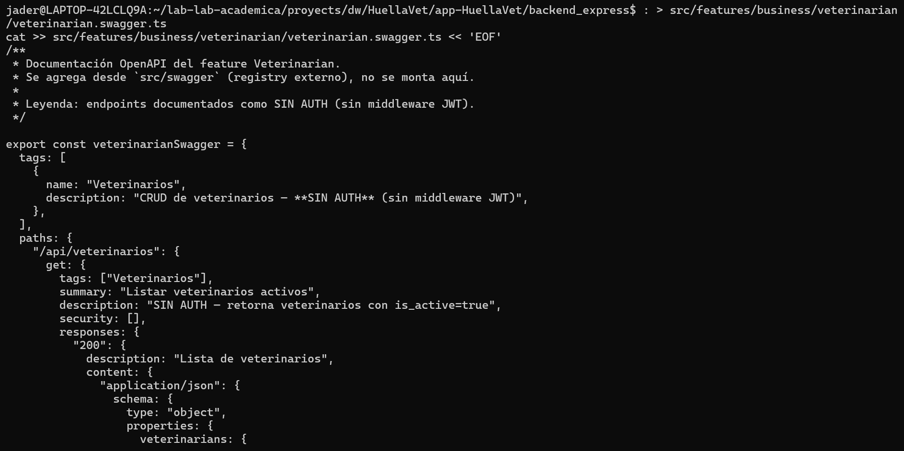

**PARCHE** — `src/swagger/index.ts` completo:

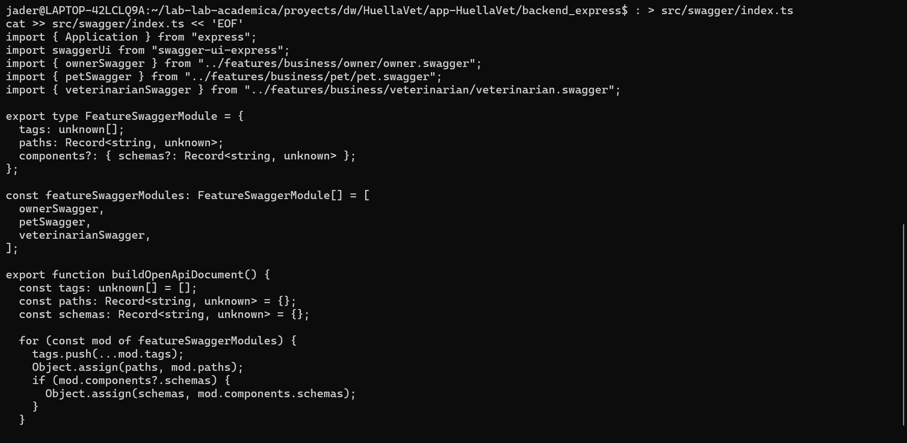

### Cierre del ISSUE-07

```         
npm run dev
```

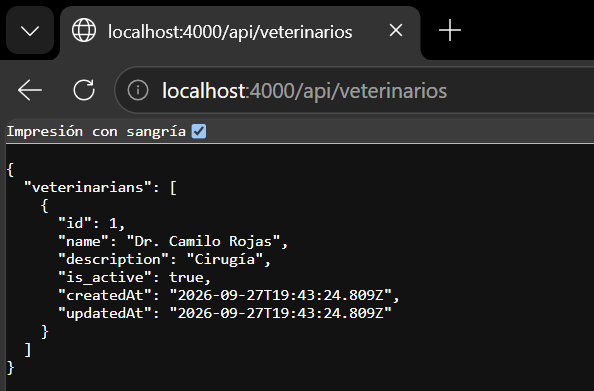](images/clipboard-971816487.png)

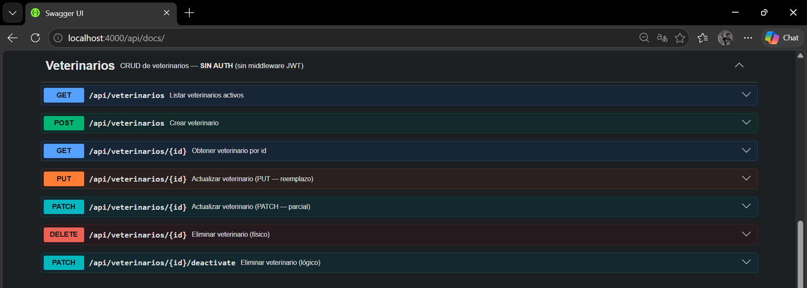

# 13. ISS-08 — Feature Appointment (citas)

## 13.1 Modelo Appointment

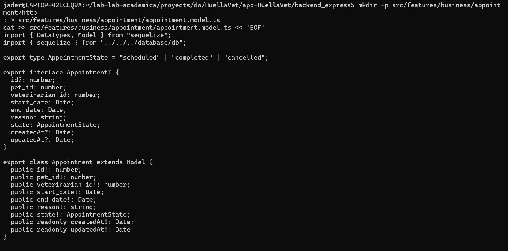

## 13.2 Controller + routes (CRUD completo)

```         
: > src/features/business/product-sale/product-sale.controller.ts
cat >> src/features/business/product-sale/product-sale.controller.ts << 'EOF'
import { Request, Response } from "express";
import { Transaction } from "sequelize";
import { sequelize } from "../../../database/db";
import { ProductSale, ProductSaleI } from "./product-sale.model";
import { Sale } from "../sale/sale.model";
import { Product } from "../product/product.model";

function paramId(req: Request): number {
  const raw = req.params.id;
  const value = Array.isArray(raw) ? raw[0] : raw;
  return Number(value);
}

async function recalcSaleTotals(sale_id: number, t: Transaction): Promise<void> {
  const items = await ProductSale.findAll({
    where: { sale_id, status: "active" },
    transaction: t,
  });
  const subtotal = items.reduce((sum, row) => sum + Number(row.line_total), 0);
  const sale = await Sale.findByPk(sale_id, { transaction: t });
  if (!sale) return;
  const total = subtotal + Number(sale.tax) - Number(sale.discounts);
  await sale.update({ subtotal, total }, { transaction: t });
}

export class ProductSaleController {
  // ================== READ ==================
  public async getAll(req: Request, res: Response) {
    try {
      const product_sales = await ProductSale.findAll({
        where: { status: "active" },
      });
      res.status(200).json({ product_sales });
    } catch (error) {
      res.status(500).json({ error: "Error fetching product sales", detail: String(error) });
    }
  }

  public async getOne(req: Request, res: Response) {
    try {
      const id = paramId(req);
      const product_sale = await ProductSale.findByPk(id);
      if (!product_sale) {
        res.status(404).json({ error: "Product sale not found" });
        return;
      }
      res.status(200).json({ product_sale });
    } catch (error) {
      res.status(500).json({ error: "Error fetching product sale", detail: String(error) });
    }
  }

  // ================== CREATE ==================
  /** Agrega una línea a una venta existente (ajusta stock y totales). */
  public async create(req: Request, res: Response) {
    const t = await sequelize.transaction();
    try {
      const body = req.body as Pick<ProductSaleI, "sale_id" | "product_id" | "quantity" | "status">;

      if (!body.sale_id || !body.product_id || !body.quantity || body.quantity < 1) {
        await t.rollback();
        res.status(400).json({ error: "sale_id, product_id and quantity (>=1) are required" });
        return;
      }

      const sale = await Sale.findByPk(body.sale_id, { transaction: t });
      if (!sale) {
        await t.rollback();
        res.status(404).json({ error: "Sale not found" });
        return;
      }
      if (sale.status !== "active") {
        await t.rollback();
        res.status(400).json({ error: "Sale must be active" });
        return;
      }

      const product = await Product.findByPk(body.product_id, {
        transaction: t,
        lock: t.LOCK.UPDATE,
      });
      if (!product) {
        await t.rollback();
        res.status(404).json({ error: "Product not found" });
        return;
      }
      if (product.status !== "active") {
        await t.rollback();
        res.status(400).json({ error: "Product must be active" });
        return;
      }
      if (product.quantity < body.quantity) {
        await t.rollback();
        res.status(400).json({
          error: "Insufficient stock",
          available: product.quantity,
          requested: body.quantity,
        });
        return;
      }

      const unit_price = Number(product.price);
      const line_total = unit_price * body.quantity;

      const product_sale = await ProductSale.create(
        {
          sale_id: body.sale_id,
          product_id: body.product_id,
          quantity: body.quantity,
          unit_price,
          line_total,
          status: body.status ?? "active",
        },
        { transaction: t }
      );

      await product.update(
        { quantity: product.quantity - body.quantity },
        { transaction: t }
      );
      await recalcSaleTotals(body.sale_id, t);

      await t.commit();
      res.status(201).json({ product_sale });
    } catch (error) {
      await t.rollback();
      res.status(500).json({ error: "Error creating product sale", detail: String(error) });
    }
  }

  // ================== UPDATE ==================
  public async updatePut(req: Request, res: Response) {
    const t = await sequelize.transaction();
    try {
      const id = paramId(req);
      const body = req.body as Pick<ProductSaleI, "quantity" | "status">;
      const product_sale = await ProductSale.findByPk(id, {
        transaction: t,
        lock: t.LOCK.UPDATE,
      });
      if (!product_sale) {
        await t.rollback();
        res.status(404).json({ error: "Product sale not found" });
        return;
      }

      const newQty = Number(body.quantity);
      if (!newQty || newQty < 1) {
        await t.rollback();
        res.status(400).json({ error: "quantity (>=1) is required" });
        return;
      }

      const product = await Product.findByPk(product_sale.product_id, {
        transaction: t,
        lock: t.LOCK.UPDATE,
      });
      if (!product) {
        await t.rollback();
        res.status(404).json({ error: "Product not found" });
        return;
      }

      const delta = newQty - product_sale.quantity;
      if (delta > 0 && product.quantity < delta) {
        await t.rollback();
        res.status(400).json({
          error: "Insufficient stock",
          available: product.quantity,
          requested_extra: delta,
        });
        return;
      }

      const unit_price = Number(product_sale.unit_price);
      const line_total = unit_price * newQty;

      await product.update(
        { quantity: product.quantity - delta },
        { transaction: t }
      );
      await product_sale.update(
        {
          quantity: newQty,
          line_total,
          status: body.status ?? product_sale.status,
        },
        { transaction: t }
      );
      await recalcSaleTotals(product_sale.sale_id, t);

      await t.commit();
      res.status(200).json({ product_sale });
    } catch (error) {
      await t.rollback();
      res.status(500).json({ error: "Error updating product sale (PUT)", detail: String(error) });
    }
  }

  public async updatePatch(req: Request, res: Response) {
    const t = await sequelize.transaction();
    try {
      const id = paramId(req);
      const body = req.body as Partial<Pick<ProductSaleI, "quantity" | "status">>;
      const product_sale = await ProductSale.findByPk(id, {
        transaction: t,
        lock: t.LOCK.UPDATE,
      });
      if (!product_sale) {
        await t.rollback();
        res.status(404).json({ error: "Product sale not found" });
        return;
      }

      if (body.quantity !== undefined) {
        const newQty = Number(body.quantity);
        if (!newQty || newQty < 1) {
          await t.rollback();
          res.status(400).json({ error: "quantity must be >= 1" });
          return;
        }

        const product = await Product.findByPk(product_sale.product_id, {
          transaction: t,
          lock: t.LOCK.UPDATE,
        });
        if (!product) {
          await t.rollback();
          res.status(404).json({ error: "Product not found" });
          return;
        }

        const delta = newQty - product_sale.quantity;
        if (delta > 0 && product.quantity < delta) {
          await t.rollback();
          res.status(400).json({
            error: "Insufficient stock",
            available: product.quantity,
            requested_extra: delta,
          });
          return;
        }

        await product.update(
          { quantity: product.quantity - delta },
          { transaction: t }
        );
        await product_sale.update(
          {
            quantity: newQty,
            line_total: Number(product_sale.unit_price) * newQty,
          },
          { transaction: t }
        );
      }

      if (body.status !== undefined) {
        await product_sale.update({ status: body.status }, { transaction: t });
      }

      await recalcSaleTotals(product_sale.sale_id, t);
      await t.commit();
      res.status(200).json({ product_sale });
    } catch (error) {
      await t.rollback();
      res.status(500).json({ error: "Error updating product sale (PATCH)", detail: String(error) });
    }
  }

  // ================== DELETE ==================
  /** Eliminación física: restaura stock y recalcula totales de la venta */
  public async deletePhysical(req: Request, res: Response) {
    const t = await sequelize.transaction();
    try {
      const id = paramId(req);
      const product_sale = await ProductSale.findByPk(id, {
        transaction: t,
        lock: t.LOCK.UPDATE,
      });
      if (!product_sale) {
        await t.rollback();
        res.status(404).json({ error: "Product sale not found" });
        return;
      }

      const product = await Product.findByPk(product_sale.product_id, {
        transaction: t,
        lock: t.LOCK.UPDATE,
      });
      if (product && product_sale.status === "active") {
        await product.update(
          { quantity: product.quantity + product_sale.quantity },
          { transaction: t }
        );
      }

      const sale_id = product_sale.sale_id;
      await product_sale.destroy({ transaction: t });
      await recalcSaleTotals(sale_id, t);

      await t.commit();
      res.status(200).json({ message: "Product sale permanently deleted", id });
    } catch (error) {
      await t.rollback();
      res.status(500).json({ error: "Error deleting product sale", detail: String(error) });
    }
  }

  /** Eliminación lógica → status = inactive (restaura stock y recalcula) */
  public async deleteLogical(req: Request, res: Response) {
    const t = await sequelize.transaction();
    try {
      const id = paramId(req);
      const product_sale = await ProductSale.findByPk(id, {
        transaction: t,
        lock: t.LOCK.UPDATE,
      });
      if (!product_sale) {
        await t.rollback();
        res.status(404).json({ error: "Product sale not found" });
        return;
      }

      if (product_sale.status === "active") {
        const product = await Product.findByPk(product_sale.product_id, {
          transaction: t,
          lock: t.LOCK.UPDATE,
        });
        if (product) {
          await product.update(
            { quantity: product.quantity + product_sale.quantity },
            { transaction: t }
          );
        }
      }

      await product_sale.update({ status: "inactive" }, { transaction: t });
      await recalcSaleTotals(product_sale.sale_id, t);

      await t.commit();
      res.status(200).json({
        message: "Product sale deactivated (logical delete)",
        product_sale,
      });
    } catch (error) {
      await t.rollback();
      res.status(500).json({ error: "Error deactivating product sale", detail: String(error) });
    }
  }
}
EOF
```

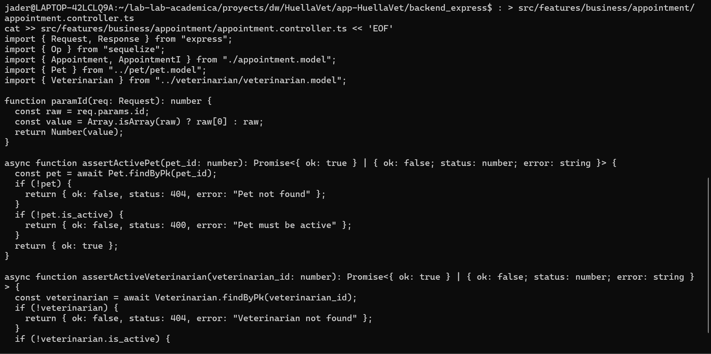

```         
: > src/features/business/product-sale/product-sale.routes.ts
cat >> src/features/business/product-sale/product-sale.routes.ts << 'EOF'
import { Application } from "express";
import { ProductSaleController } from "./product-sale.controller";

export class ProductSaleRoutes {
  public productSaleController: ProductSaleController = new ProductSaleController();

  public routes(app: Application): void {
    // ================== RUTAS SIN AUTENTICACIÓN / SIN MIDDLEWARE JWT ==================

    // getAll
    app
      .route("/api/detalle-ventas")
      .get(this.productSaleController.getAll.bind(this.productSaleController));

    // getOne
    app
      .route("/api/detalle-ventas/:id")
      .get(this.productSaleController.getOne.bind(this.productSaleController));

    // create
    app
      .route("/api/detalle-ventas")
      .post(this.productSaleController.create.bind(this.productSaleController));

    // update (PUT / PATCH)
    app
      .route("/api/detalle-ventas/:id")
      .put(this.productSaleController.updatePut.bind(this.productSaleController))
      .patch(this.productSaleController.updatePatch.bind(this.productSaleController));

    // delete físico
    app
      .route("/api/detalle-ventas/:id")
      .delete(this.productSaleController.deletePhysical.bind(this.productSaleController));

    // delete lógico
    app
      .route("/api/detalle-ventas/:id/deactivate")
      .patch(this.productSaleController.deleteLogical.bind(this.productSaleController));
  }
}
EOF
```

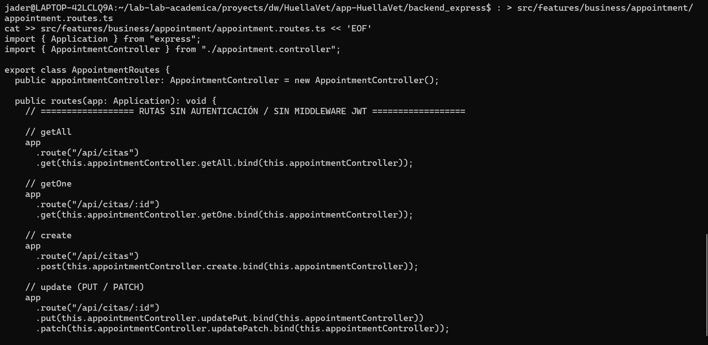

## 13.3 HTTP (REST Client)

```         
: > src/features/business/sale/http/sales.get.http
cat >> src/features/business/sale/http/sales.get.http << 'EOF'
### Feature Sale — GET ALL / GET ONE
### Leyenda: SIN AUTH (sin middleware JWT / sin autenticación)
@baseUrl = http://localhost:4000
@id = 1

# @name getAllSales
GET {{baseUrl}}/api/ventas

###

# @name getOneSale
GET {{baseUrl}}/api/ventas/{{id}}
EOF
```

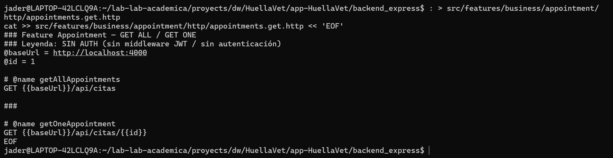

```         
: > src/features/business/sale/http/sales.create.http
cat >> src/features/business/sale/http/sales.create.http << 'EOF'
### Feature Sale — CREATE
### Leyenda: SIN AUTH (sin middleware JWT / sin autenticación)
@baseUrl = http://localhost:4000

# @name createSale
POST {{baseUrl}}/api/ventas
Content-Type: application/json

{
  "client_id": 1,
  "tax": 19,
  "discounts": 5,
  "items": [
    { "product_id": 1, "quantity": 2 },
    { "product_id": 2, "quantity": 1 }
  ]
}
EOF
```

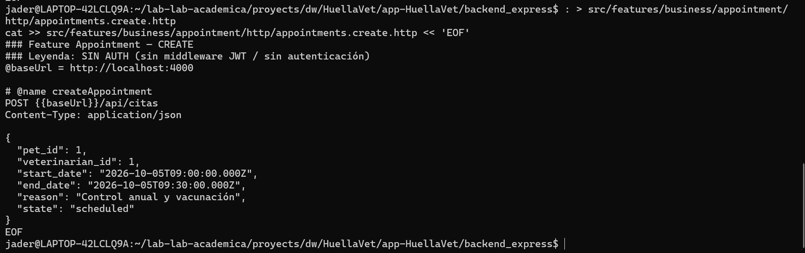

```         
: > src/features/business/sale/http/sales.update.http
cat >> src/features/business/sale/http/sales.update.http << 'EOF'
### Feature Sale — UPDATE (PUT) / UPDATE (PATCH) — solo cabecera
### Leyenda: SIN AUTH (sin middleware JWT / sin autenticación)
@baseUrl = http://localhost:4000
@id = 1

# @name updateSalePut
PUT {{baseUrl}}/api/ventas/{{id}}
Content-Type: application/json

{
  "client_id": 1,
  "tax": 20,
  "discounts": 10,
  "sale_date": "2026-09-16T12:00:00.000Z",
  "status": "active"
}

###

# @name updateSalePatch
PATCH {{baseUrl}}/api/ventas/{{id}}
Content-Type: application/json

{
  "tax": 15,
  "discounts": 0
}
EOF
```

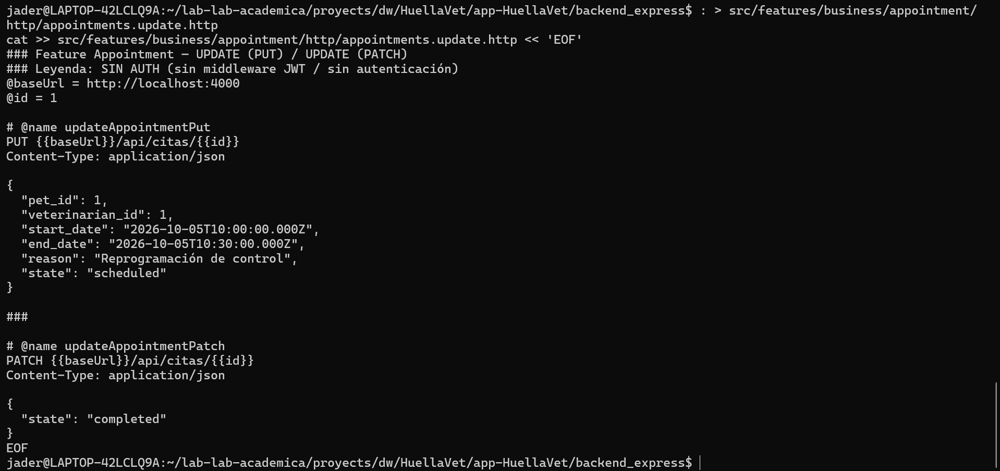

```         
: > src/features/business/sale/http/sales.delete.http
cat >> src/features/business/sale/http/sales.delete.http << 'EOF'
### Feature Sale — DELETE físico / DELETE lógico (status = inactive)
### Leyenda: SIN AUTH (sin middleware JWT / sin autenticación)
@baseUrl = http://localhost:4000
@id = 1

# @name deleteSalePhysical
DELETE {{baseUrl}}/api/ventas/{{id}}

###

# @name deleteSaleLogical
PATCH {{baseUrl}}/api/ventas/{{id}}/deactivate
EOF
```

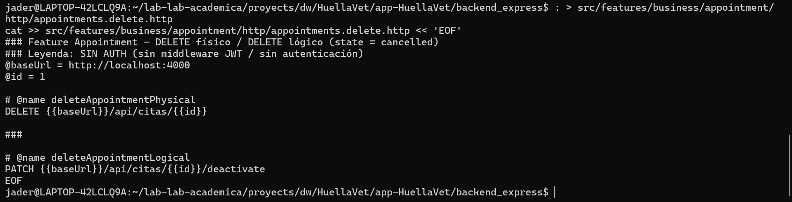

## 13.4 Cableado Routes + Config

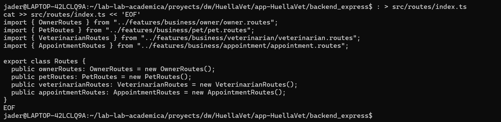

**PARCHE** — `src/config/index.ts`:

**1. Debajo de** `import "../features/business/veterinarian/veterinarian.model";`

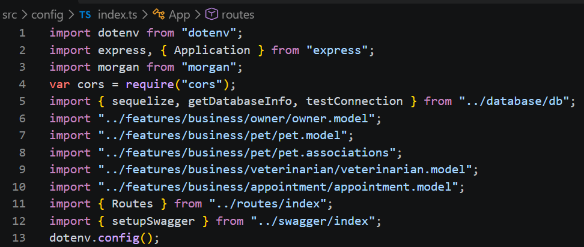

**2. Dentro de** `routes()`, debajo de `this.routePrv.veterinarianRoutes.routes(this.app);`

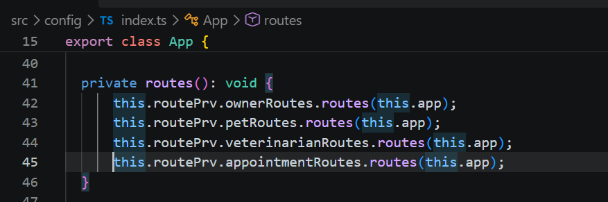

## 13.5 Relación Pet, Appointment y Veterinarian 

```         
: > src/features/business/sale/sale.associations.ts
cat >> src/features/business/sale/sale.associations.ts << 'EOF'
import { Sale } from "./sale.model";
import { Client } from "../client/client.model";

Sale.belongsTo(Client, { foreignKey: "client_id", as: "client" });
Client.hasMany(Sale, { foreignKey: "client_id", as: "sales" });
EOF
```

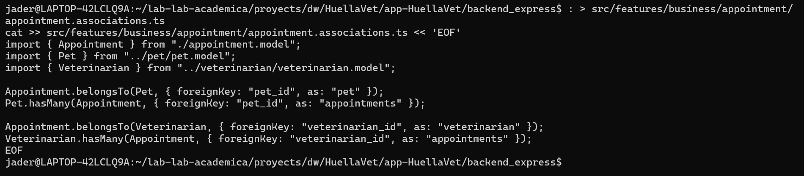

**PARCHE** — `src/config/index.ts` **ya existe**.

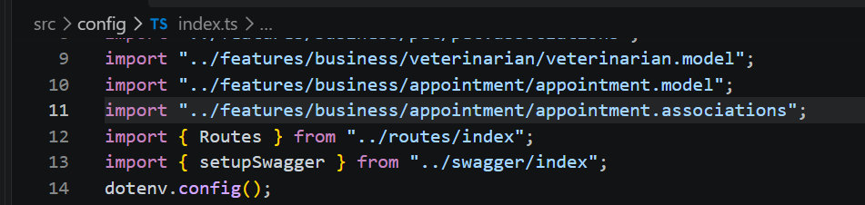

### Verificación

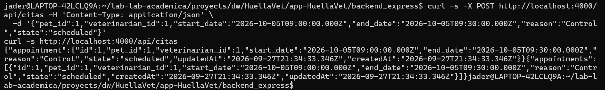

## 13.6 Seeder + Swagger Appointment

```         
: > src/features/business/sale/sale.seeder.ts
cat >> src/features/business/sale/sale.seeder.ts << 'EOF'
import { faker } from "@faker-js/faker";
import { Sale } from "./sale.model";
import { Client } from "../client/client.model";

/**
 * Seeder del feature Sale (cabeceras).
 * Las líneas `product_sales` las inserta `product-sale.seeder.ts`.
 * Idempotente: si ya hay ventas, no inserta.
 */
export async function seedSales(count: number): Promise<number> {
  if (count <= 0) {
    console.log("⏭️  sales: count=0, se omite");
    return 0;
  }

  const existing = await Sale.count();
  if (existing > 0) {
    console.log(`⏭️  sales: ya hay ${existing} registro(s), se omite seeder`);
    return 0;
  }

  const clients = await Client.findAll({ where: { status: "active" } });
  if (clients.length === 0) {
    console.log("⏭️  sales: faltan clientes activos, se omite seeder");
    return 0;
  }

  const rows = Array.from({ length: count }, () => {
    const client = clients[Math.floor(Math.random() * clients.length)];
    const tax = Number(faker.number.float({ min: 0, max: 20, fractionDigits: 2 }));
    const discounts = Number(faker.number.float({ min: 0, max: 10, fractionDigits: 2 }));
    return {
      sale_date: faker.date.recent({ days: 30 }),
      subtotal: 0,
      tax,
      discounts,
      total: tax - discounts,
      client_id: client.id,
      status: "active" as const,
    };
  });

  await Sale.bulkCreate(rows);
  console.log(`✅ sales: insertados ${count} registro(s) falsos (sin ítems)`);
  return count;
}
EOF
```

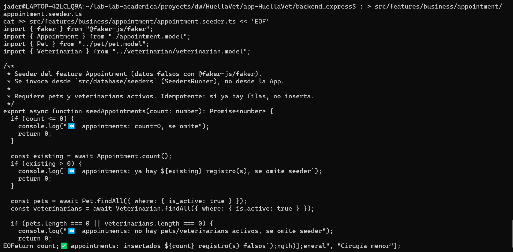

**PARCHE** — `src/database/seeders/counts.ts`

```         
: > src/database/seeders/counts.ts
cat >> src/database/seeders/counts.ts << 'EOF'
/**
 * Cantidad de registros por tabla (snake_case = nombre de tabla BD).
 * Prioridad: CLI (--clients=N) > env (SEED_CLIENTS) > default de este archivo.
 *
 * Cuando agregues features, suma aquí la clave (nombre de tabla) y léela en el runner.
 */
export type SeedCounts = {
  clients: number;
  product_types: number;
  products: number;
  sales: number;
  product_sales: number;
  // users?: number;
  // roles?: number;
};

export const DEFAULT_SEED_COUNTS: SeedCounts = {
  clients: 10,
  product_types: 25,
  products: 15,
  sales: 5,
  product_sales: 12,
};

export function resolveSeedCounts(argv: string[] = process.argv.slice(2)): SeedCounts {
  const counts: SeedCounts = { ...DEFAULT_SEED_COUNTS };

  const envMap: Array<[keyof SeedCounts, string | undefined]> = [
    ["clients", process.env.SEED_CLIENTS],
    ["product_types", process.env.SEED_PRODUCT_TYPES],
    ["products", process.env.SEED_PRODUCTS],
    ["sales", process.env.SEED_SALES],
    ["product_sales", process.env.SEED_PRODUCT_SALES],
  ];
  for (const [key, value] of envMap) {
    if (value !== undefined && value !== "") {
      counts[key] = Number(value);
    }
  }

  for (const arg of argv) {
    const m = arg.match(/^--([a-zA-Z_]+)=(\d+)$/);
    if (!m) continue;
    const key = m[1] as keyof SeedCounts;
    const value = Number(m[2]);
    if (key in counts) {
      counts[key] = value;
    }
  }

  return counts;
}
EOF
```

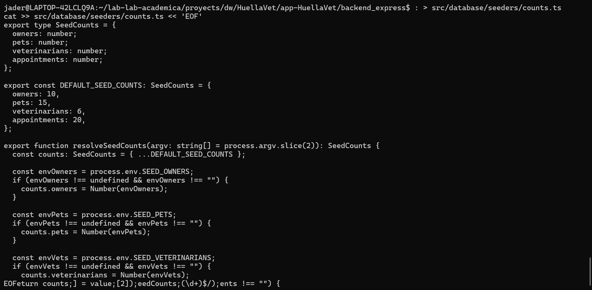

**PARCHE** — `src/database/seeders/index.ts`

```         
: > src/database/seeders/index.ts
cat >> src/database/seeders/index.ts << 'EOF'
import dotenv from "dotenv";
import { sequelize, testConnection } from "../db";
import "../../features/business/client/client.model";
import "../../features/business/product-type/product-type.model";
import "../../features/business/product/product.model";
import "../../features/business/sale/sale.model";
import "../../features/business/product-sale/product-sale.model";
import "../../features/business/product/product.associations";
import "../../features/business/sale/sale.associations";
import "../../features/business/product-sale/product-sale.associations";
import { seedClients } from "../../features/business/client/client.seeder";
import { seedProductTypes } from "../../features/business/product-type/product-type.seeder";
import { seedProducts } from "../../features/business/product/product.seeder";
import { seedSales } from "../../features/business/sale/sale.seeder";
import { seedProductSales } from "../../features/business/product-sale/product-sale.seeder";
import { resolveSeedCounts } from "./counts";

dotenv.config();

/**
 * SeedersRunner — ejecuta los seeders de TODAS las tablas (features).
 *
 * Tablas actuales (orden padres → hijos):
 *   clients → product_types → products → sales → product_sales
 *
 * Ejecutar seeders de todas las tablas:
 *   npm run db:seed
 *
 * Variar cantidades (CLI o env; claves = nombre de tabla):
 *   npm run db:seed -- --clients=20 --product_types=5 --products=15 --sales=5 --product_sales=12
 *   SEED_CLIENTS=5 SEED_PRODUCT_TYPES=3 SEED_PRODUCTS=10 SEED_SALES=2 SEED_PRODUCT_SALES=6 npm run db:seed
 *
 * Defaults: ver `counts.ts`. Cada seeder es idempotente (si ya hay filas, omite).
 * Ubicación de cada seeder: `src/features/.../<entidad>.seeder.ts`
 * Este archivo solo orquesta; no define datos.
 */
export async function runAllSeeders(): Promise<void> {
  const counts = resolveSeedCounts();
  console.log("🌱 Iniciando SeedersRunner...");
  console.log("📊 Conteos:", counts);

  const ok = await testConnection();
  if (!ok) {
    throw new Error("No hay conexión a la base de datos");
  }

  const isMysql =
    sequelize.getDialect() === "mysql" || sequelize.getDialect() === "mariadb";
  if (isMysql) {
    await sequelize.query("SET FOREIGN_KEY_CHECKS = 0");
  }
  try {
    await sequelize.sync({ force: false, alter: true });
  } finally {
    if (isMysql) {
      await sequelize.query("SET FOREIGN_KEY_CHECKS = 1");
    }
  }

  // Orden: business (padres → hijos)
  await seedClients(counts.clients);
  await seedProductTypes(counts.product_types);
  await seedProducts(counts.products);
  await seedSales(counts.sales);
  await seedProductSales(counts.product_sales);

  console.log("🌱 SeedersRunner finalizado");
}

if (require.main === module) {
  runAllSeeders()
    .then(async () => {
      await sequelize.close();
      process.exit(0);
    })
    .catch(async (err) => {
      console.error("❌ Error en seeders:", err);
      await sequelize.close();
      process.exit(1);
    });
}
EOF
```

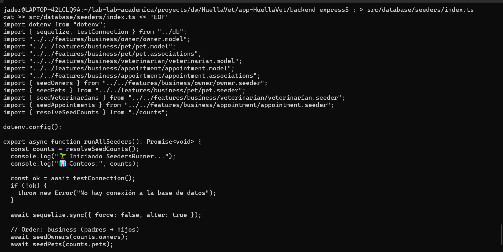

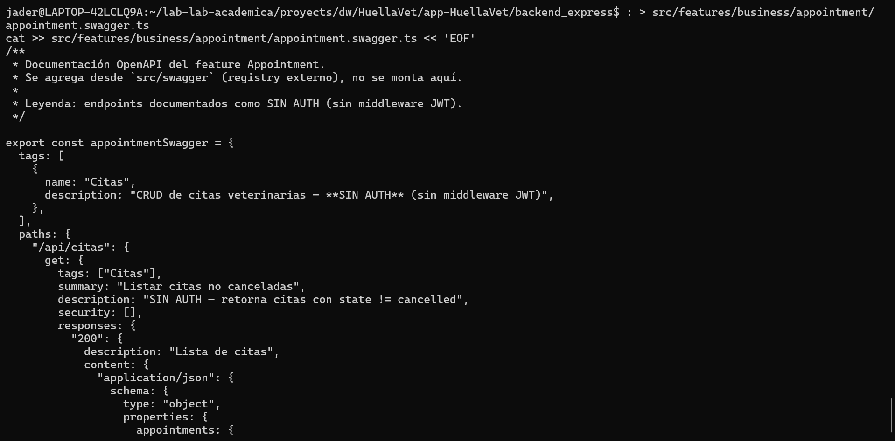

**PARCHE** — `src/swagger/index.ts` completo:

```         
: > src/swagger/index.ts
cat >> src/swagger/index.ts << 'EOF'
import { Application } from "express";
import swaggerUi from "swagger-ui-express";
import { clientSwagger } from "../features/business/client/client.swagger";
import { productTypeSwagger } from "../features/business/product-type/product-type.swagger";
import { productSwagger } from "../features/business/product/product.swagger";
import { saleSwagger } from "../features/business/sale/sale.swagger";
import { productSaleSwagger } from "../features/business/product-sale/product-sale.swagger";

export type FeatureSwaggerModule = {
  tags: unknown[];
  paths: Record<string, unknown>;
  components?: { schemas?: Record<string, unknown> };
};

/**
 * Registry externo: importa la documentación OpenAPI de cada feature
 * (mismo patrón que SeedersRunner).
 */
const featureSwaggerModules: FeatureSwaggerModule[] = [
  clientSwagger,
  productTypeSwagger,
  productSwagger,
  saleSwagger,
  productSaleSwagger,
];

export function buildOpenApiDocument() {
  const tags: unknown[] = [];
  const paths: Record<string, unknown> = {};
  const schemas: Record<string, unknown> = {};

  for (const mod of featureSwaggerModules) {
    tags.push(...mod.tags);
    Object.assign(paths, mod.paths);
    if (mod.components?.schemas) {
      Object.assign(schemas, mod.components.schemas);
    }
  }

  return {
    openapi: "3.0.3",
    info: {
      title: "StoreLab API",
      version: "1.0.0",
      description:
        "API StoreLab (Express + Sequelize). Los endpoints de business están documentados como **SIN AUTH** (este lab no implementa autenticación).",
    },
    servers: [
      {
        url: `http://localhost:${process.env.PORT || 4000}`,
        description: "Local",
      },
    ],
    tags,
    paths,
    components: { schemas },
  };
}

/** Monta Swagger UI y el JSON OpenAPI */
export function setupSwagger(app: Application): void {
  const document = buildOpenApiDocument();
  app.use("/api/docs", swaggerUi.serve, swaggerUi.setup(document));
  app.get("/api/docs.json", (_req, res) => {
    res.json(document);
  });
  console.log("📘 Swagger UI: /api/docs  |  OpenAPI JSON: /api/docs.json");
}
EOF
```

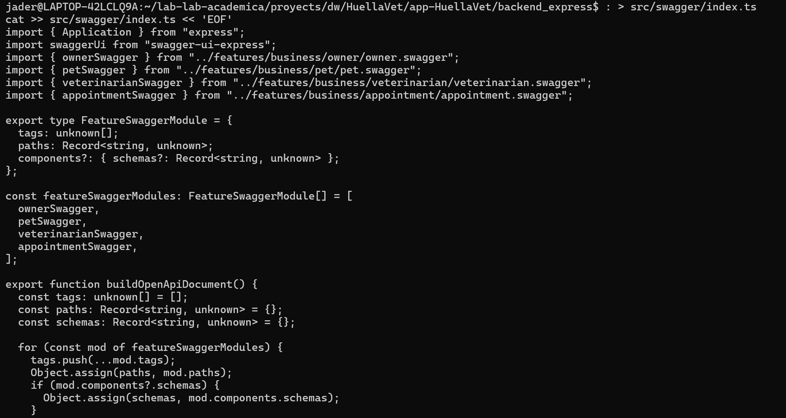

### Cierre del ISSUE-08

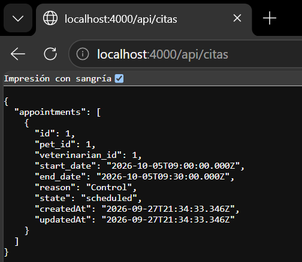](images/clipboard-2252877040.png)

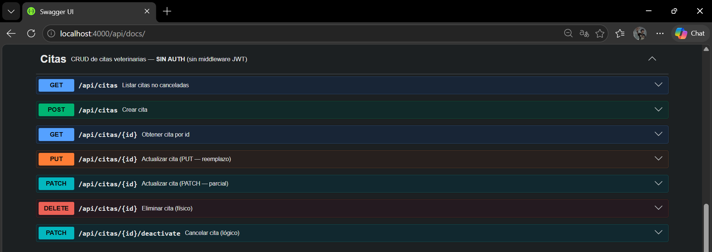

# 14. ISS-09 — Feature Consultation (Consultas)

## 13.1 Modelo Consultation

```         
: > src/features/business/product-type/product-type.model.ts
cat >> src/features/business/product-type/product-type.model.ts << 'EOF'
import { DataTypes, Model } from "sequelize";
import { sequelize } from "../../../database/db";

export interface ProductTypeI {
  id?: number;
  name: string;
  description?: string | null;
  status: "active" | "inactive";
  createdAt?: Date;
  updatedAt?: Date;
}

export class ProductType extends Model {
  public id!: number;
  public name!: string;
  public description!: string | null;
  public status!: "active" | "inactive";
  public readonly createdAt!: Date;
  public readonly updatedAt!: Date;
}

ProductType.init(
  {
    name: {
      type: DataTypes.STRING,
      allowNull: false,
    },
    description: {
      type: DataTypes.STRING,
      allowNull: true,
    },
    status: {
      type: DataTypes.ENUM("active", "inactive"),
      defaultValue: "inactive",
      allowNull: false,
    },
  },
  {
    sequelize,
    modelName: "ProductType",
    tableName: "product_types",
    timestamps: true,
  }
);
EOF
```

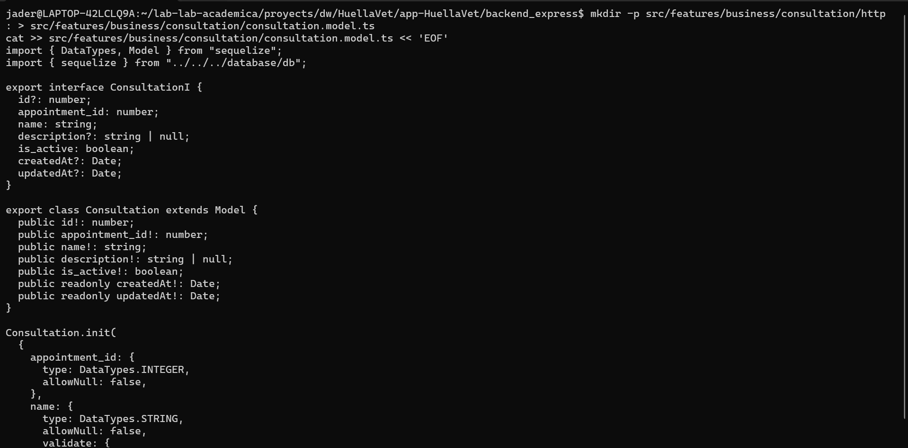

## 14.2 Controller + routes (CRUD completo)

```         
: > src/features/business/product-type/product-type.controller.ts
cat >> src/features/business/product-type/product-type.controller.ts << 'EOF'
import { Request, Response } from "express";
import { ProductType, ProductTypeI } from "./product-type.model";

function paramId(req: Request): number {
  const raw = req.params.id;
  const value = Array.isArray(raw) ? raw[0] : raw;
  return Number(value);
}

export class ProductTypeController {
  // ================== READ ==================
  public async getAll(req: Request, res: Response) {
    try {
      const product_types = await ProductType.findAll({
        where: { status: "active" },
      });
      res.status(200).json({ product_types });
    } catch (error) {
      res.status(500).json({ error: "Error fetching product types", detail: String(error) });
    }
  }

  public async getOne(req: Request, res: Response) {
    try {
      const id = paramId(req);
      const product_type = await ProductType.findByPk(id);
      if (!product_type) {
        res.status(404).json({ error: "Product type not found" });
        return;
      }
      res.status(200).json({ product_type });
    } catch (error) {
      res.status(500).json({ error: "Error fetching product type", detail: String(error) });
    }
  }

  // ================== CREATE ==================
  public async create(req: Request, res: Response) {
    try {
      const body = req.body as ProductTypeI;
      const product_type = await ProductType.create({
        name: body.name,
        description: body.description ?? null,
        status: body.status ?? "active",
      });
      res.status(201).json({ product_type });
    } catch (error) {
      res.status(500).json({ error: "Error creating product type", detail: String(error) });
    }
  }

  // ================== UPDATE ==================
  public async updatePut(req: Request, res: Response) {
    try {
      const id = paramId(req);
      const body = req.body as ProductTypeI;
      const product_type = await ProductType.findByPk(id);
      if (!product_type) {
        res.status(404).json({ error: "Product type not found" });
        return;
      }

      await product_type.update({
        name: body.name,
        description: body.description ?? null,
        status: body.status ?? product_type.status,
      });

      res.status(200).json({ product_type });
    } catch (error) {
      res.status(500).json({ error: "Error updating product type (PUT)", detail: String(error) });
    }
  }

  public async updatePatch(req: Request, res: Response) {
    try {
      const id = paramId(req);
      const body = req.body as Partial<ProductTypeI>;
      const product_type = await ProductType.findByPk(id);
      if (!product_type) {
        res.status(404).json({ error: "Product type not found" });
        return;
      }

      await product_type.update(body);
      res.status(200).json({ product_type });
    } catch (error) {
      res.status(500).json({ error: "Error updating product type (PATCH)", detail: String(error) });
    }
  }

  // ================== DELETE ==================
  /** Eliminación física */
  public async deletePhysical(req: Request, res: Response) {
    try {
      const id = paramId(req);
      const product_type = await ProductType.findByPk(id);
      if (!product_type) {
        res.status(404).json({ error: "Product type not found" });
        return;
      }
      await product_type.destroy();
      res.status(200).json({ message: "Product type permanently deleted", id });
    } catch (error) {
      res.status(500).json({ error: "Error deleting product type", detail: String(error) });
    }
  }

  /** Eliminación lógica → status = inactive */
  public async deleteLogical(req: Request, res: Response) {
    try {
      const id = paramId(req);
      const product_type = await ProductType.findByPk(id);
      if (!product_type) {
        res.status(404).json({ error: "Product type not found" });
        return;
      }
      await product_type.update({ status: "inactive" });
      res.status(200).json({
        message: "Product type deactivated (logical delete)",
        product_type,
      });
    } catch (error) {
      res.status(500).json({ error: "Error deactivating product type", detail: String(error) });
    }
  }
}
EOF
```

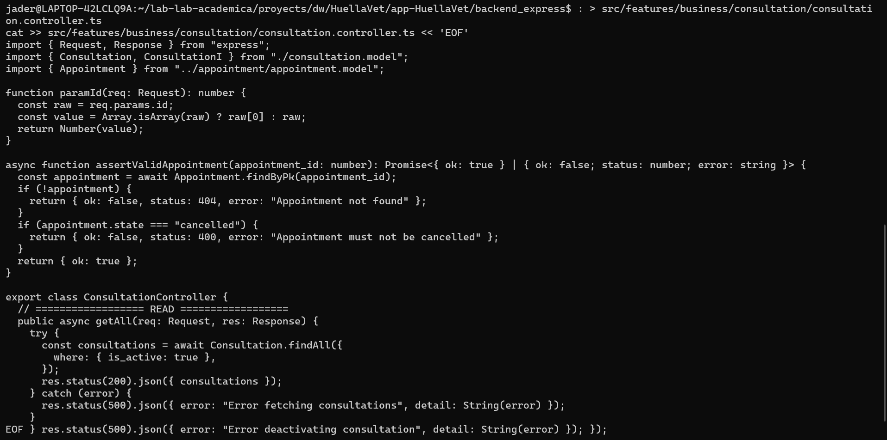

```         
: > src/features/business/product-type/product-type.routes.ts
cat >> src/features/business/product-type/product-type.routes.ts << 'EOF'
import { Application } from "express";
import { ProductTypeController } from "./product-type.controller";

export class ProductTypeRoutes {
  public productTypeController: ProductTypeController = new ProductTypeController();

  public routes(app: Application): void {
    // ================== RUTAS SIN AUTENTICACIÓN / SIN MIDDLEWARE JWT ==================

    // getAll
    app
      .route("/api/tipos-producto")
      .get(this.productTypeController.getAll.bind(this.productTypeController));

    // getOne
    app
      .route("/api/tipos-producto/:id")
      .get(this.productTypeController.getOne.bind(this.productTypeController));

    // create
    app
      .route("/api/tipos-producto")
      .post(this.productTypeController.create.bind(this.productTypeController));

    // update (PUT / PATCH)
    app
      .route("/api/tipos-producto/:id")
      .put(this.productTypeController.updatePut.bind(this.productTypeController))
      .patch(this.productTypeController.updatePatch.bind(this.productTypeController));

    // delete físico
    app
      .route("/api/tipos-producto/:id")
      .delete(this.productTypeController.deletePhysical.bind(this.productTypeController));

    // delete lógico
    app
      .route("/api/tipos-producto/:id/deactivate")
      .patch(this.productTypeController.deleteLogical.bind(this.productTypeController));
  }
}
EOF
```

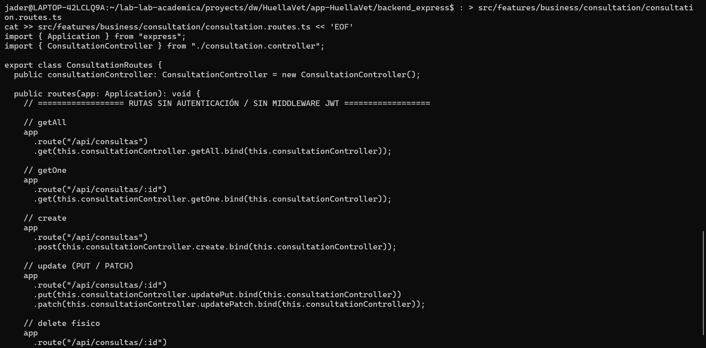

## 14.3 HTTP (REST Client)

```         
: > src/features/business/product-type/http/product-types.get.http
cat >> src/features/business/product-type/http/product-types.get.http << 'EOF'
### Feature ProductType — GET ALL / GET ONE
### Leyenda: SIN AUTH (sin middleware JWT / sin autenticación)
@baseUrl = http://localhost:4000
@id = 1

# @name getAllProductTypes
GET {{baseUrl}}/api/tipos-producto

###

# @name getOneProductType
GET {{baseUrl}}/api/tipos-producto/{{id}}
EOF
```

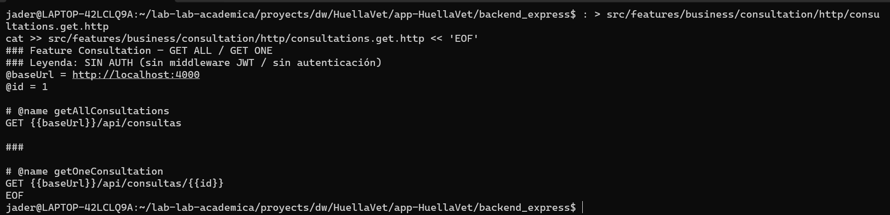

```         
: > src/features/business/product-type/http/product-types.create.http
cat >> src/features/business/product-type/http/product-types.create.http << 'EOF'
### Feature ProductType — CREATE
### Leyenda: SIN AUTH (sin middleware JWT / sin autenticación)
@baseUrl = http://localhost:4000

# @name createProductType
POST {{baseUrl}}/api/tipos-producto
Content-Type: application/json

{
  "name": "Electrónica",
  "description": "Dispositivos y accesorios",
  "status": "active"
}
EOF
```

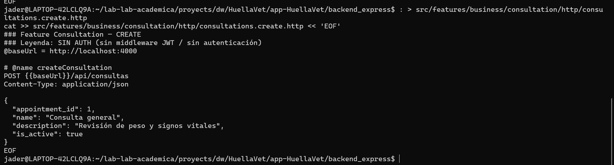

```         
: > src/features/business/product-type/http/product-types.update.http
cat >> src/features/business/product-type/http/product-types.update.http << 'EOF'
### Feature ProductType — UPDATE (PUT) / UPDATE (PATCH)
### Leyenda: SIN AUTH (sin middleware JWT / sin autenticación)
@baseUrl = http://localhost:4000
@id = 1

# @name updateProductTypePut
PUT {{baseUrl}}/api/tipos-producto/{{id}}
Content-Type: application/json

{
  "name": "Electrónica Actualizada",
  "description": "Categoría renovada",
  "status": "active"
}

###

# @name updateProductTypePatch
PATCH {{baseUrl}}/api/tipos-producto/{{id}}
Content-Type: application/json

{
  "description": "Descripción parcial"
}
EOF
```

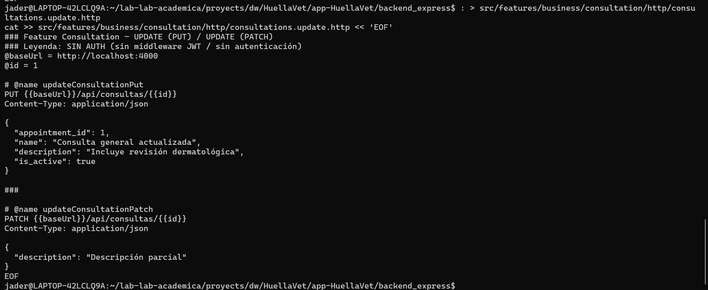

```         
: > src/features/business/product-type/http/product-types.delete.http
cat >> src/features/business/product-type/http/product-types.delete.http << 'EOF'
### Feature ProductType — DELETE físico / DELETE lógico (status = inactive)
### Leyenda: SIN AUTH (sin middleware JWT / sin autenticación)
@baseUrl = http://localhost:4000
@id = 1

# @name deleteProductTypePhysical
DELETE {{baseUrl}}/api/tipos-producto/{{id}}

###

# @name deleteProductTypeLogical
PATCH {{baseUrl}}/api/tipos-producto/{{id}}/deactivate
EOF
```

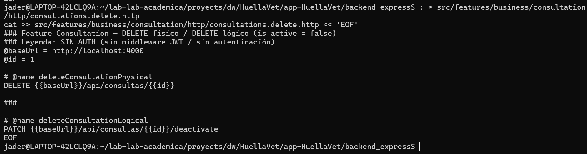

## 14.4 Cableado Routes + Config

**PARCHE** — `src/routes/index.ts` **ya existe**.

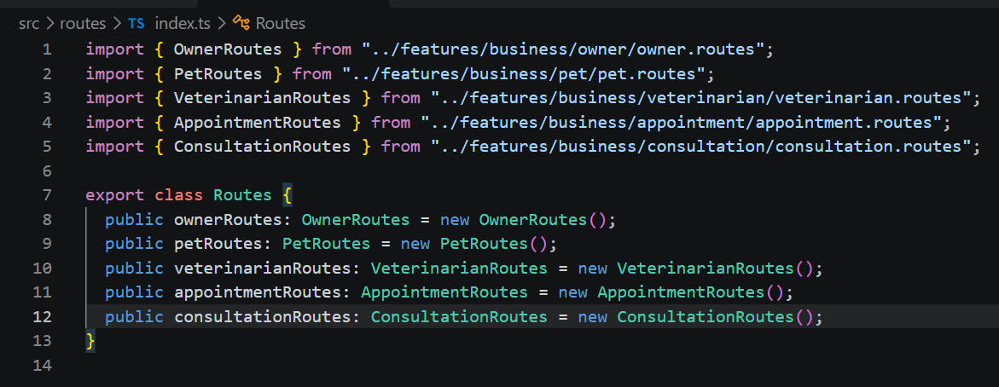

**PARCHE** — `src/config/index.ts` **ya existe**.

1.  **Debajo de** `import "../features/business/client/client.model";`, **añadir**

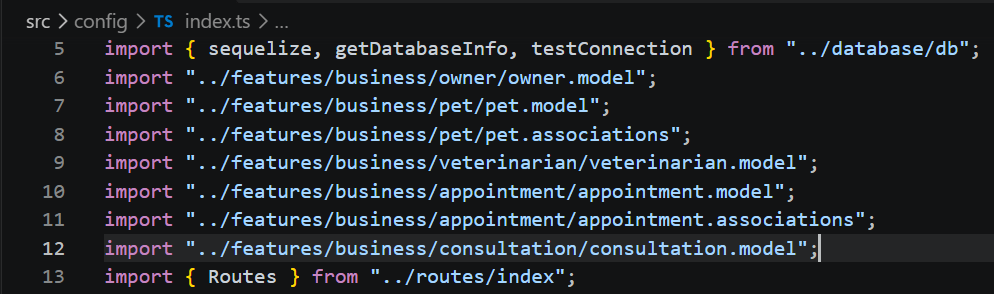

2.  **Dentro de** `routes()`, **debajo de** `this.routePrv.clientRoutes.routes(this.app);`, **añadir**

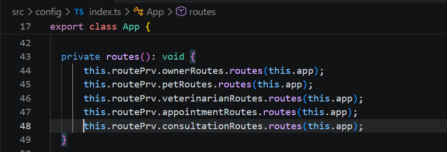

### Verificación

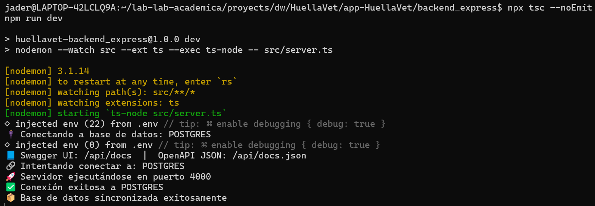

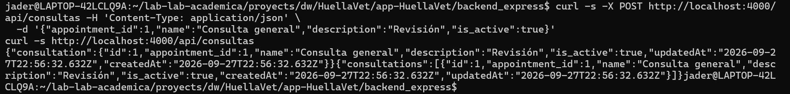

## 14.5 Relación Appointment ↔ Consultation 

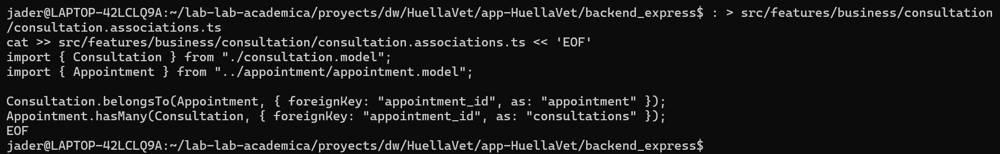

**PARCHE** — `src/config/index.ts`: debajo de `import "../features/business/consultation/consultation.model";`, añade

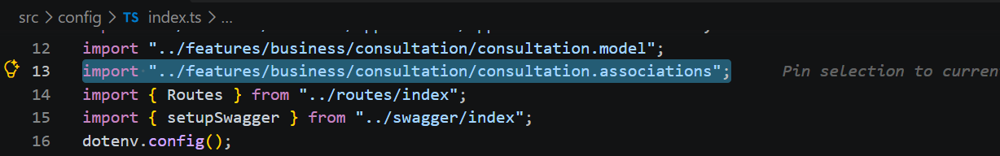

## 14.6 Seeder Consultation

```         
: > src/features/business/product-type/product-type.seeder.ts
cat >> src/features/business/product-type/product-type.seeder.ts << 'EOF'
import { faker } from "@faker-js/faker";
import { ProductType } from "./product-type.model";

/**
 * Seeder del feature ProductType (datos falsos con @faker-js/faker).
 * Se invoca desde `src/database/seeders` (SeedersRunner), no desde la App.
 *
 * Idempotente: si ya hay filas, no vuelve a insertar.
 */
export async function seedProductTypes(count: number): Promise<number> {
  if (count <= 0) {
    console.log("⏭️  product_types: count=0, se omite");
    return 0;
  }

  const existing = await ProductType.count();
  if (existing > 0) {
    console.log(`⏭️  product_types: ya hay ${existing} registro(s), se omite seeder`);
    return 0;
  }

  const rows = Array.from({ length: count }, () => ({
    name: faker.commerce.department(),
    description: faker.commerce.productDescription(),
    status: "active" as const,
  }));

  await ProductType.bulkCreate(rows);
  console.log(`✅ product_types: insertados ${count} registro(s) falsos`);
  return count;
}
EOF
```

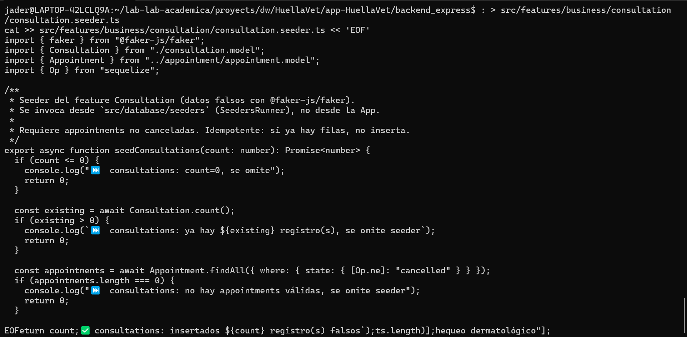

**PARCHE** — `src/database/seeders/counts.ts` **ya existe**.

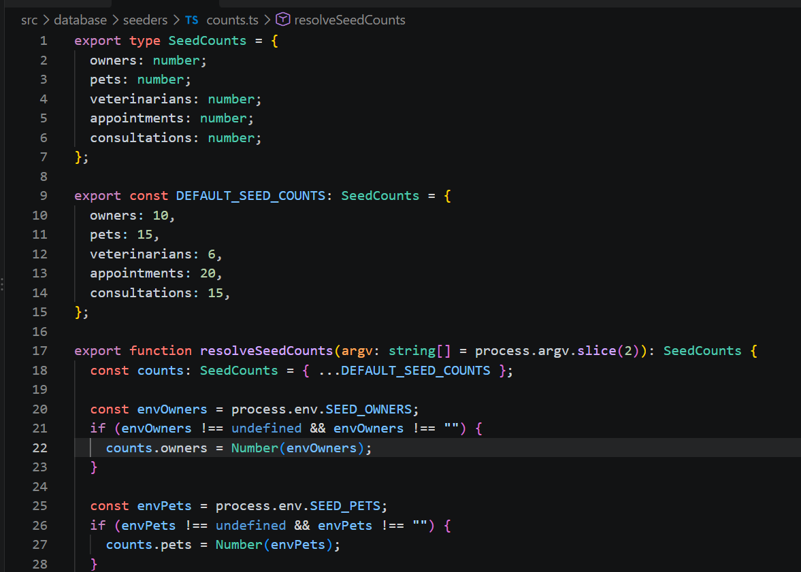

**PARCHE** — `src/database/seeders/index.ts` **ya existe**.

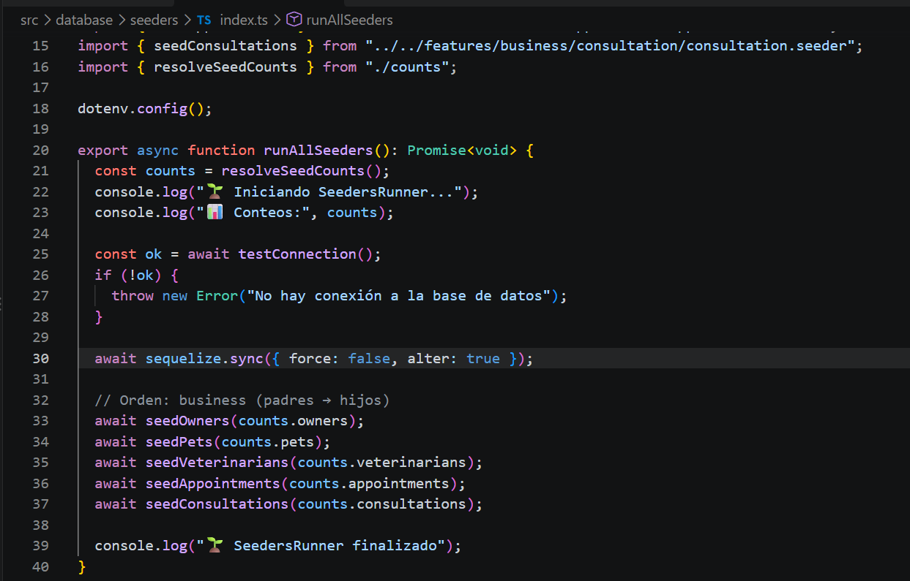

## 14.7 Swagger Consultation

```         
: > src/features/business/product-type/product-type.swagger.ts
cat >> src/features/business/product-type/product-type.swagger.ts << 'EOF'
/**
 * Documentación OpenAPI del feature ProductType.
 * Se agrega desde `src/swagger` (registry externo), no se monta aquí.
 *
 * Leyenda: endpoints documentados como SIN AUTH (sin middleware JWT).
 */

export const productTypeSwagger = {
  tags: [
    {
      name: "TiposProducto",
      description: "CRUD de tipos de producto — **SIN AUTH** (sin middleware JWT)",
    },
  ],
  paths: {
    "/api/tipos-producto": {
      get: {
        tags: ["TiposProducto"],
        summary: "Listar tipos de producto activos",
        description: "SIN AUTH — retorna tipos con status=active",
        security: [],
        responses: {
          "200": {
            description: "Lista de tipos de producto",
            content: {
              "application/json": {
                schema: {
                  type: "object",
                  properties: {
                    product_types: {
                      type: "array",
                      items: { $ref: "#/components/schemas/ProductType" },
                    },
                  },
                },
              },
            },
          },
        },
      },
      post: {
        tags: ["TiposProducto"],
        summary: "Crear tipo de producto",
        description: "SIN AUTH",
        security: [],
        requestBody: {
          required: true,
          content: {
            "application/json": {
              schema: { $ref: "#/components/schemas/ProductTypeCreate" },
            },
          },
        },
        responses: {
          "201": {
            description: "Tipo de producto creado",
            content: {
              "application/json": {
                schema: {
                  type: "object",
                  properties: {
                    product_type: { $ref: "#/components/schemas/ProductType" },
                  },
                },
              },
            },
          },
        },
      },
    },
    "/api/tipos-producto/{id}": {
      get: {
        tags: ["TiposProducto"],
        summary: "Obtener tipo de producto por id",
        description: "SIN AUTH",
        security: [],
        parameters: [
          {
            name: "id",
            in: "path",
            required: true,
            schema: { type: "integer" },
          },
        ],
        responses: {
          "200": {
            description: "Tipo de producto encontrado",
            content: {
              "application/json": {
                schema: {
                  type: "object",
                  properties: {
                    product_type: { $ref: "#/components/schemas/ProductType" },
                  },
                },
              },
            },
          },
          "404": { description: "No encontrado" },
        },
      },
      put: {
        tags: ["TiposProducto"],
        summary: "Actualizar tipo de producto (PUT — reemplazo)",
        description: "SIN AUTH",
        security: [],
        parameters: [
          {
            name: "id",
            in: "path",
            required: true,
            schema: { type: "integer" },
          },
        ],
        requestBody: {
          required: true,
          content: {
            "application/json": {
              schema: { $ref: "#/components/schemas/ProductTypeUpdate" },
            },
          },
        },
        responses: {
          "200": { description: "Actualizado" },
          "404": { description: "No encontrado" },
        },
      },
      patch: {
        tags: ["TiposProducto"],
        summary: "Actualizar tipo de producto (PATCH — parcial)",
        description: "SIN AUTH",
        security: [],
        parameters: [
          {
            name: "id",
            in: "path",
            required: true,
            schema: { type: "integer" },
          },
        ],
        requestBody: {
          required: true,
          content: {
            "application/json": {
              schema: { $ref: "#/components/schemas/ProductTypePatch" },
            },
          },
        },
        responses: {
          "200": { description: "Actualizado" },
          "404": { description: "No encontrado" },
        },
      },
      delete: {
        tags: ["TiposProducto"],
        summary: "Eliminar tipo de producto (físico)",
        description: "SIN AUTH — borra la fila",
        security: [],
        parameters: [
          {
            name: "id",
            in: "path",
            required: true,
            schema: { type: "integer" },
          },
        ],
        responses: {
          "200": { description: "Eliminado" },
          "404": { description: "No encontrado" },
        },
      },
    },
    "/api/tipos-producto/{id}/deactivate": {
      patch: {
        tags: ["TiposProducto"],
        summary: "Eliminar tipo de producto (lógico)",
        description: "SIN AUTH — status = inactive",
        security: [],
        parameters: [
          {
            name: "id",
            in: "path",
            required: true,
            schema: { type: "integer" },
          },
        ],
        responses: {
          "200": { description: "Desactivado" },
          "404": { description: "No encontrado" },
        },
      },
    },
  },
  components: {
    schemas: {
      ProductType: {
        type: "object",
        properties: {
          id: { type: "integer", example: 1 },
          name: { type: "string", example: "Electrónica" },
          description: { type: "string", example: "Dispositivos y accesorios", nullable: true },
          status: { type: "string", enum: ["active", "inactive"], example: "active" },
          createdAt: { type: "string", format: "date-time" },
          updatedAt: { type: "string", format: "date-time" },
        },
      },
      ProductTypeCreate: {
        type: "object",
        required: ["name"],
        properties: {
          name: { type: "string" },
          description: { type: "string" },
          status: { type: "string", enum: ["active", "inactive"], default: "active" },
        },
      },
      ProductTypeUpdate: {
        type: "object",
        required: ["name"],
        properties: {
          name: { type: "string" },
          description: { type: "string" },
          status: { type: "string", enum: ["active", "inactive"] },
        },
      },
      ProductTypePatch: {
        type: "object",
        properties: {
          name: { type: "string" },
          description: { type: "string" },
          status: { type: "string", enum: ["active", "inactive"] },
        },
      },
    },
  },
};
EOF
```

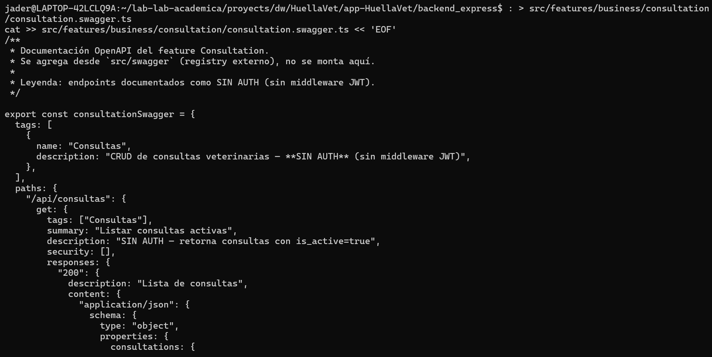

**PARCHE** — `src/swagger/index.ts` **ya existe**.

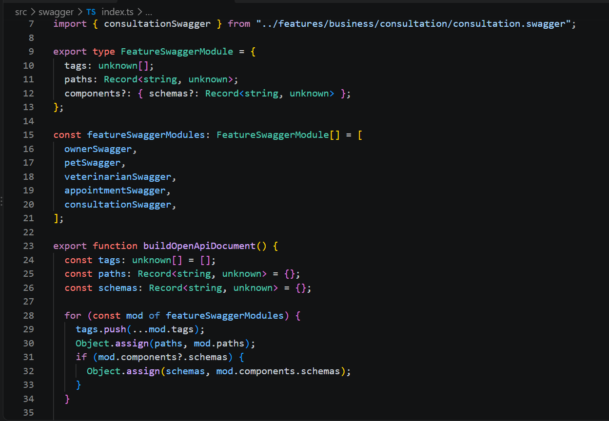

### Cierre del ISSUE-09

```         
npm run dev
```

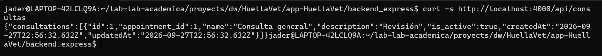](images/clipboard-3628658065.png)

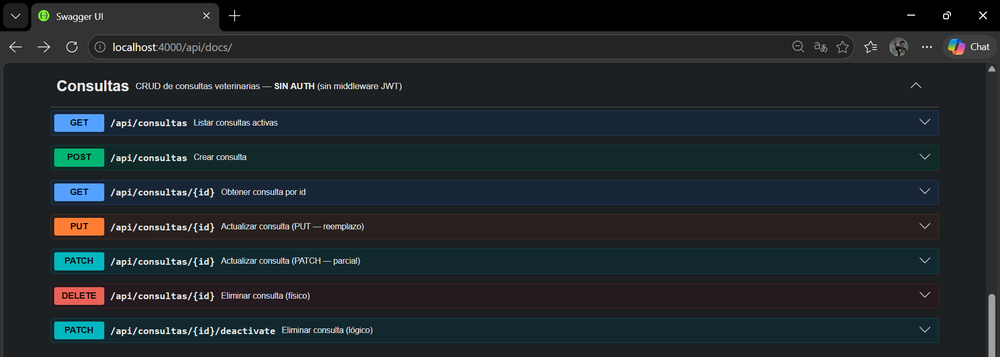
