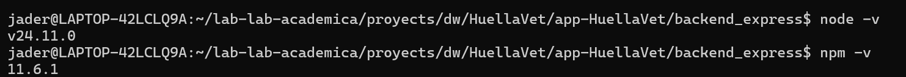
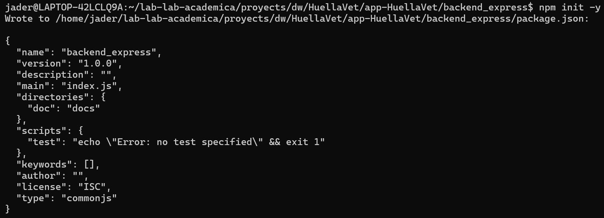

# **Archivo Evidencia Manual Backend Express**

**Nombre:** Jader Gutiérrez Areiza

**Asignatura:** Desarrollo Web

**Docente:** Jaider Quintero

Programa Ingeniería en Sistemas - Octavo Semestre

Universidad de La Guajira

# 1. ISS-00 — Requisitos previos

---
node -v
npm -v
---

### Verificación

# 2. ISS-01 — Esqueleto express Arrancable

## 2.1 Inicializar npm y scripts

---
mkdir backend_expres
cd backend_express
npm init -y
mkdir -p docs
---

