::: {custom-style="Title" align="center"}
**UNIVERSIDAD DE LA GUAJIRA**\
**FACULTAD DE INGENIERÍA**\
**PROGRAMA DE INGENIERÍA DE SISTEMAS**

**ACTIVIDAD 01 DE DESARROLLO WEB**\
**Presentado por:**\
Jader Gutiérrez Areiza

**Octavo Semestre**\
**Asignatura:** Desarrollo Web\
**Docente:** Jaider Quintero

**Riohacha, La Guajira**\
**2026**
:::

## 1. Requisitos previos

En esta sección se verifica la actualización de los paquetes del Ubuntu en WSL y la presencia de Docker junto con el complemento Docker Compose.

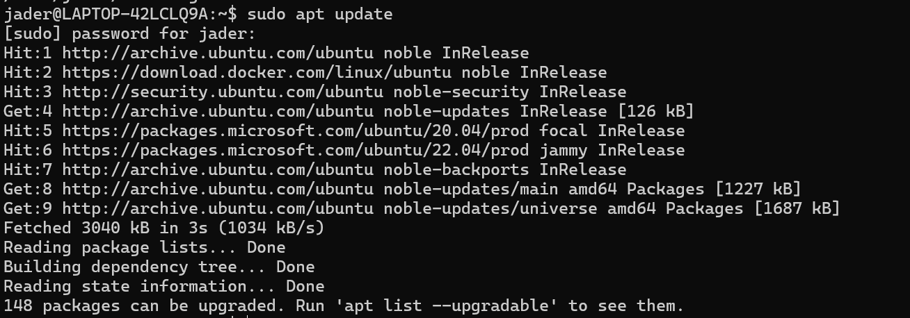

Verificación de versiones de Docker y Docker Compose:

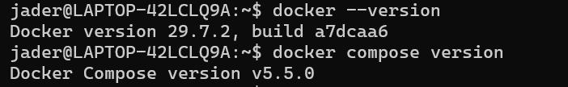

## 2. Crear carpetas

Se crea la estructura del directorio de trabajo para alojar los servicios de la infraestructura de base de datos.

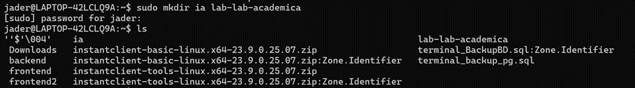

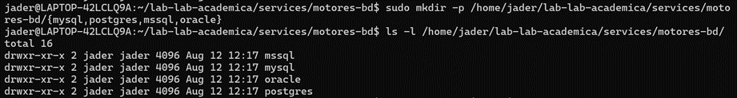

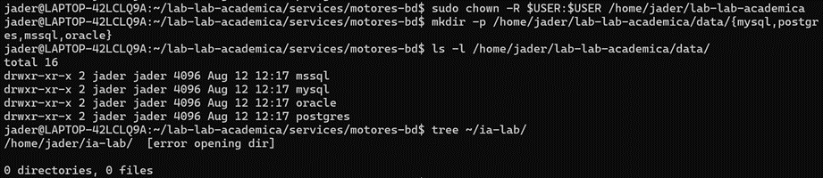

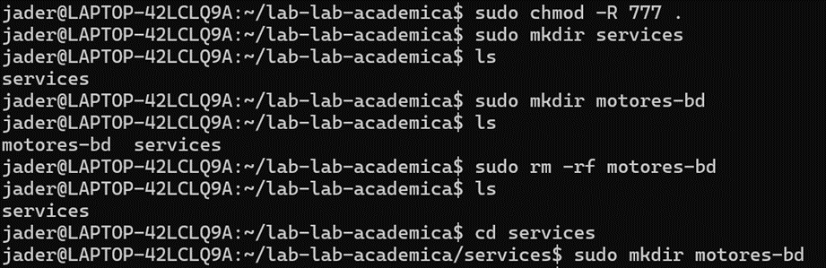

Se verifica la estructura:

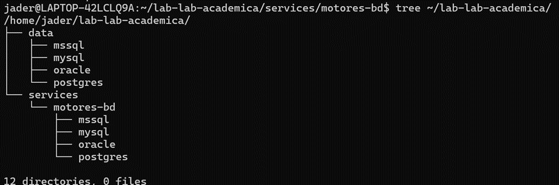

## 3. Red Compartida

Para permitir que los contenedores de los distintos motores de bases de datos se comuniquen entre sí y sean accesibles desde la red local o desde equipos remotos, se crea una red personalizada en Docker.

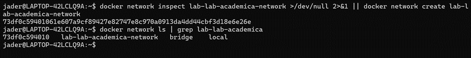

## 4. MySQL

### 4.1 Crear el archivo docker-compose.yml

En la carpeta `~/ia-lab/services/motores-bd/mysql`, se define la infraestructura del contenedor mediante el archivo `docker-compose.yml` .

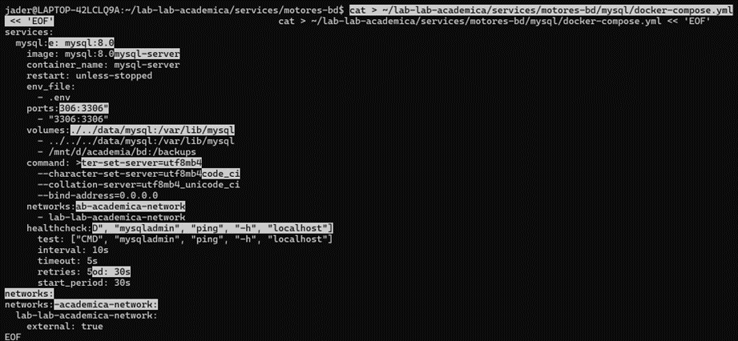

### 4.2 Crear el archivo .env

Se crea el archivo `.env` para gestionar las variables de entorno confidenciales, tales como las contraseñas del usuario `root` y la configuración inicial del motor.

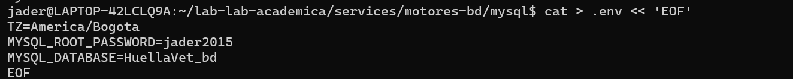

### 4.3 Crear README.md

Aquí se detallan los comandos de inicio, detención y las credenciales de acceso para la administración del contenedor de MySQL.

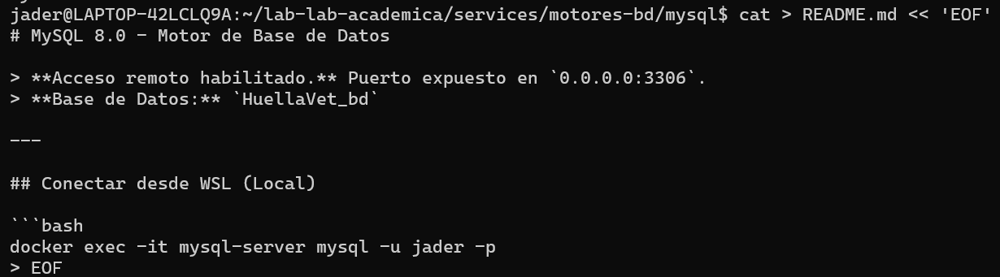

### 4.4 Conectar remotamente desde cualquier equipo

Se realiza el despliegue del servicio ejecutando `docker compose up -d` y se verifica la conexión remota desde el equipo cliente utilizando un gestor de bases de datos como DBeaver apuntando a la IP del servidor en el puerto 3306.

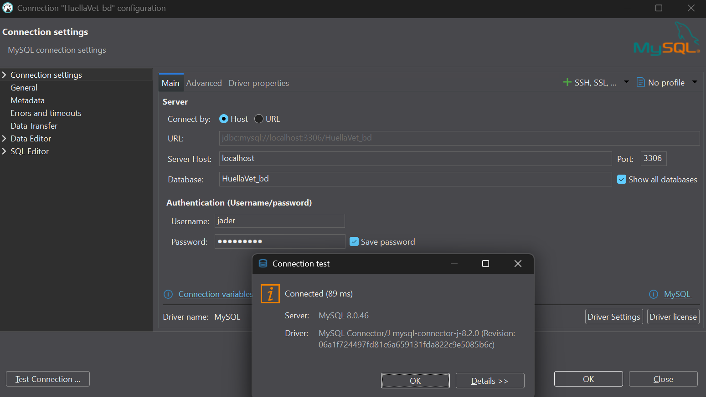{width="581"}

### 4.5 Crear un usuario PROPIO con ACCESO REMOTO

Desde la terminal del contenedor se crea un usuario de base de datos personalizado otorgándole privilegios de acceso desde cualquier host.

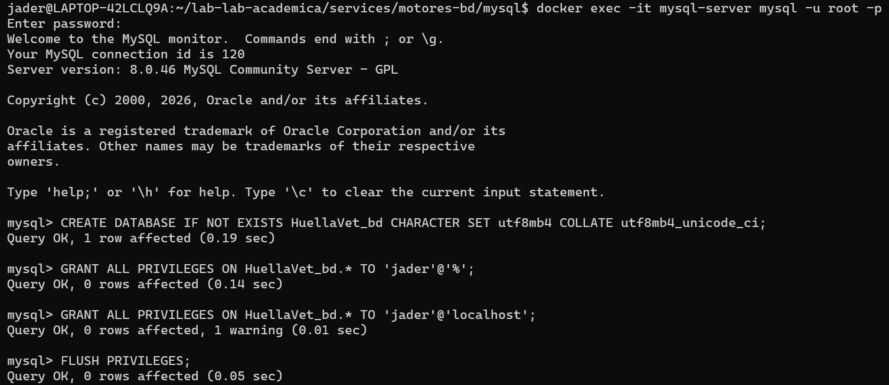

### 4.6 Backup de la Base de Datos

Se realiza una copia de seguridad (dump) de la base de datos para validar el proceso de respaldo utilizando la herramienta `mysqldump`.

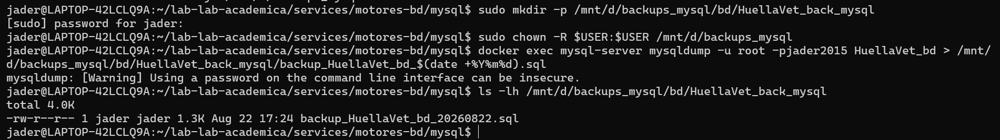

## 5. PostgreSQL

### 5.1 Crear docker-compose.yml

Se crea la carpeta `postgres` y dentro se configura el archivo `docker-compose.yml`, mapeando el puerto `5433` (o `5432`) hacia el contenedor de PostgreSQL.

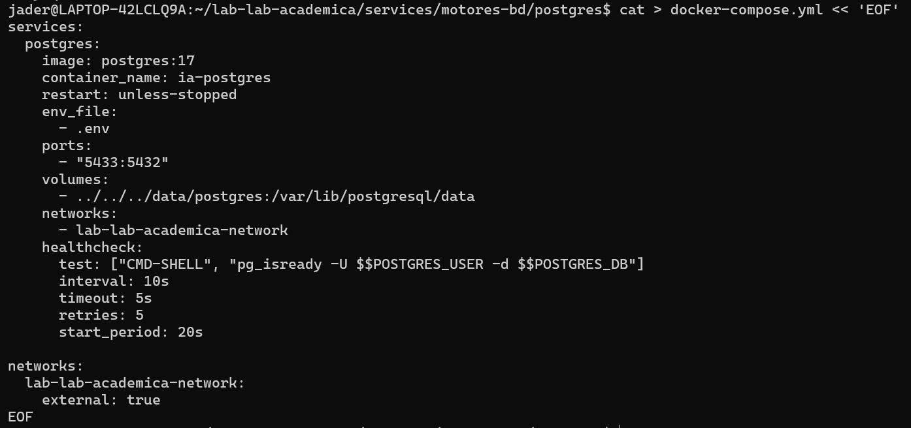

### 5.2 Crear .env

Se definen las credenciales del superusuario `postgres` y el nombre de la base de datos inicial dentro del archivo de variables de entorno `.env`.

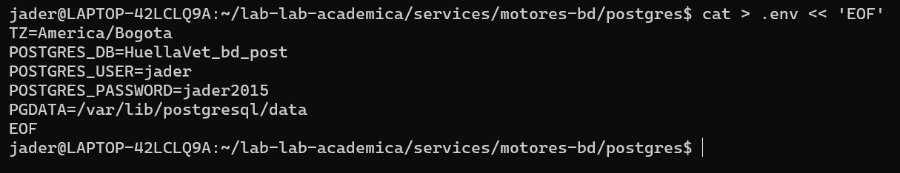

### 5.3 Crear README.md

Se documentan las instrucciones de uso del contenedor de PostgreSQL, puertos de exposición y parámetros de conexión.

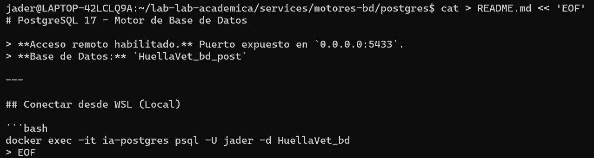

### 5.4 Conectar remotamente desde cualquier equipo

Se levanta el servicio con `docker compose up -d` y se prueba la conectividad de red desde un cliente gráfico como DBeaver utilizando la dirección IP del servidor.

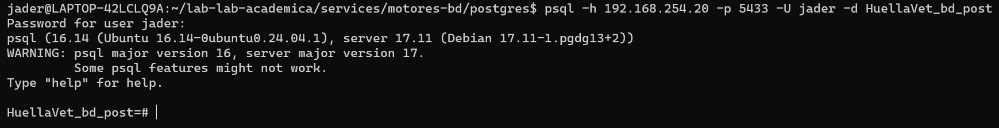

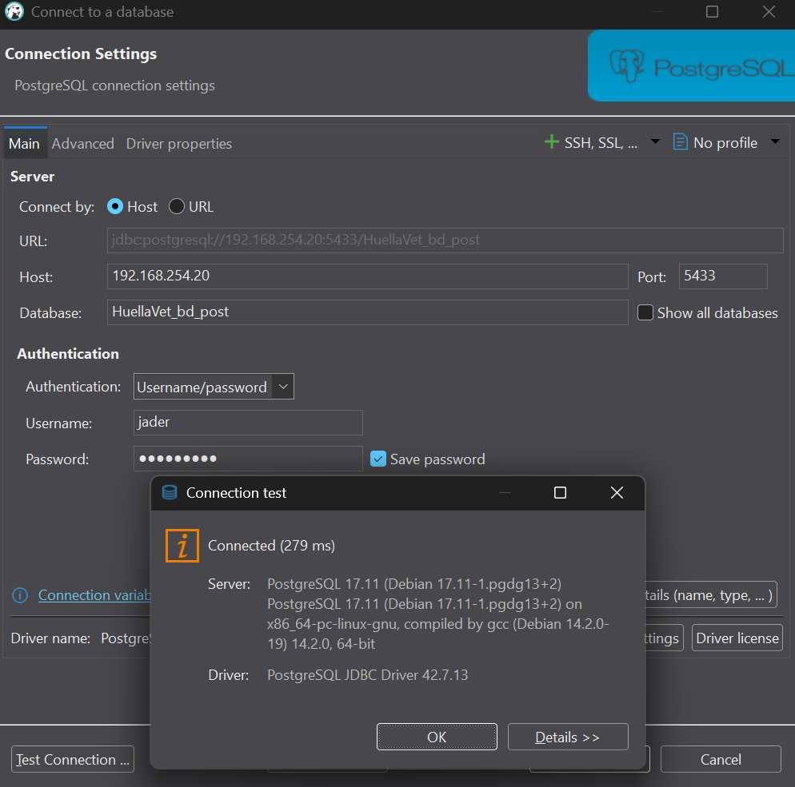{width="425"}

### 5.5 Crear un usuario PROPIO con ACCESO REMOTO

Se ingresa a la consola interactiva `psql` para crear un nuevo usuario y asignarle una base de datos con permisos globales de consulta y modificación.

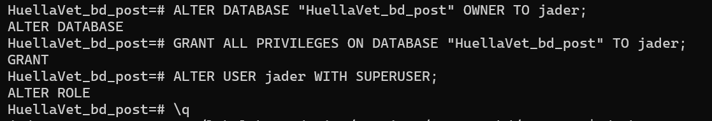

### 5.6 Backup de una base de datos

Se ejecuta la herramienta de respaldo `pg_dump` mediante la terminal para exportar la estructura y datos de la base de datos a un archivo ejecutable `.sql`.

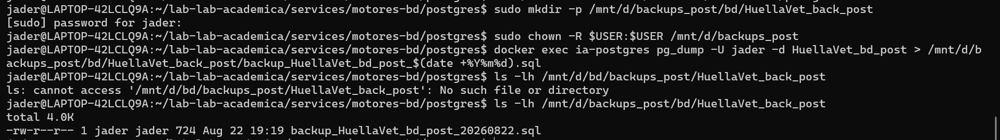

## 6. MS SQL Server

### 6.1 Crear docker-compose.yml

En la carpeta `mssql`, se estructura el `docker-compose.yml` utilizando la imagen de Microsoft SQL Server para Linux y exponiendo el puerto estándar `1433`.

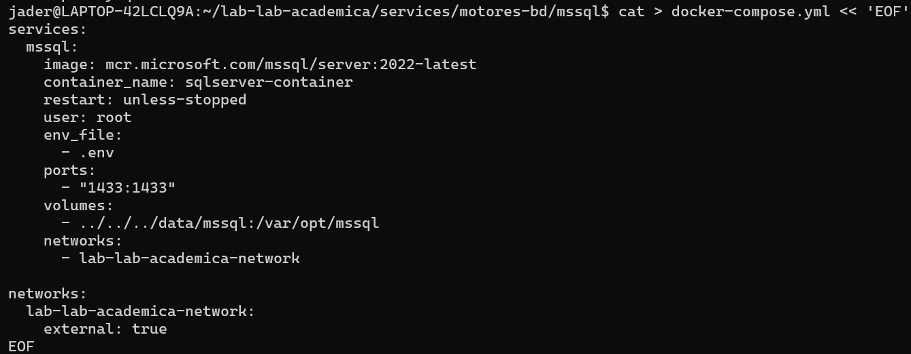

### 6.2 Crear .env

Se almacena la contraseña del usuario administrador `SA` respetando las políticas de complejidad requeridas por SQL Server.

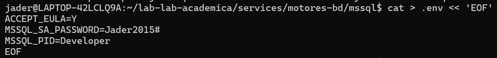

### 6.3 Crear README.md

Se genera la documentación de soporte que indica cómo iniciar el contenedor y los requisitos de autenticación para SQL Server.

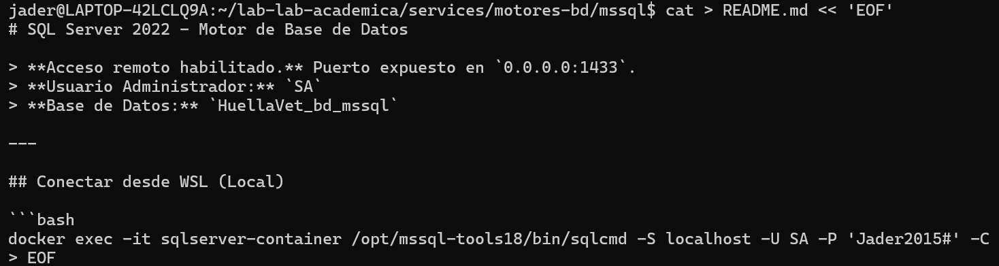

### 6.4 Conectar remotamente desde cualquier equipo

Se despliega el servicio y se valida el acceso desde DBeaver a través de la red local.

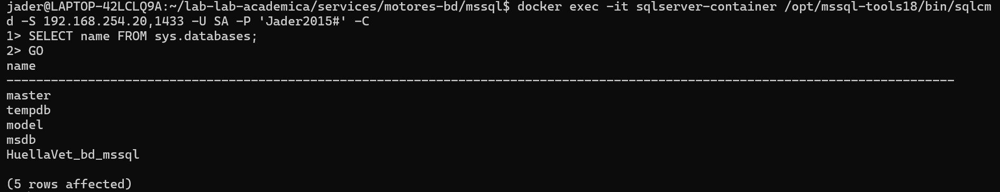

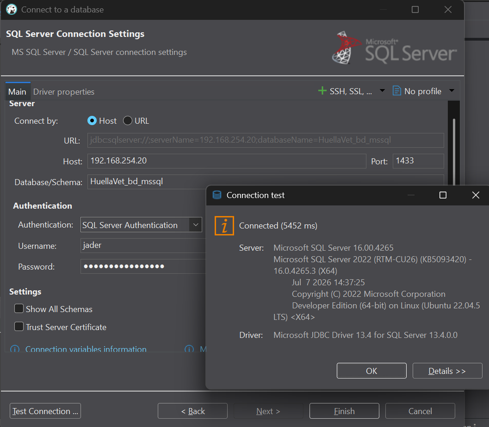{width="443"}

### 6.5 Crear un usuario PROPIO con ACCESO REMOTO

Utilizando comandos SQL (`CREATE LOGIN` y `CREATE USER`), se habilita un nuevo usuario dentro de la instancia para evitar operaciones con la cuenta de superusuario `SA`.

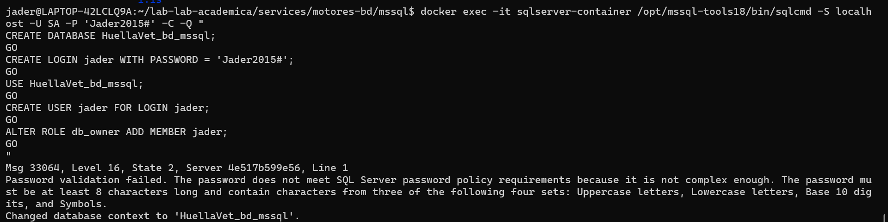

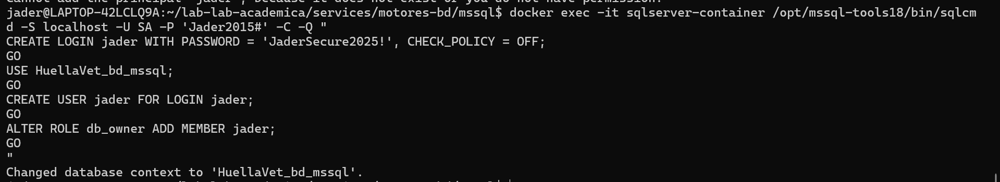

### 6.6 Backup de una base de datos

Se realiza la copia de seguridad de la base de datos hacia un archivo de respaldo `.bak` o mediante exportación de script SQL.

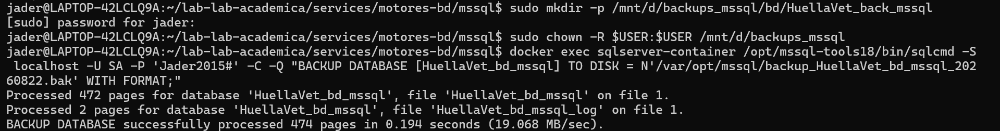

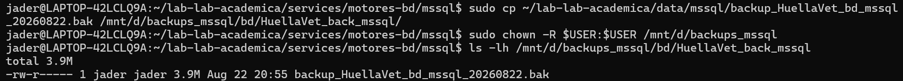

## 7. Oracle XE

### 7.1 Crear docker-compose.yml

Se configura la carpeta `oracle` junto con el archivo `docker-compose.yml` para desplegar el contenedor de Oracle Database Express Edition (XE), mapeando el puerto `1521` para la comunicación SQL.

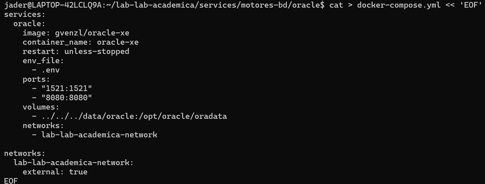

### 7.2 Crear .env

Se establece la clave del usuario `SYS` / `SYSTEM` y las variables de entorno de la base de datos (`XEPDB1`).

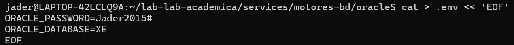

### 7.3 Crear README.md

Se crea el archivo `README.md` con los detalles específicos de arquitectura de la instancia Oracle XE y su forma de conexión.

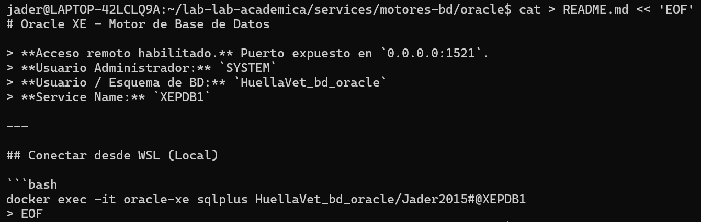

### 7.4 Conectar remotamente desde cualquier equipo

Se inicia el contenedor y se establece conexión remota probando el identificador del servicio desde DBeaver.

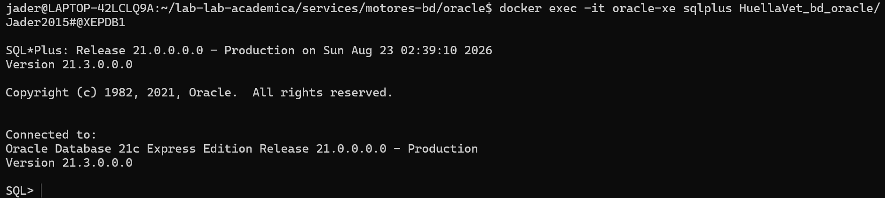

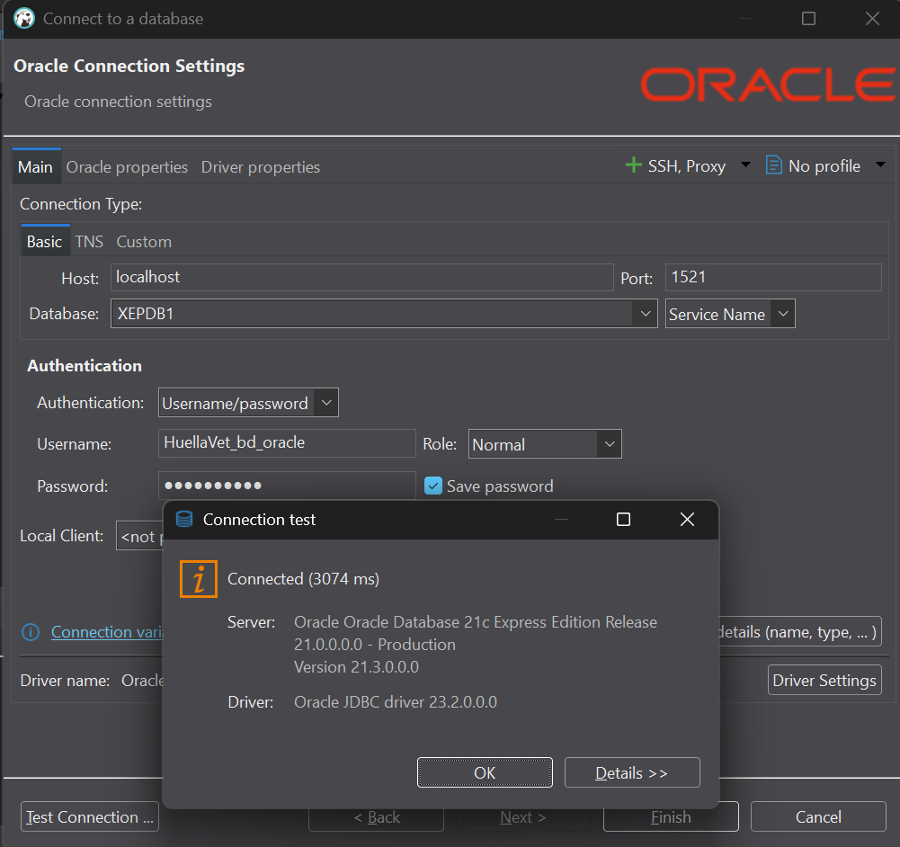{width="436"}

### 7.5 Crear un usuario PROPIO con ACCESO REMOTO

Se accede mediante `sqlplus` dentro del contenedor para crear un usuario de esquema propio en el PDB asignando los roles (`CONNECT`, `RESOURCE`).

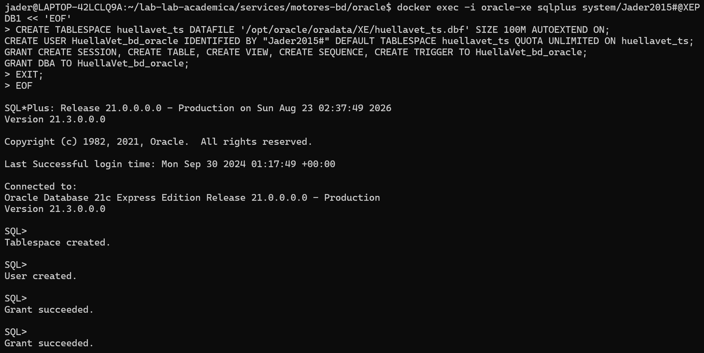
